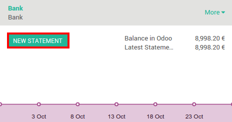
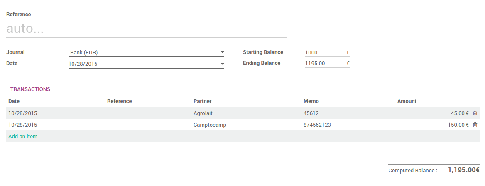
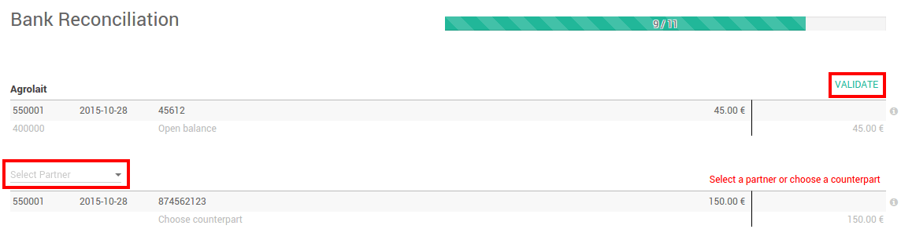
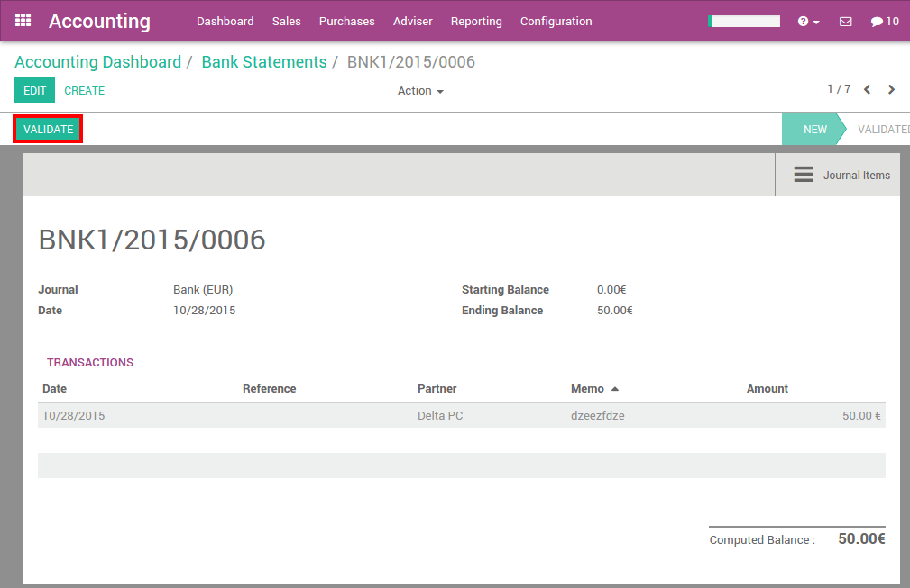

=================================
Register bank statements manually
=================================

Overview
========

With Odoo, you can import your bank statements, synchronize with your
bank but also register your bank statements manually.

Configuration
=============

No special configuration is necessary to register invoices. All you need
to do is install the accounting app.

.. image:: media/manual01.png
   :align: center

Register bank statements manually
=================================

Create your Bank Statements
---------------------------

In the Dashboard, click on the button **New Statement** related to the
bank journal. If some reconciliations need to be done, the New Statement
link will be found underneath.

Just fill in the fields according the the information written on your
bank statement. The reference can be filled in manually or you can leave
it empty. We recommend to fill in the partner to ease the reconciliation
process.

The difference between the starting balance and the ending balance
should be equal to the computed balance.

When you are done, click on **Save**.

Reconcile your Bank Statements
------------------------------

You can choose to directly reconcile the statement by clicking on the
button |manual04|

.. |manual04| image:: media/manual04.png

You can also start the reconciliation process from the dashboard by
clicking on **Reconcile # Items**.

.. image:: media/manual05.png
   :align: center

Click on **Validate** to reconcile your bank statement. If the partner
is missing, Odoo will ask you to **select a partner**.

.. tip::

		Hit CTRL-Enter to reconcile all the balanced items on the sheets.

Close Bank Statements from the reconciliation
---------------------------------------------

If the balance is correct, you can directly close the statement from the
reconciliation by clicking on |manual07|.

Otherwise, click on |manual08| to open the statement and correct the
issue.

.. |manual08| image:: media/manual08.png

Close Bank Statements
---------------------

On the accounting dashboard, click on the More button of your bank
journal, then click on Bank Statements.

.. image:: media/manual09.png
   :align: center

To close the bank statement, just click on **Validate**.

.. seealso::

	* :doc:`../reconciliation/use_cases`
	* :doc:`../feeds/synchronize`
