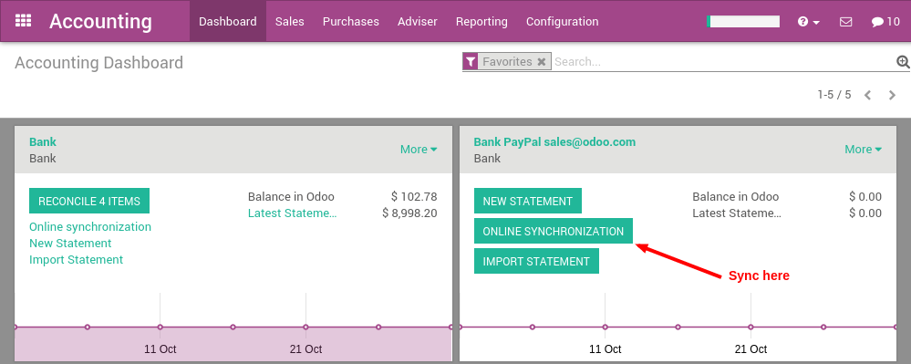

=================================================
How to synchronize your Paypal account with Odoo?
=================================================

With Odoo, you can synchronize your Paypal account. That way, you don't
have to record all your Paypal transaction in your favorite accounting
software. The synchronization is done every 4 hours, and you can start
reconciling Paypal payments in just a click.

Configuration
=============

Install the account_yodlee module
----------------------------------

Start by installing the **account_yodlee** module, if it is not already
installed. To do that, got the the menu 
:menuselection:`Accounting --> Configuration --> Settings` of the
accounting application. In the section **Bank & Cash**, set the option **Bank
Interface - Sync your bank feeds automatically**.

.. image:: media/paypal01.png
    :align: center

Click on the apply button once it's done.

Setup your Paypal account
-------------------------

A Paypal account in Odoo is managed like a bank account. To setup your
Paypal account, use the menu :menuselection:`Configuration --> Bank Accounts`. 
Create a new bank account and name it **Paypal**. In the bank field, you can set
**Paypal**.

.. image:: media/paypal02.png
    :align: center

Once the Paypal account is created, go back to the **Accounting** dashboard
and click on the **Synchronize** button. In the dialog, choose **Paypal** as
the online institution and click on the configure button.

Then, you will have to provide your credentials to connect to Paypal.
Once everything is done, you should see your Paypal transactions right
in Odoo and you can start reconciling your payments.

Enjoy a full integration! You don't need to record transaction manually
anymore.

.. note::
    You only have to provide your credentials the first time. Once
    done, Odoo will synchronize with Paypal every 4 hours automatically.
