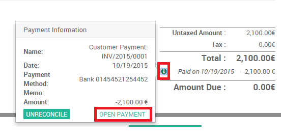
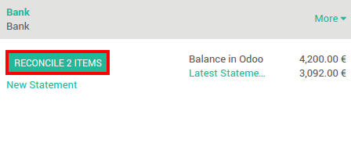
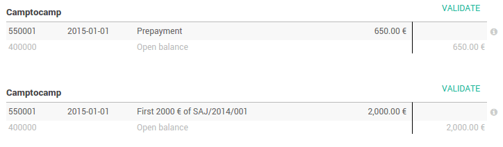

=============================================
Use cases in the bank reconciliation process?
=============================================

Overview
========

Linking your bank statements with your accounting can be a lot of work.
You need to find invoices back, relate payments and that amount of
administration can cast a lot of time. Luckily, with Odoo you can very
easily link your invoices or any other payment with your bank
statements.

Two reconciliation processes exist in Odoo.

1. We can directly register a payment on the invoices
2. We can reconcile open invoices with bank statements

Configuration
=============

No special configuration is necessary to register invoices. All we need
to do is install the accounting app.

.. image:: media/use01.png
   :align: center

Use cases
=========

Case 1: Payments registration
-----------------------------

We received the payment proof for our invoice of 2100 euros issued to
Smith & Co.

We start at our issued Invoice of 2100 euros for Smith & Co. Because the
sold product is a service we demand an immediate payment. Our accountant
only handles the bank statements at the end of week, so we have to mark
the invoice as paid so we can remember we can start the service with our
customer.

Our customer send us a payment confirmation. We can thus register a
payment and mark the invoice as paid.

.. image:: media/use02.png
   :align: center

By clicking on **register payment,** we are telling Odoo that our
customer paid the Invoice. We thus have to specify the amount and the
payment method

.. image:: media/use03.png
   :align: center

We can always find the payment back from the Invoice by clicking on the
:menuselection:`Info --> Open Payment`.

The invoice has been paid and **the reconciliation has been done
automatically.**

Case 2: Bank statements reconciliations
---------------------------------------

We start at our issued Invoice of 3000 euros for Smith & Co. Let's also
assume that other Invoices are open for different customers.

.. image:: media/use05.png
   :align: center

We receive our bank statement and not only the invoice of Smith & Co has
been paid, the one of Buzz of 92 euros as well.

**Import** or **Create** the bank statements. Please refer to the
documents from the Bank Feeds section.

.. image:: media/use06.png
   :align: center

On the dashboard, click on **Reconcile # Items**

If everything was right (correct partner name, right amount) odoo will
do the reconciliations **automatically**.

.. image:: media/use08.png
   :align: center

If some issues are found, you will need to take **manual actions**.

For example, if the partner is missing from your bank statement, just
fill it in :

.. image:: media/use09.png
   :align: center

If the payment is done with a down payment, just check if it is all
right and validate all related payments :

.. tip::

	Hit CTRL-Enter to reconcile all the balanced items in the sheet.

.. seealso::

	* :doc:`../feeds/ofx`
	* :doc:`../feeds/synchronize`
	* :doc:`../feeds/manual`
