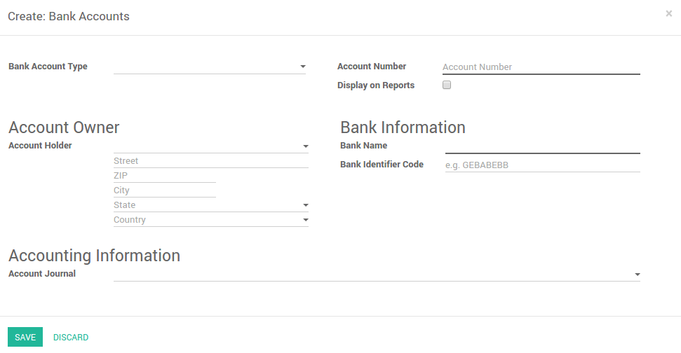

Set up your new bank account
============================

In Odoo, you can manage multiple bank accounts. In this page, you will
be guided in the creation, modification or deletion of a bank or a
credit card account.

Go to the list of your bank accounts
------------------------------------

Go to :menuselection:`Configuration --> Settings --> Configure your company bank
accounts` >
The bank accounts are configured on the company information. You have to
be in the edit mode to be able to do your changes.

.. image:: media/image10.png
   :align: center

.. note::

	If you are working in a multi-company environnement, you have to switch company to add, edit or delete bank accounts on another company.

Add or edit a bank account
--------------------------

Click on **Add an item** to add a new bank account. If you want to edit one, simply click on the line.

.. note::
	
	If the bank account type is IBAN, Odoo will check if the number is valid

.. demo:fields:: base.action_res_partner_bank_account_form

.. demo:action:: base.action_res_partner_bank_account_form

   View *Bank Account* in our Online Demonstration

.. todo:: add inherited field tooltip

	**Display on reports :** Display this bank account on the documents that
	will be printed or send to the customers

	**Bank Identifier Code** = BIC : SWIFT Address assigned to a bank in
	order to send automated payments quickly and accurately to the banks
	concerned

The initial balance of a bank statement will be set to the closing balance of the previous one within the same journal automatically.

As you may notice in the journal form, a dedicated account has been generated automatically at the bank account creation.

Delete a bank account or credit card account
--------------------------------------------

Click on the trashcan icon |image5| in the list of your bank accounts to remove one bank account.

.. |image5| image:: media/image13.png
	:class: btn-group

