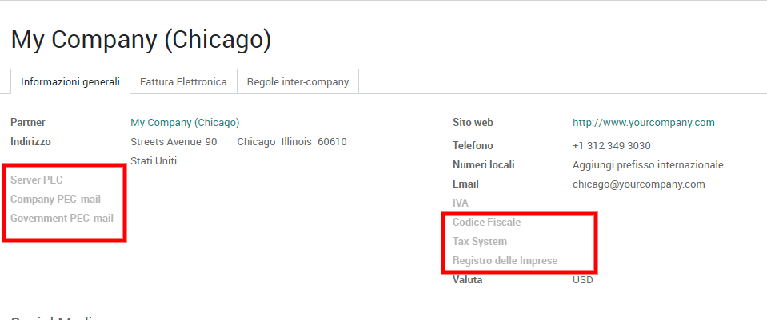

==========
Italy (IT)
==========

Questa guida spiegherà come utilizzare la fattura elettronica in Odoo e
come configurare correttamente i dati aziendali, i contatti e la
contabilità. Per testare la fattura elettronica i dati devono essere
reali e non inventati, altrimenti il sistema dell’agenzia delle entrate
non riconoscerà l’interscambio di informazioni.

Configurare le informazioni sulla tua Azienda
=============================================

Il passo successivo è la configurazione delle informazioni necessarie al
funzionamento della fatturazione elettronica. Si può accedere alla
schermata dall’applicazione Impostazioni: selezionare “Utenti e aziende”
e scegliere Aziende. Accedere quindi alle informazioni sulla Azienda per
cui si desidera configurare la fatturazione elettronica.

I dati necessari al funzionamento dello strumento di fatturazione
elettronica sono i seguenti:

-  Server PEC. Le informazioni sul server utilizzato dal tuo indirizzo
   di posta elettronica certificata sono fornite dal tuo fornitore o dal
   Ministero. Lo stesso server deve essere configurato come server che
   gestisce tutta la corrispondenza mail in Odoo, per saperne di più si
   puo’ consultare la relativa :doc:`guida <../../../email_communication/advanced/email_servers>`.

-  Indirizzo PEC dell’ Azienda, tale indirizzo deve essere lo stesso
   registrato presso l’Agenzia delle Entrate per l’utilizzo dei servizi
   di fatturazione elettronica.

-  Indirizzo PEC dell’Agenzia delle Entrate. La mail sarà fornito al
   momento della registrazione della tua PEC presso l’Agenzia delle
   Entrate, ricorda che l’Agenzia delle Entrate potrebbe cambiare questo
   indirizzo in seguito, previa comunicazione.

-  Partita IVA e Codice Fiscale. Per far si che la Fatturazione
   Elettronica funzioni correttamente, questi cambi devono essere
   compilati correttamente.

-  Regime Fiscale. Il regime fiscale a cui è sottoposta l’Azienda deve
   essere selezionato scegliendo dalla lista precompilata fornita da
   Odoo. Chiedi al commercialista qual’è il corretto regime fiscale!

-  Numero di Iscrizione nel registro delle Imprese.

Configurare le impostazioni per la Fatturazione Elettronica
-----------------------------------------------------------

-  Numero di iscrizione nel registro Imprese tenuto presso la Camera di
   Commercio.

-  Rappresentate Fiscale. Questa opzione è dedicata ad aziende con sede
   al di fuori del territorio nazionale ma conducenti attività
   commerciali in Italia rilevanti ai fini dell’IVA. È possibile
   indicare in questo campo se l’Azienda si avvale di un Rappresentate
   Fiscale in Italia.

.. image:: media/italy_IT02.png
  :align: center

Configurare il profilo dei clienti
----------------------------------

Per un corretto utilizzo dell’applicazione, il profilo di clienti e
fornitori, nell’applicazione contatti, deve essere configurato con le
necessarie informazioni legali.

Selezionando il nome del cliente e accedendo quindi ai suoi dati, si
trovano i seguenti campi che devono essere compilati: Indirizzo PEC,
Codice Fiscale e Indice PA *che deve contere i 6-7 caratteri
contenuti nell’indice PA e necessari per la comunicazione tramite
fattura elettronica*.

.. image:: media/italy_IT03.png
  :align: center

Il processo di fatturazione
===========================

Si può procedere ad emettere una fattura seguendo le indicazioni
dell’applicazione. Il momento che determina il formale invio della
fattura è il momento in cui viene selezionata l’opzione “Valida”. La
fattura viene quindi inviata: lo stato della sua consegna verrà
notificato all’utente tramite pop-up sulla parte iniziale della
schermata della fattura.

.. image:: media/italy_IT04.png
  :align: center

.. image:: media/italy_IT05.png
  :align: center

I messaggi che possono apparire sono i seguenti:

#. Fattura invitata. In attesa di accettazione

#. Invio fallito. Puoi modificare la fattura ed inviarla di nuovo

#. La fattura è stata correttamente inviata ed accettata dal
   destinatario.

I vari stadi di spedizione e recezione della fattura sono visibili anche
dall’elenco delle Fatture nella forma di icone, accanto alla colonna
“Stato” dall’applicazione contabilità.

*Icona Rossa*: Invio fallito

*Icona Gialla*: Fattura invitata. In attesa di accettazione

*Icona Verde*: Fattura inviata e accettata dal destinatario

Per inviare la fattura tramite PEC e generare il file XML, basterà
cliccare su invia. Il documento verrà poi mostrato tra gli allegati.

.. image:: media/italy_IT06.png
  :align: center

