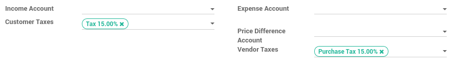
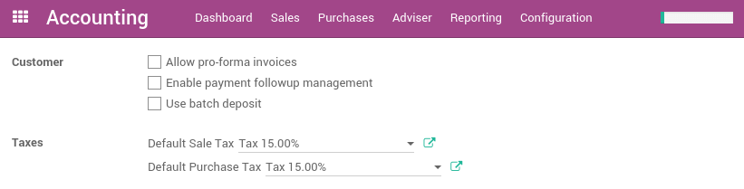

========================
How to set default taxes
========================

Taxes applied in your country are installed automatically for most localizations.

Default taxes set in orders and invoices come from each product's Invoicing tab.
Such taxes are used when you sell to companies that are in the same country/state than you.

To change the default taxes set for any new product created go to
:menuselection:`Invoicing/Accounting --> Configuration --> Settings`.

.. tip::
    If you work in a multi-companies environment, the sales and 
    purchase taxes may have a different value according to the 
    company you work for. You can login into two different companies 
    and change this field for each company.

.. seealso::

  * :doc:`create`
  * :doc:`application`
  * :doc:`taxcloud`
  * :doc:`B2B_B2C`
  * :doc:`tax_included`
