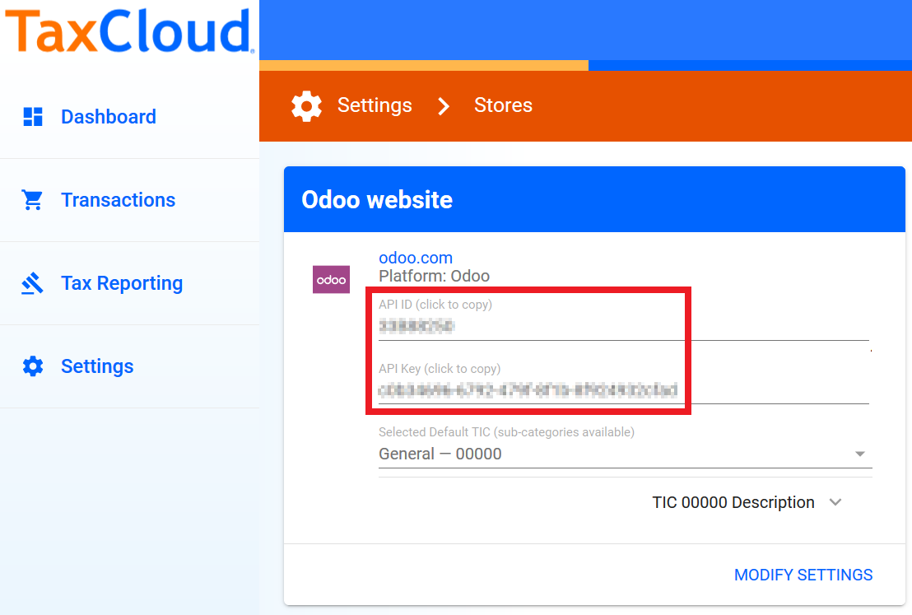
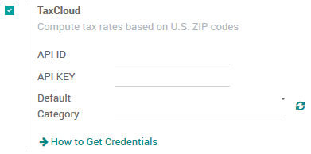
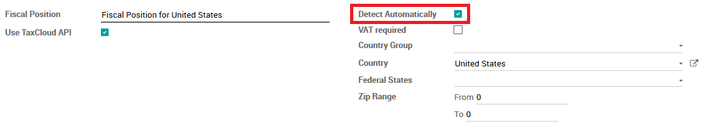
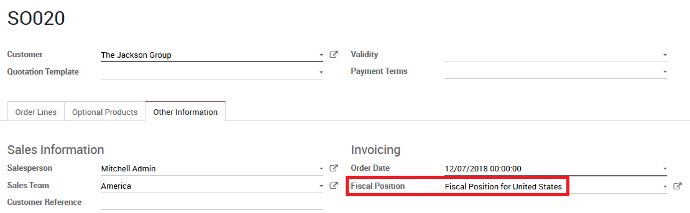

=========================================================
Get correct tax rates in the United States using TaxCloud
=========================================================

The **TaxCloud** integration allows you to correctly calculate the sales
tax for every address in the United States and keeps track of which products
are exempt from sales tax and in which states each exemption applies.
TaxCloud calculates sales tax in real-time for every state, city, and
special jurisdiction in the United States.

Configuration
=============

In TaxCloud
-----------
* Create a free account on `TaxCloud
  <https://taxcloud.com/#register>`__ website.
* Register your Odoo website on TaxCloud to get an *API ID* and an *API Key*.

* In Settings on TaxCloud, click *Locations* to enter the location of your Office(s) & Warehouse(s).
* In Settings on TaxCloud, click *Manage Tax States* to verify the states where you collect sales tax.

In Odoo
-------
* Go to :menuselection:`Invoicing / Accounting --> Configuration --> Settings`
  and check *TaxCloud - Compute tax rates based on U.S. ZIP codes* (note: actually uses complete street address).
* Enter your TaxCloud credentials.
* Click SAVE to store your credentials.

* Click the Refresh Icon next to *Default Category* to import the TIC product categories
  from TaxCloud (Taxability Information Codes). Some categories may imply specific rates or attract product/service type exemptions.
* Select your default *TIC Code*. This will apply to any new
  product created.
* Set a specific TaxCloud TIC Category on the *General Information* tab of the Product,
  or on the Product Category.
* Make sure your company address is complete (including the state
  and the zip code). Go to :menuselection:`Settings --> Users & Companies --> Companies`
  to open and edit your Company record.

How it works
============

Salestax is calculated in Odoo based on fiscal positions
(see :doc:`fiscal_positions`).
A Fiscal Position for the United States is created when installing *TaxCloud*.
Everything works out-of-the-box.

You can configure Odoo to automtically detect which Customers should use this fiscal
position.  Go to :menuselection:`Accounting --> Configuration --> Fiscal Positions`
to open and edit the record.

Now, this fiscal position is automatically set on any sales order, web order, or invoice
when the customer country is *United States*. This triggers the
automated tax computation.

Add your product(s). You have two options to get Sales Tax on the Order.  You can confirm it,
or you can save it and from the *Action* Menu choose **Update Taxes with TaxCloud**.

Coupons & Promotions
====================

If you use the Coupon or Promotion Programs, the integration with Taxcloud might seem a bit odd.

The problem lies with the fact that Taxcloud does not accept lines with negative amounts as part of
the tax computation. This means that the amount of the lines added by the promotion program must be
deduced from the total of the lines it impacts. This means, amongst other complications, that orders
that use coupons or promotions with a Taxcloud fiscal position **must** be invoiced completely -
you cannot create invoices for partial deliveries, etc.

Another specific oddity is possible in the UI: imagine that you sell a product from the Taxcloud
category *[20110] Computers* and that you have a promotion program in place that provides a 50%
discount on this product. If the tax rate for this particular product is 7%, the tax rate that will
be computed from the Taxcloud integration will display 3.5%. This happens because the discount is
included in the price that is sent to Taxcloud, but in Odoo this discount is in another line
entirely. At the end of the day, your tax computation will be correct (since a 3.5% tax on the full
price is the equivalent of a 7% tax on half the price), but this might be surprising from a user
point of view.

.. seealso::
   - :doc:`fiscal_positions`
