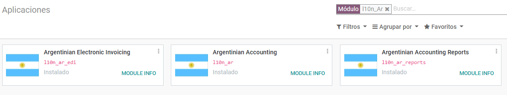
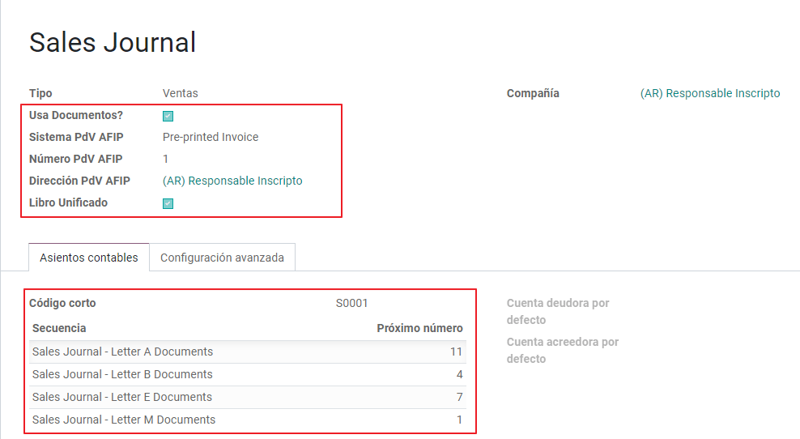
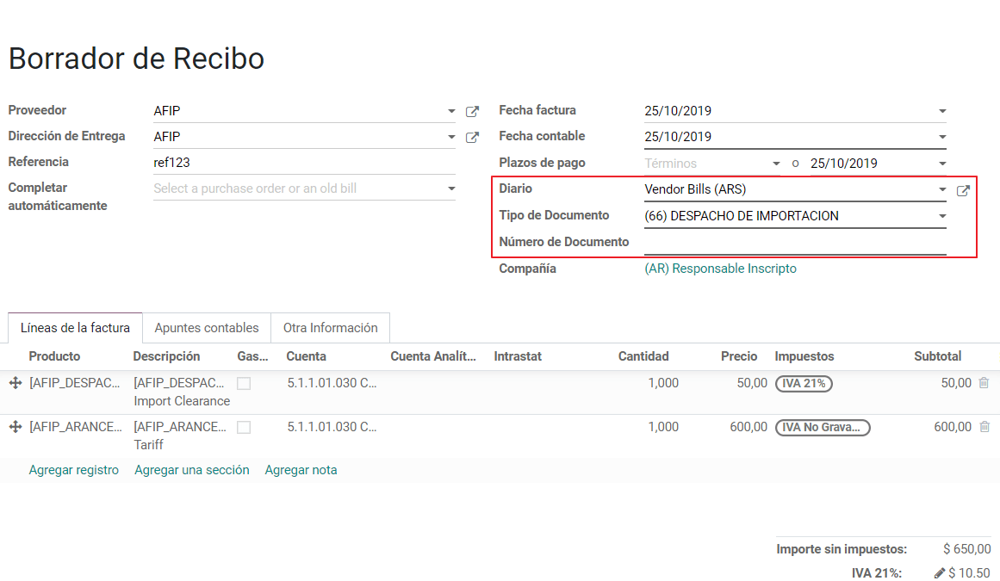
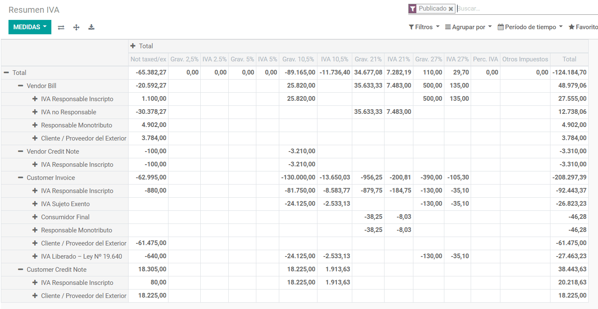

========
Argentina
========

Introduction
~~~~~~~~~~~~
The Argentinean localization has been improved and extended in Odoo V13, in this version the next modules are available:

#. **l10n_ar**:  This module add accounting features for the Argentinian localization, which represent the minimal configuration needed for a company  to operate in Argentina and under the AFIP (Administración Federal de Ingresos Públicos) regulations and guidelines.

#. **l10n_ar_reports**: Add VAT Book report which is a legal requirement in Argentine and that holds the VAT detail info of sales or purchases recorded on the journal entries. This module includes as well the  VAT summary report that is used to analyze the invoice

Configuration
~~~~~~~~~~~~~

1. Install the Argentinean localization modules
---------------------------------------------

For this, go to Apps and search for Argentina. Then click Install for the first two modules.

1.1 Configure your company
-----------------------------------------------------

Once that the modules are installed, the first step is to set up your company data.  Additional to  the basic information, a key field to fill in the AFIP Responsibility Type, that represent the fiscal obligation and structure of the company:

1.2 Chart of Account
-----------------------------

In Accounting settings there are three available packages of Chart of accounts, which are related to the AFIP responsibility type of the Company, considering that if the base companies don't require as many accounts as the companies that gave more complex fiscal requirements:

Monotributista  (149 accounts)
IVA Exempto   (159 accounts)
Responsables Inscriptos  (166 Accounts)

2. Configure Master data
-------------------------------------

2.1 Partner
+++++++++++

2.1.1 Identification Type and VAT
^^^^^^^^^^^^^^^^^^^^

As part of the Argentinean localization, the document types defined by the AFIP are now available on the Partner form, this information is essential for most transactions. There are six identification types available by default:

Note: The complete list of Identification types defined by the AFIP is included in Odoo but just the common ones are active.

2.1.2 AFIP Responsibility Type
^^^^^^^^^^^^^^^^^^^^^^^^^^^^
In Argentina the document type associated with customers and vendors transactions is defined based on the AFIP Responsibility type, this field should be defined in the partner form:

2.2 Taxes
+++++++++

As part of the localization module,  the taxes are created automatically with their related financial account and configuration.

2.2.2 Taxes Classification
^^^^^^^^^^^^^^^^^^^^^^^^^^^^
#. **Type**:
-  VAT. Is the regular VAT and it can have several percentages.
-  Perception. Advance payment of a tax that is applied on Invoices.
-  Retention.  Advance payment of a tax that is applied on payments
-  Otros.

#. **Tax Category**:
- Regular VAT
- Profits
- Gross Income
- Otros

#. **Application**:
- National
- Provincial
- Municipal
- Impuestos Internos
- Otros

2.2.3 Special Taxes
^^^^^^^^^^^^^^^^^^^^^^^^^^^^
Some argentine taxes are not commonly used  for all companies, these type of taxes are included as Inactive by default, it's important that before creating a new tax you confirm if they are not already included in the Inactive taxes:

.. image:: media/argentina07.png
   :align: center

2.3 Document Types
++++++++++++
In some Latinamerica countries, including Argentina, some accounting transactions like invoices and vendor bills are classified by  document types defined by the government fiscal authorities (In Argentina case: AFIP).

The document type is an essential information that needs to be displayed in the printed reports and that needs to be easily identified, within the set of invoices as well of account moves.

Each document type can have a unique sequence per journal where it is assigned. As part of the localization, the Document Type include the country on which the document is applicable and the data is created automatically when the localization module is installed.

The information required for the document types is included by default so the user doesn't need to fill anything on this view:

.. image:: media/argentina08.png
   :align: center

Note:  There are several document types that inactive by default but they can be activated if needed.

2.3.1 Letters
^^^^^^^^^^^^^^^^^^^^
For Argentina, the document types include a letter that helps that indicates the transaction/operation, example:

When an invoice is related to a B2B transaction, a document type "A" must be used.
When an invoice is related to a B2C transaction, a document type "B" must be used.
When an invoice is related to exportation transaction, a document type "E" must be used.
The documents included in the localization have the proper letter associated, the user doesn't need to configure anything additional.

Use on Invoices
2.3.1 Use on Invoices
^^^^^^^^^^^^^^^^^^^^
The document type on each transaction will be determined by:
- The Journal related to the Invoice, identifying if the journal use documents.
- Condition applied based on the type of Issues and Receiver (ex. Type of fiscal regimen of the buyer and type of fiscal regimen of the vendor)

4.4 Journals
++++++++++++
In the Argentinean localization the Journal can have a different approach depending on its usage and internal type, to configure you journals go to Accounting -> Configuration -> Journals:

4.4.1 AFIP Information
^^^^^^^^^^^^^^^^^^^^

#. **AFIP POS System**: This field is only visible for the Sales  journals and defined the type of AFIP POS that will be used to manage the transactions for which the journal is created.  The AFIP POS defines as well:
- The sequences of document types related to the WS.
- The structure and data of the electronic invoice file.

#. **AFIP POS Number**: This is the number configured in the AFIP to identify the operations related to this AFIP POS.

#. **AFIP POS Address**: This field is related to commercial address registered for the POS, which is usually the same address than the Company. For example: has multiple stores (fiscal locations) then AFIP will require that you have one AFIP POS per location: this location will be printed in the invoice report.

#. **Unified Book**: When AFIP POS System is Preimpresa the document types (applicable to the journal)  with the same letter will share the same sequence.  For example

Invoice: FA-A 0001-00000002
Credit Note: NC-A 0001-00000003
Debit Note: ND-A 0001-00000004

Usage and testing
~~~~~~~~~~~~~~~~~

1. Invoice
----------

After the partners and journals are created and configured, when the invoices are created the will have the next behaviour:

1.1 Document type assignation
++++++++++++++++++++
Once the partner is selected the document type will filled automatically, based on the AFIP document type:

**Invoice for a customer IVA Responsable Inscripto, prefix A**

**Invoice for an end customer, prefix B**

**Exportation Invoice, prefix E**

As it is shown in the invoices, all of them use the same journal but the prefix and sequence is given by the document type.

The most common document type will be defined automatically for the different combinations of AFIP responsibility type but it can be updated manually by the user.

1.2 Invoice Taxes
++++++++++++++++++++++
Based on the  AFIP Responsibility type,  the VAT tax can have a different behavior on the pdf report:

#. Tax excluded: In this case the taxed amount needs to be clearly identified in the report. This condition applies when the customer have the next AFIP Responsibility Type.
**Responsable Inscripto**

#. Tax amount included: This means that the taxed amount is included as part of the product price, subtotal and totals.  This condition applies when the customer have the next AFIP Responsibility Type.
- IVA Sujeto Exento
- Consumidor Final
- Responsable Monotributo
- IVA liberado

2. Vendor Bills
----------

Based on the sales journal selected for the invoice, the document type is now a required field.  This value is auto populated based on the AFIP Responsibility type of Issuer and Customer, but the value can be switched if necessary.

The document number needs to be registered manually and the format is validated automatically, in case that the format is invalid a user error will be displayed indicating the correct format that is expected.

Reports
~~~~~~~~~~~~~~~~~
As part of the localization the next Financial reports were added:

1. VAT Reports
----------
1.1  Libro de IVA Ventas
++++++++++++++++++++++

1.2  Libro de IVA Compras
++++++++++++++++++++++

1.3  Resumen de IVA
++++++++++++++++++++++

2.  IIBB - Reports
----------

2.1  IIBB - Ventas por Jurisdicción
++++++++++++++++++++++

2.2  IIBB - Compras  por Jurisdicción
++++++++++++++++++++++

