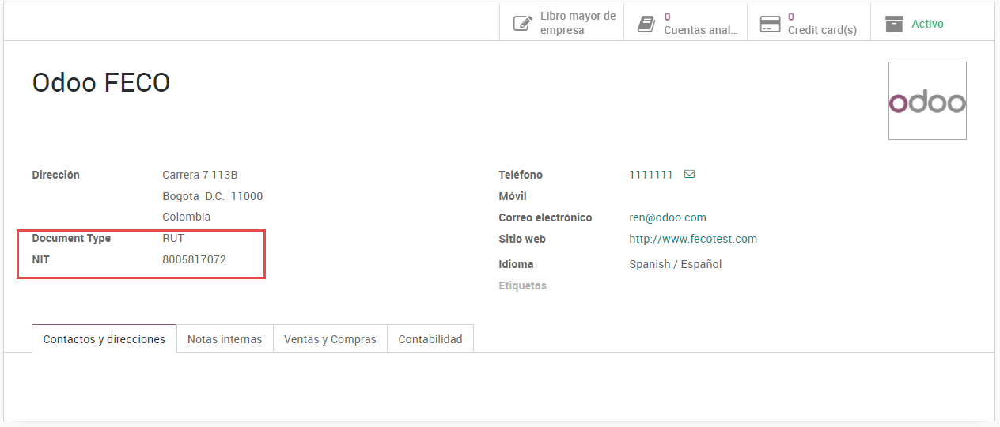
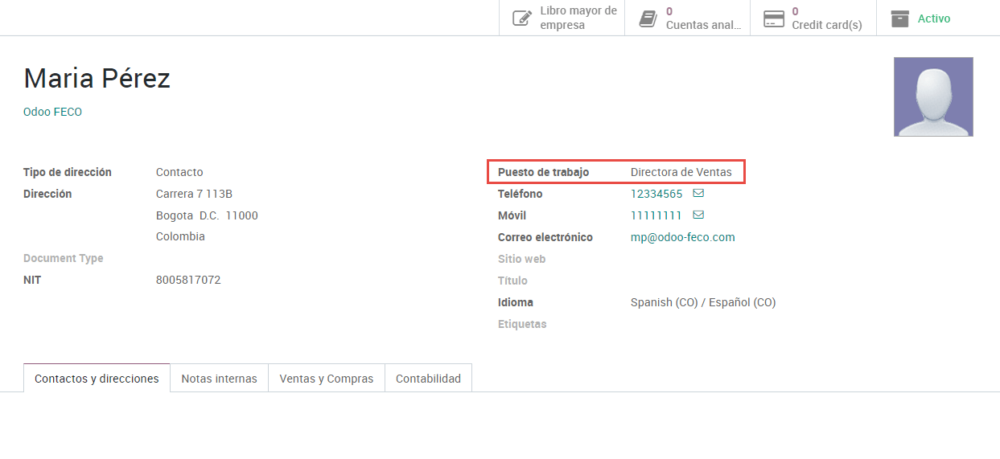
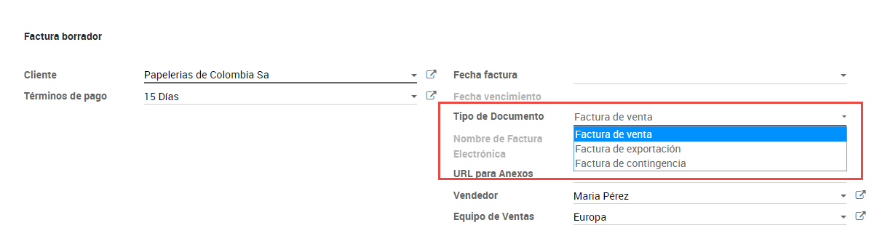
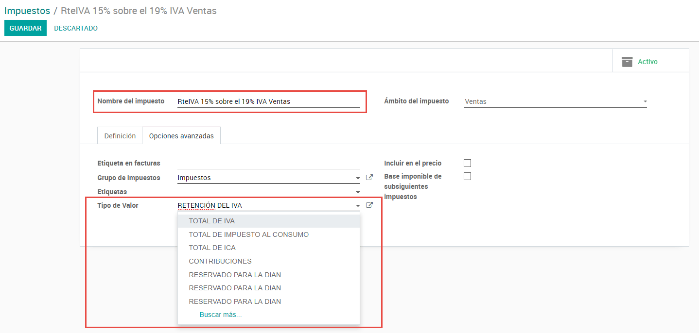
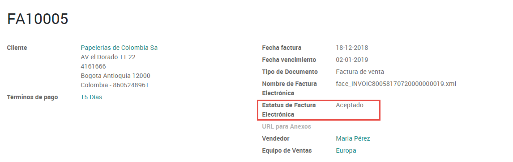
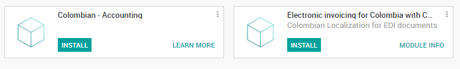
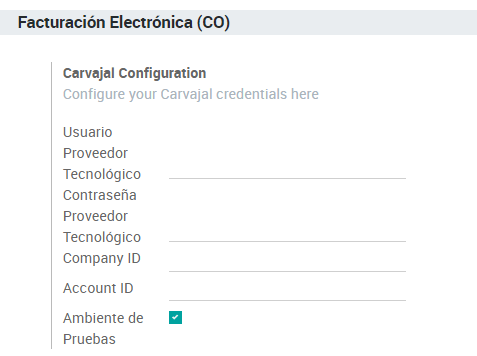

=============
Colombia (ES)
=============

**Facturación Electrónica para Colombia**

Introducción
============

La Facturación Electrónica para Colombia está disponible en Odoo V12 y
requiere los siguientes Módulos:

1. **l11n_co**:** Contiene los datos básicos para manejar el
       módulo de contabilidad, incluyendo la configuración por defecto
       de los siguientes puntos:

    | a. Plan Contable
    | b. Impuestos
    | c. Retenciones
    | d. Tipos de Documentos de Identificación

1. **l10n_co_edi**: Este módulo incluye todos los campos
       adicionales que son requeridos para la Integración entre Carvajal
       T&S y la generación de la Factura Electrónica, basado en los
       requisitos legales de la DIAN.

Flujo General
-------------

Configuración
=============

1. Instalación de los módulos de Localización Colombiana
--------------------------------------------------------

Para esto ve a las aplicaciones y busca “Colombia”, luego da click en
Instalar a los primeros dos módulos:

cz

2. Configuración de las credenciales del Servicio Web de Carvajal T&S
~~~~~~~~~~~~~~~~~~~~~~~~~~~~~~~~~~~~~~~~~~~~~~~~~~~~~~~~~~~~~~~~~~~~~

| Una vez que los módulos están instalados, para poderte conectar con el
  Servicio Web de Carvajal T&S, es necesario configurar el Usuario y las
  Credenciales. Esta información será provista por Carvajal T&S.
| Ve a Facturación –> Configuración –> Configuración y busca la sección
  **Facturación Electrónica Colombiana**

.. image:: media/colombia_ES02.png
  :align: center

| La funcionalidad de pruebas le permite conectarse e interactuar con el
  ambiente piloto de Carvajal T&S, esto permite a los usuarios probar el
  flujo completo y la integración con el Portal Financiero CEN, al cual
  se accede a través de la siguiente liga: `Cenfinanciero <https://cenfinancierolab.cen.biz>`__, 

Una vez que el ambiente de producción está listo en Odoo y en Carvajal
T&S el ambiente de pruebas debe ser deshabilitado para poder enviar la
información al ambiente de producción de Carvajal, para el cual es
utilizada la siguiente URL: `Cenfinanciero <https://cenfinancierolab.cen.biz>`__, 

3. Configuración de Información para PDF
----------------------------------------

| Como parte de la información configurable que es enviada en el XML,
  puedes definir los datos de la sección fiscal del PDF, así como de la
  información Bancaria.
| Ve a Contabilidad – Configuración – Ajustes y busca la sección
  **Facturación Electrónica Colombiana**.

.. image:: media/colombia_ES03.png
  :align: center

4. Configuración de los Datos Principales Requeridos en el XML
--------------------------------------------------------------

4.1 Contacto (Tercero)
~~~~~~~~~~~~~~~~~~~~~~

4.1.1 Identificación
~~~~~~~~~~~~~~~~~~~~

Como parte de la Localización Colombiana, los tipos de documentos
definidos por la DIAN ahora están disponibles en el formulario de
Contactos, por lo cual ya es posible asignarles su número de
identificación asociado al tipo de documento correspondiente.

Nota: Cuando el tipo de documento es RUT la identificación necesita ser
ingresada en Odoo incluyendo el Dígito de Verificación. Odoo separará
este número cuando la información sea enviada a los proveedores
terceros.

4.1.2 Estructura Fiscal (RUT)
~~~~~~~~~~~~~~~~~~~~~~~~~~~~~

Los Códigos de tipo de Obligación aplicables a los terceros (sección 53
en el documento de RUT), son incluidos como parte del módulo de
Facturación Electrónica, dado que es información requerida por la DIAN.

Estos campos se encuentran en Contactos –> Pestaña de Ventas y Compras
–> Información Fiscal

Adicionalmente dos últimos campos fueron agregados para especificar el
régimen fiscal del contacto. Cabe aclarar que para envío de Factura
electrónica de Carvajal, únicamente se hace distinción de entre Grandes
Contribuyentes y Régimen simplificado, por lo se muestran solo estas dos
opciones.

4.2 Impuestos
-------------

| Si tus transacciones de ventas incluyen productos con impuestos, es
  importante considerar que un campo adicional llamado *Tipo de Valor*
  necesita ser configurado en la siguiente ruta:
| Contabilidad – > Configuración –> Impuestos: –> Opciones Avanzadas
  –>Tipo de Valor

Los impuestos para Retenciones (ICA, IVA y Fuente) también están
incluidos en las opciones para configurar tus impuestos, esta
configuración es considerada para desplegar correctamente los impuestos
en la representación gráfica de la Factura. (PDF)

.. image:: media/colombia_ES07.png
  :align: center

4.3 Diarios
-----------

Una vez que la DIAN ha asignado la secuencia y prefijo oficiales para la
resolución de la Facturación Electrónica, los Diarios de Ventas
relacionados con tus documentos de facturación necesitan ser
actualizados en Odoo.

La secuencia es configurada usando el modo de desarrollador en la
siguiente ruta:

Contabilidad –> Configuración –> Diarios –> Liga de Secuencia

Una vez que la secuencia es abierta, los campos de Prefijo y Siguiente
Número deben ser configurados y sincronizados con el CEN Financiero.

.. image:: media/colombia_ES09.png
  :align: center

4.4 Usuarios
------------

La plantilla por defecto que es usada por Odoo en la representación
gráfica incluye el nombre del Vendedor, así que estos campos deben ser
considerados:

.. image:: media/colombia_ES10.png
  :align: center

Uso y Pruebas
=============

Facturas
--------

Una vez que toda la información principal y las credenciales han sido
configuradas, es posible empezar a probar el flujo de la Facturación
Electrónica siguiendo las instrucciones que se detallan a continuación:

1. Invoice Creation
~~~~~~~~~~~~~~~~~~~

El flujo de trabajo funcional que lleva lugar antes de la validación de
una factura continua siendo igual con Facturación Electrónica,
independientemente de si es creada desde una Orden de Venta o si es
creado manualmente.

Los cambios principales que son introducidos con la Facturación
Electrónica son los siguientes:

Hay tres tipos de documentos

-  **Factura electrónica**. Este es el documento normal y aplica
       para Facturas, Notas de Crédito y Notas de Débito.

-  **Factura de Importación**. Debe ser seleccionada para
       transacciones de importación.

-  **Factura de Contingencia**. Esta es un caso excepcional y es
       utilizada como un respaldo manual en caso que la compañía no
       pueda usar el ERP y hay necesidad de crear la factura
       manualmente. Al ingresar esta factura en el ERP, se debe
       seleccionar este tipo.

.. image:: media/colombia_ES11.png
  :align: center

1. Invoice Validation
~~~~~~~~~~~~~~~~~~~~~

Después que la factura fue validada, un archivo XML es creado y enviado
automáticamente al proveedor de la factura electrónica. Este archivo es
desplegado en el historial.

.. image:: media/colombia_ES12.png
  :align: center

Un campo adicional es ahora desplegado en la pestaña de “Otra
Información” con el nombre del archivo XML. Adicionalmente hay un
segundo campo adicional que es desplegado con el estatus de la Factura
Electrónica, con el valor inicial **En Proceso**.

.. image:: media/colombia_ES13.png
  :align: center

1. Recepción del XML y PDF Legal
~~~~~~~~~~~~~~~~~~~~~~~~~~~~~~~~

| El proveedor de la Factura Electrónica recibe el archivo XML y procede
  a validar la información y la estructura contenida. Si todo es
  correcto, el estatus de la Factura cambia a “Validado”. Como parte de
  este proceso se generar el XML Legal, el cual incluye una firma
  digital y un código único (CUFE) y generan el PDF de la Factura (el
  cual incluye un código QR) y el CUFE.

| Odoo envía una petición de actualización automáticamente para
  verificar que el XML fue creado. Si este es el caso, las siguientes
  acciones son hechas automáticamente.

-  El XML Legal y el PDF son incluidos en un archivo ZIP y desplegados
       en el historial de la Factura.

-  El estatus de la Factura Electrónica es cambiado a “Aceptado”.

.. image:: media/colombia_ES15.png
  :align: center

Nota: En caso que el PDF y el XML sean requeridos inmediatamente, es
posible mandar manualmente la petición del estatus usando el siguiente
botón:

1. Errores Frecuentes
~~~~~~~~~~~~~~~~~~~~~

Durante la validación del XML los errores más comunes usualmente están
relacionados con información principal faltante. En estos casos, los
detalles del error son recuperados en la petición de actualización y
desplegados en el historial.

Si la información principal es corregida, es posible re procesar el XML
con la nueva información y mandar la versión actualizada usando el
siguiente botón:

.. image:: media/colombia_ES18.png
  :align: center

.. image:: media/colombia_ES19.png
  :align: center

Casos de Uso adicionales
------------------------

El proceso para las Notas de Crédito y Débito (Proveedores) es
exactamente el mismo que en las Facturas. Su flujo de trabajo funcional
se mantiene igual.
