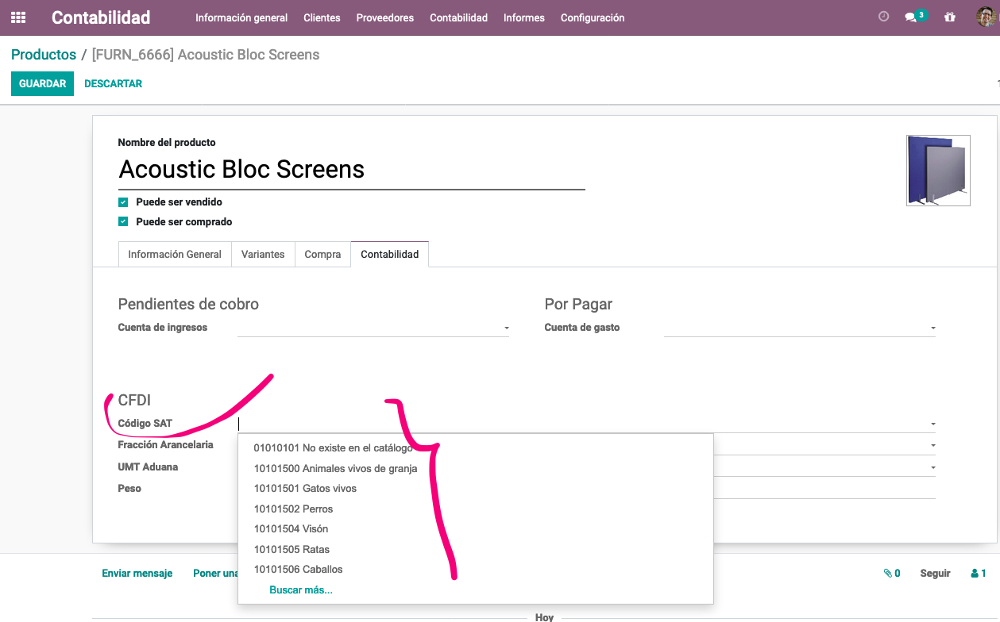

==============================
Mexico Accounting Localization
==============================

Configuration 
~~~~~~~~~~~~~~

First, install the Mexican Accounting Localization. For this, go in Apps
and search for Mexico. Then click on *Install*.

.. image:: media/mexico01.png
   :align: center

.. tip::
   When creating a database from www.odoo.com, if you choose Mexico
   as country when creating your account, the mexican localization will be
   automatically installed.

Accounting Reports
~~~~~~~~~~~~~~~~~~

Some specific reports have been added for the Mexican accounting
localization :

-  DIOT

-  COA

-  Trial Balance

Electronic Invoices (CDFI format)
~~~~~~~~~~~~~~~~~~~~~~~~~~~~~~~~~

When sending a customer invoice by email, there is an option to join the
xml file of the invoice to your email (CDFI format). To activate this
setting, go in accounting > settings and activate the Mexican Electronic
Invoicing.

.. image:: media/mexico02.png
   :align: center

Invoices Certification
~~~~~~~~~~~~~~~~~~~~~~

With the Odoo Mexican Localization, certify your customer invoices.

Create your customer invoice and simply send it to a PAC. The PAC will
sign the invoice and send it back to you but also send the invoice to
the SAT. Your customer is able to check on the SAT if your invoice is
well valid before paying it.

Configuration
^^^^^^^^^^^^^

First, make sure that your company is configured with the correct data.
Go in :menuselection:`Settings --> Users --> Companies`
and enter a valid address and VAT for
your company. Don’t forget to define a mexican fiscal position on your
company’s contact.

.. tip::
   If you want to test the Mexican Localization, you can copy the
   below configuration.

.. image:: media/mexico03.png
   :align: center

To configure the EDI with the **PACs**, you can go in
:menuselection:`Accounting --> Settings --> Electronic Invoicing (MX)``.
You can choose a PAC within the`list of supported PACs and then enter
your PAC username and PAC password.

.. image:: media/mexico04.png
   :align: center

.. tip::
   If you ticked the box *MX PAC test environment* there is no need
   to enter a PAC username or password.

You then have to enter your **SAT Certificates**. You will have to
upload your certificate, your certificate key and type your certificate
password.

.. image:: media/mexico05.png
   :align: center

.. |download_mexico_certificate_cer| image:: ../../_static/banners/download-icon.png
      :alt: Certificate
      :target: ../../_static/files/certificate.cer

.. |download_mexico_certificate_key| image:: ../../_static/banners/download-icon.png
      :alt: Certificate Key
      :target: ../../_static/files/certificate.key

.. tip::
   Here is a SAT certificate you can use if you want to test the
   Mexican Accounting Locatization.

   - :ref:`Certificate:` |download_mexico_certificate_cer|
   - :ref:`Certificate Key:` |download_mexico_certificate_key|
   - Certificate password : 12345678a

Process
^^^^^^^

Create a customer invoice and validate it. Now you can click on *Action*
and *Update PAC status*. Your invoice status will be updated.

