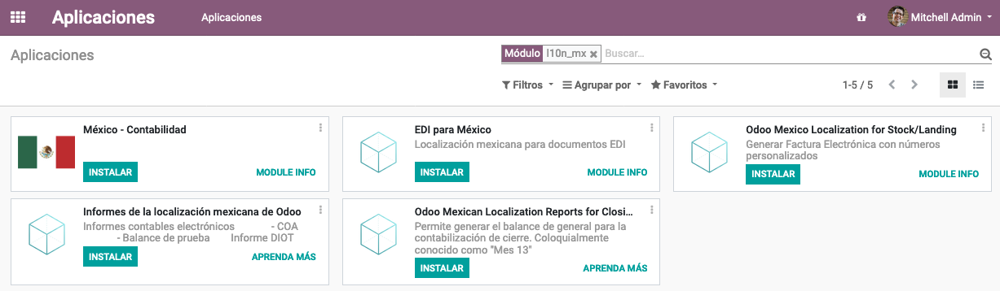

======
Mexico
======

.. note::
   This documentation is written assuming that you follow and know the official
   documentation regarding Invoicing, Sales and Accounting and that you have
   experience working with odoo on such areas, we are not intended to put
   here procedures that are already explained on those documents, just the
   information necessary to allow you use odoo in a Company with the country
   "Mexico" set.

Introduction
~~~~~~~~~~~~

The mexican localization is a group of 3 modules:

1. **l10n_mx:** All basic data to manage the accounting, taxes and the
   chart of account, this proposed chart of account installed is a intended
   copy of the list of group codes offered by the `SAT`_.
2. **l10n_mx_edi**: All regarding to electronic transactions, CFDI 3.2 and 3.3,
   payment complement, invoice addendum.
3. **l10n_mx_reports**: All mandatory electronic reports for electronic
   accounting are here (Accounting app required).

With the Mexican localization in Odoo you will be able not just to comply
with the required features by law in México but to use it as your
accounting and invoicing system due to all the set of normal requirements for
this market, becoming your Odoo in the perfect solution to administer your
company in Mexico.

Configuration
~~~~~~~~~~~~~

.. tip::
   After the configuration we will give you the process to test everything,
   try to follow step by step in order to allow you to avoid expend time on
   fix debugging problems. In any step you can recall the step and try again.

1. Install the Mexican Accounting Localization
----------------------------------------------

For this, go in Apps and search for Mexico. Then click on *Install*.

.. tip::
   When creating a database from www.odoo.com, if you choose Mexico
   as country when creating your account, the mexican localization will be
   automatically installed.

2. Electronic Invoices (CDFI 3.2 and 3.3 format)
------------------------------------------------

To enable this requirement in Mexico go to configuration in accounting Go in
:menuselection:`Accounting --> Settings` and enable the option on the image
with this you will be able to generate the signed invoice (CFDI 3.2 and 3.3)
and generate the payment complement signed as well (3.3 only) all fully
integrate with the normal invoicing flow in Odoo.

.. image:: media/mexico02.png
   :align: center

.. _mx-legal-info:

3. Set you legal information in the company
-------------------------------------------

First, make sure that your company is configured with the correct data.
Go in :menuselection:`Settings --> Users --> Companies`
and enter a valid address and VAT for
your company. Don’t forget to define a mexican fiscal position on your
company’s contact.

.. tip::
   If you want use the Mexican localization on test mode, you can put any known
   address inside Mexico with all fields for the company address and
   set the vat to **TCM970625MB1**.

.. image:: media/mexico03.png
   :align: center

4. Set the proper "Fiscal Position" on the partner that represent the company
-----------------------------------------------------------------------------

Go In the same form where you are editing the company save the record in
order to set this form as a readonly and on readonly view click on the partner
link, then edit it and set in the *Invoicing* tab the proper Fiscal Information
(for the **Test Environment** this must be *601 - General de Ley Personas
Morales*, just search it as a normal Odoo field if you can't see the option).

5. Enabling CFDI Version 3.3
----------------------------

.. warning::
   This steps are only necessary when you will enable the CFDI 3.3 (only available
   for V11.0 and above) if you do not have Version 11.0 or above on your
   SaaS instance please ask for an upgrade sending a ticket to support in
   https://www.odoo.com/help.

Enable debug mode:

.. image:: media/mexico10.png
   :align: center

Go and look the following technical parameter, on
:menuselection:`Settings --> Technical --> Parameters --> System Parameters`
and set the parameter called *l10n_mx_edi_cfdi_version* to 3.3 (Create it if
the entry with this name does not exist).

.. warning::
   The CFDI 3.2 will be legally possible until November 30th 2017 enable the
   3.3 version will be a mandatory step to comply with the new `SAT resolution`_
   in any new database created since v11.0 released CFDI 3.3 is the default
   behavior.

.. image:: media/mexico11.png
   :align: center

Important considerations when yo enable the CFDI 3.3
====================================================

Your tax which represent the VAT 16% and 0% must have the "Factor Type" field
set to "Tasa".

.. image:: media/mexico12.png
   :align: center
.. image:: media/mexico13.png
   :align: center

You must go to the Fiscal Position configuration and set the proper code (it is
the first 3 numbers in the name) for example for the test one you should set
601, it will look like the image.

.. image:: media/mexico14.png
   :align: center

All products must have for CFDI 3.3 the "SAT code" and the field "Reference"
properly set, you can export them and re import them to do it faster.

.. image:: media/mexico15.png
   :align: center

6. Configure the PAC in order to sign properly the invoices
-----------------------------------------------------------

To configure the EDI with the **PACs**, you can go in
:menuselection:`Accounting --> Settings --> Electronic Invoicing (MX)`.
You can choose a PAC within the **List of supported PACs** on the *PAC field*
and then enter your PAC username and PAC password.

.. warning::
   Remember you must sign up in the refereed PAC before hand, that process
   can be done with the PAC itself on this case we will have two
   (2) availables `Finkok`_ and `Solución Factible`_.

   You must process your **Private Key (CSD)** with the SAT institution before
   follow this steps, if you do not have such information please try all the
   "Steps for Test" and come back to this process when you finish the process
   proposed for the SAT in order to set this information for your production
   environment with real transactions.

.. image:: media/mexico04.png
   :align: center

.. tip::
   If you ticked the box *MX PAC test environment* there is no need
   to enter a PAC username or password.

.. tip::
   Here is a SAT certificate you can use if you want to use the *Test
   Environment* for the Mexican Accounting Localization.

   - `Certificate`_
   - `Certificate Key`_
   - **Password:** 12345678a

7. Configure the tag in sales taxes
-----------------------------------

This tag is used to set the tax type code, transferred or withhold, applicable
to the concept in the CFDI.
So, if the tax is a sale tax the "Tag" field should be "IVA", "ISR" or "IEPS".

Note that the default taxes already has a tag assigned, but when you create a
new tax you should choose a tag.

Usage and testing
~~~~~~~~~~~~~~~~~

Invoicing
---------

To use the mexican invoicing you just need to do a normal invoice following
the normal Odoo's behaviour.

Once you validate your first invoice a correctly signed invoice should look
like this:

.. image:: media/mexico07.png
   :align: center

You can generate the PDF just clicking on the Print button on the invoice or
sending it by email following the normal process on odoo to send your invoice
by email.

Once you send the electronic invoice by email this is the way it should looks
like.

.. image:: media/mexico09.png
   :align: center

Cancelling invoices
-------------------

The cancellation process is completely linked to the normal cancellation in Odoo.

If the invoice is not paid.

- Go to to the customer invoice journal where the invoice belong to

.. image:: media/mexico28.png
   :align: center

.. image:: media/mexico29.png
   :align: center

- Check the "Allow cancelling entries" field

.. image:: media/mexico29.png
   :align: center

- Go back to your invoice and click on the button "Cancel Invoice"

.. image:: media/mexico30.png
   :align: center

- For security reasons it is recommendable return the check on the to allow
  cancelling to false again, then go to the journal and un check such field.

**Legal considerations**

- A cancelled invoice will automatically cancelled on the SAT.
- If you retry to use the same invoice after cancelled, you will have as much
  cancelled CFDI as you tried, then all those xml are important to maintain a
  good control of the cancellation reasons.
- You must unlink all related payment done to an invoice on odoo before
  cancel such document, this payments must be cancelled to following the same
  approach but setting the "Allow Cancel Entries" in the payment itself.

Payments (Just available for CFDI 3.3)
--------------------------------------

To generate the payment complement you only need to follow the normal payment
process in Odoo, this considerations to understand the behavior are important.

1. To generate payment complement the payment term in the invoice must be
   PPD, because It is the expected behavior legally required for
   "Cash payment".

   **1.1. How can I generate an invoice with payment term `PUE`?**

   `According to the SAT documentation`_ a payment is classified as ``PUE`` if
   the invoice was agreed to be fully payed before the 17th of the next
   calendar month (the next month of the CFDI date), any other condition
   will generate a ``PPD`` invoice.

   **1.2. How can I get this with Odoo?**

   In order to set the appropriate CFDI payment term (PPD or PUE), you can
   easily set it by using the ``Payment Terms`` defined in the invoice.

   - If an invoice is generated without ``Payment Term`` the attribute
     ``MetodoPago`` will be ``PUE``.

   - Today, if is the first day of the month and is generated an invoice with
     ``Payment Term`` ``30 Net Days`` the ``Due Date`` calculated is going to
     be the first day of the following month, this means its before the 17th
     of the next month, then the attribute ``MetodoPago`` will be ``PUE``.

   - Today, if an invoice is generated with ``Payment Term`` ``30 Net Days``
     and the ``Due Date`` is higher than the day 17 of the next month the
     ``MetodoPago`` will be ``PPD``.

   - If having a ``Payment Term`` with 2 lines or more, for example
     ``30% Advance End of Following Month``, this is an installments term,
     then the attribute ``MetodoPago`` will be ``PPD``.

2. To test a normal signed payment just create an invoice with payment term
   ``30% Advance End of Following Month`` and then register a payment to it.
3. You must print the payment in order to retrieve the PDF properly.
4. Regarding the "Payments in Advance" you must create a proper invoice with
   the payment in advance itself as a product line setting the proper SAT code
   following the procedure on the official documentation `given by the SAT`_
   in the section **Apéndice 2 Procedimiento para la emisión de los CFDI en el
   caso de anticipos recibidos**.
5. Related to topic 4 it is blocked the possibility to create a Customer
   Payment without a proper invoice.

Accounting
----------
The accounting for Mexico in odoo is composed by 3 reports:

1. Chart of Account (Called and shown as COA).
2. Electronic Trial Balance.
3. DIOT report.

1 and 2 are considered as the electronic accounting, and the DIOT is a report
only available on the context of the accounting.

You can find all those reports in the original report menu on Accounting app.

.. image:: media/mexico16.png
   :align: center

Electronic Accounting (Requires Accounting App)
===============================================

Electronic Chart of account CoA
-------------------------------

The electronic accounting never has been easier, just go to
:menuselection:`Accounting --> Reporting --> Mexico --> COA` and click on the
button **Export for SAT (XML)**

.. image:: media/mexico19.png
   :align: center

**How to add new accounts?**

If you add an account with the coding convention NNN.YY.ZZ where NNN.YY is a
SAT coding group then your account will be automatically configured.

Example to add an Account for a new Bank account go to
:menuselection:`Accounting --> Settings --> Chart of Account` and then create
a new account on the button "Create" and try to create an account with the
number 102.01.99 once you change to set the name you will see a tag
automatically set, the tags set are the one picked to be used in the COA on
xml.

.. image:: media/mexico20.png
   :align: center

**What is the meaning of the tag?**

To know all possible tags you can read the `Anexo 24`_ in the SAT
website on the section called **Código agrupador de cuentas del SAT**.

.. tip::
   When you install the module l10n_mx and yous Chart of Account rely on it
   (this happen automatically when you install setting Mexico as country on
   your database) then you will have the more common tags if the tag you need
   is not created you can create one on the fly.

Electronic Trial Balance
------------------------

Exactly as the COA but with Initial balance debit and credit, once you have
your coa properly set you can go to :menuselection:`Accounting --> Reports --> Mexico --> Trial Balance`
this is automatically generated, and can be exported to XML using the button
in the top  **Export for SAT (XML)** with the previous selection of the
period you want to export.

.. image:: media/mexico21.png
   :align: center

All the normal auditory and analysis features are available here also as any
regular Odoo Report.

DIOT Report (Requires Accounting App)
=====================================

**What is the DIOT and the importance of presenting it SAT**

When it comes to procedures with the SAT Administration Service we know that
we should not neglect what we present. So that things should not happen in Odoo.

The DIOT is the Informational Statement of Operations with Third Parties (DIOT),
which is an an additional obligation with the VAT, where we must give the status
of our operations to third parties, or what is considered the same, with our
providers.

This applies both to individuals and to the moral as well, so if we have VAT
for submitting to the SAT and also dealing with suppliers it is necessary to.
submit the DIOT:

**When to file the DIOT and in what format?**

It is simple to present the DIOT, since like all format this you can obtain
it in the page of the SAT, it is the electronic format A-29 that you can find
in the SAT website.

Every month if you have operations with third parties it is necessary to
present the DIOT, just as we do with VAT, so that if in January we have deals
with suppliers, by February we must present the information pertinent to
said data.

**Where the DIOT is presented?**

You can present DIOT in different ways, it is up to you which one you will
choose and which will be more comfortable for you than you will present every
month or every time you have dealings with suppliers.

The A-29 format is electronic so you can present it on the SAT page, but this
after having made up to 500 records.

Once these 500 records are entered in the SAT, you must present them to the
Local Taxpayer Services Administration (ALSC) with correspondence to your tax
address, these records can be presented in a digital storage medium such as a
CD or USB, which once validated you will be returned, so do not doubt that you
will still have these records and of course, your CD or USB.

**One more fact to know: the Batch load?**

When reviewing the official SAT documents on DIOT, you will find the Batch
load, and of course the first thing we think is what is that ?, and according
to the SAT site is:

The "batch upload" is the conversion of records databases of transactions with
suppliers made by taxpayers in text files (.txt). These files have the
necessary structure for their application and importation into the system of
the Informative Declaration of Operations with third parties, avoiding the
direct capture and consequently, optimizing the time invested in its
integration for the presentation in time and form to the SAT.

You can use it to present the DIOT, since it is allowed, which will make this
operation easier for you, so that it does not exist to avoid being in line
with the SAT in regard to the Information Statement of Operations with
Third Parties.

You can find the `official information here`_.

**How Generate this report in odoo?**

- Go to  :menuselection:`Accounting --> Reports --> Mexico --> Transactions with third partied (DIOT)`.

- A report view is shown, select last month to report the immediate before
  month you are or left the current month if it suits to you.

.. image:: media/mexico25.png
   :align: center

- Click on "Export (TXT).

.. image:: media/mexico24.png
   :align: center

- Save in a secure place the downloaded file and go to SAT website and follow
  the necessary steps to declare it.

Important considerations on your Supplier and Invice data for the DIOT
======================================================================

- All suppliers must have set the fields on the accounting tab called "DIOT
  Information", the *L10N Mx Nationality* field is filled with just select the
  proper country in the address, you do not need to do anything else there, but
  the *L10N Mx Type Of Operation* must be filled by you in all your suppliers.

- There are 3 options of VAT for this report, 16%, 0% and exempt, an invoice
  line in odoo is considered exempt if no tax on it, the other 2 taxes are
  properly configured already.
- Remember to pay an invoice which represent a payment in advance you must
  ask for the invoice first and then pay it and reconcile properly the payment
  following standard odoo procedure.
- You do not need all you data on partners filled to try to generate the
  supplier invoice, you can fix this information when you generate the report
  itself.
- Remember this report only shows the Supplier Invoices that were actually paid.

If some of this considerations are not taken into account a message like this
will appear when generate the DIOT on TXT with all the partners you need to
check on this particular report, this is the reason we recommend use this
report not just to export your legal obligation but to generate it before
the end of the month and use it as your auditory process to see all your
partners are correctly set.

.. image:: media/mexico26.png
   :align: center

Extra Recommended features
~~~~~~~~~~~~~~~~~~~~~~~~~~

Contact Module (Free)
---------------------

If you want to administer properly your customers, suppliers and addresses
this module even if it is not a technical need, it is highly recommended to
install.

Multi currency (Requires Accounting App)
----------------------------------------

In Mexico almost all companies send and receive payments in different
currencies if you want to manage such capability you should enable the multi
currency feature and you should enable the synchronization with **Banxico**,
such feature allow you retrieve the proper exchange rate automatically
retrieved from SAT and not being worried of put such information daily in the
system manually.

Go to settings and enable the multi currency feature.

.. image:: media/mexico17.png
   :align: center

Enabling Explicit errors on the CFDI using the XSD local validator (CFDI 3.3)
-----------------------------------------------------------------------------

Frequently you want receive explicit errors from the fields incorrectly set
on the xml, those errors are better informed to the user if the check is
enable, to enable the Check with xsd feature follow the next steps (with
debug mode enabled).

- Go to :menuselection:`Settings --> Technical --> Actions --> Server Actions`
- Look for the Action called "Download XSD files to CFDI"
- Click on button "Create Contextual Action"
- Go to the company form :menuselection:`Settings --> Users&Companies --> Companies`
- Open any company you have.
- Click on "Action" and then on "Download XSD file to CFDI".

.. image:: media/mexico18.png
   :align: center

Now you can make an invoice with any error (for example a product without
code which is pretty common) and an explicit error will be shown instead a
generic one with no explanation.

.. note::
   If you see an error like this:

     The cfdi generated is not valid

     attribute decl. 'TipoRelacion', attribute 'type': The QName value
     '{http://www.sat.gob.mx/sitio_internet/cfd/catalogos}c_TipoRelacion' does
     not resolve to a(n) simple type definition., line 36

   This can be caused because of a database backup restored in anothe server,
   or when the XSD files are not correctly downloaded. Follow the same steps
   as above but:

   - Go to the company in which the error occurs.
   - Click on "Action" and then on "Download XSD file to CFDI".

FAQ
~~~

- **Error message** (Only applicable on CFDI 3.3):

:9:0:ERROR:SCHEMASV:SCHEMAV_CVC_MINLENGTH_VALID: Element '{http://www.sat.gob.mx/cfd/3}Concepto', attribute 'NoIdentificacion': [facet 'minLength'] The value '' has a length of '0'; this underruns the allowed minimum length of '1'.

:9:0:ERROR:SCHEMASV:SCHEMAV_CVC_PATTERN_VALID: Element '{http://www.sat.gob.mx/cfd/3}Concepto', attribute 'NoIdentificacion': [facet 'pattern'] The value '' is not accepted by the pattern '[^|]{1,100}'.

.. tip::
   **Solution:** You forget to set the proper "Reference" field in the product,
   please go to the product form and set your internal reference properly.

- **Error message**:

:6:0:ERROR:SCHEMASV:SCHEMAV_CVC_COMPLEX_TYPE_4: Element '{http://www.sat.gob.mx/cfd/3}RegimenFiscal': The attribute 'Regimen' is required but missing.

:5:0:ERROR:SCHEMASV:SCHEMAV_CVC_COMPLEX_TYPE_4: Element '{http://www.sat.gob.mx/cfd/3}Emisor': The attribute 'RegimenFiscal' is required but missing.

.. tip::
   **Solution:** You forget to set the proper "Fiscal Position" on the
   partner of the company, go to customers, remove the customer filter and
   look for the partner called as your company and set the proper fiscal
   position which is the kind of business you company does related to SAT
   list of possible values, antoher option can be that you forgot follow the
   considerations about fiscal positions.

   Yo must go to the Fiscal Position configuration and set the proper code (it is
   the first 3 numbers in the name) for example for the test one you should set
   601, it will look like the image.

.. image:: media/mexico27.png
   :align: center

.. tip::
   For testing purposes this value must be *601 - General de Ley Personas Morales*
   which is the one required for the demo VAT.

- **Error message**:

:2:0:ERROR:SCHEMASV:SCHEMAV_CVC_ENUMERATION_VALID: Element '{http://www.sat.gob.mx/cfd/3}Comprobante', attribute 'FormaPago': [facet 'enumeration'] The value '' is not an element of the set {'01', '02', '03', '04', '05', '06', '08', '12', '13', '14', '15', '17', '23', '24', '25', '26', '27', '28', '29', '30', '99'}

.. tip::
   **Solution:** The payment method is required on your invoice.

.. image:: media/mexico31.png
   :align: center

- **Error message**:

:2:0:ERROR:SCHEMASV:SCHEMAV_CVC_ENUMERATION_VALID: Element '{http://www.sat.gob.mx/cfd/3}Comprobante', attribute 'LugarExpedicion': [facet 'enumeration'] The value '' is not an element of the set {'00
:2:0:ERROR:SCHEMASV:SCHEMAV_CVC_DATATYPE_VALID_1_2_1: Element '{http://www.sat.gob.mx/cfd/3}Comprobante', attribute 'LugarExpedicion': '' is not a valid value of the atomic type '{http://www.sat.gob.mx/sitio_internet/cfd/catalogos}c_CodigoPostal'.
:5:0:ERROR:SCHEMASV:SCHEMAV_CVC_COMPLEX_TYPE_4: Element '{http://www.sat.gob.mx/cfd/3}Emisor': The attribute 'Rfc' is required but missing.

.. tip::
   **Solution:** You must set the address on your company properly, this is a
   mandatory group of fields, you can go to your company configuration on
   :menuselection:`Settings --> Users & Companies --> Companies` and fill
   all the required fields for your address following the step
   :ref:`mx-legal-info`.

- **Error message**:

:2:0:ERROR:SCHEMASV:SCHEMAV_CVC_DATATYPE_VALID_1_2_1: Element '{http://www.sat.gob.mx/cfd/3}Comprobante', attribute 'LugarExpedicion': '' is not a valid value of the atomic type '{http://www.sat.gob.mx/sitio_internet/cfd/catalogos}c_CodigoPostal'.

.. tip::
   **Solution:** The postal code on your company address is not a valid one
   for Mexico, fix it.

.. image:: media/mexico32.png
   :align: center

- **Error message**:

:18:0:ERROR:SCHEMASV:SCHEMAV_CVC_COMPLEX_TYPE_4: Element '{http://www.sat.gob.mx/cfd/3}Traslado': The attribute 'TipoFactor' is required but missing.
:34:0:ERROR:SCHEMASV:SCHEMAV_CVC_COMPLEX_TYPE_4: Element '{http://www.sat.gob.mx/cfd/3}Traslado': The attribute 'TipoFactor' is required but missing.", '')

.. tip::
   **Solution:** Set the mexican name for the tax 0% and 16% in your system
   and used on the invoice.

   Your tax which represent the VAT 16% and 0% must have the "Factor Type" field
   set to "Tasa".

.. image:: media/mexico12.png
   :align: center
.. image:: media/mexico13.png
   :align: center

.. _SAT: http://www.sat.gob.mx/fichas_tematicas/buzon_tributario/Documents/Anexo24_05012015.pdf
.. _Finkok: https://www.finkok.com/contacto.html
.. _`Solución Factible`: https://solucionfactible.com/sf/v3/timbrado.jsp
.. _`SAT resolution`: http://sat.gob.mx/informacion_fiscal/factura_electronica/Paginas/Anexo_20_version3.3.aspx
.. _`According to the SAT documentation`: https://www.sat.gob.mx/cs/Satellite?blobcol=urldata&blobkey=id&blobtable=MungoBlobs&blobwhere=1461173400586&ssbinary=true
.. _`given by the SAT`: http://sat.gob.mx/informacion_fiscal/factura_electronica/Documents/GuiaAnexo20DPA.pdf
.. _`Anexo 24`: http://www.sat.gob.mx/fichas_tematicas/buzon_tributario/Documents/Anexo24_05012015.pdf
.. _`official information here`: http://www.sat.gob.mx/fichas_tematicas/declaraciones_informativas/Paginas/declaracion_informativa_terceros.aspx
.. _`Certificate`: ../../_static/files/certificate.cer
.. _`Certificate Key`: ../../_static/files/certificate.key
