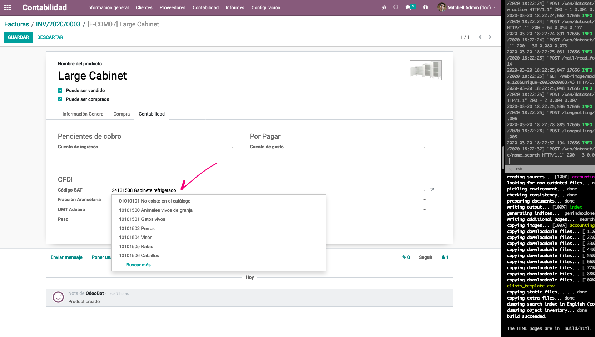
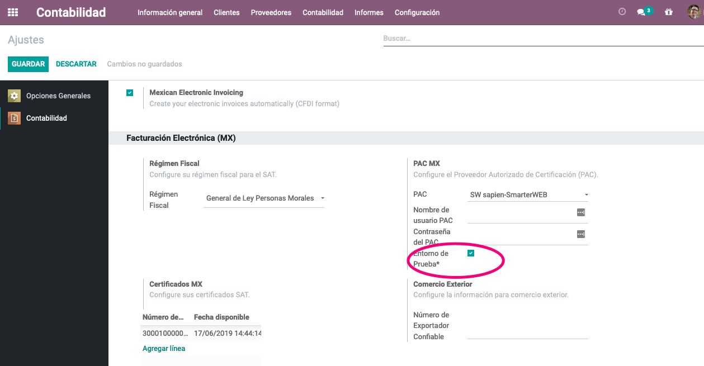

===================
Mexico Localization
===================

.. note::
   This documentation is written assuming that you follow and know the official
   documentation regarding Invoicing, Sales and Accounting and that you have
   experience working with odoo on such areas, we are not intended to put
   here procedures that are already explained on those documents, just the
   information necessary to allow you use odoo in a Company with the country
   "México" set.

Introduction
~~~~~~~~~~~~

The mexican localization is a group of 3 modules:

1. **l10n_mx:** All the basic data to manage the accounting, taxes and the
   chart of account, this proposed chart of account installed is a intended
   copy of the list of group codes offered by the `SAT`_.
2. **l10n_mx_edi**: All regarding to electronic transactions, CFDI 3.2 and 3.3,
   payment complement, invoice addendum.
3. **l10n_mx_reports**: All mandatory electronic reports for electronic
   accounting are here (Accounting app required).

With the Mexican localization in Odoo you will be able not just to comply
with the required features by law in México but to use it as your
accounting and invoicing system due to all the set of normal requirements for
this market, becoming your Odoo in the perfect solution to administer your
company in México.

Configuration 
~~~~~~~~~~~~~

.. tip::
   After the configuration we will give you the process to test everything,
   try to follow step by step in order to allow you to avoid expend time on
   fix debugging problems. In any step you can recall the step and try again.

1. Install the Mexican Accounting Localization.
-----------------------------------------------

For this, go in Apps and search for Mexico. Then click on *Install*.

.. image:: media/mexico01.png
   :align: center

.. tip::
   When creating a database from www.odoo.com, if you choose Mexico
   as country when creating your account, the mexican localization will be
   automatically installed.

2. Electronic Invoices (CDFI 3.2 and 3.3 format)
------------------------------------------------

To enable this requirement in Mexico go to configuration in accounting Go in
:menuselection:`Accounting --> Settings` and enable the option on the image
with this you will be able to generate the signed invoice (CFDI 3.2 and 3.3)
and generate the payment complement signed as well (3.3 only) all fully
integrate with the normal invoicing flow in Odoo.

.. image:: media/mexico02.png
   :align: center

3. Set you legal information in the company
-------------------------------------------

First, make sure that your company is configured with the correct data.
Go in :menuselection:`Settings --> Users --> Companies`
and enter a valid address and VAT for
your company. Don’t forget to define a mexican fiscal position on your
company’s contact.

.. tip::
   If you want use the Mexican localization on test mode, you can put any known
   address inside Mexico with all fields for the company address and
   set the vat to **ACO560518KW7**.

.. image:: media/mexico03.png
   :align: center

4. Set the proper "Fiscal Position" on the partner that represent the company.
------------------------------------------------------------------------------

Go In the same form where you are editing the company save the record in
order to set this form as a readonly and on readonly view click on the partner
link, then edit it and set in the *Invoicing* tab the proper Fiscal Information
(for the **Test Environment** this must be *601 - General de Ley Personas
Morales*, just search it as a normal Odoo field if you can't see the option).

5. Enabling CFDI Version 3.3
----------------------------

.. warning::
   This steps are only necessary when you will enable the CFDI 3.3 (only available
   for V11.0 and above) if you do not have Version 11.0 or above on your
   SaaS instance please ask for an upgrade sending a ticket to support in
   https://www.odoo.com/help.

Enable debug mode:

.. image:: media/mexico10.png
   :align: center

Go and look the following technical parameter, on
:menuselection:`Settings --> Technical --> Parameters --> System Parameters`
and set the parameter called *l10n_mx_edi_cfdi_version* to 3.3 (Create it if
the entry with this name does not exist).

.. warning::
   The CFDI 3.2 will be legally possible until November 30th 2017 enable the
   3.3 version will be a mandatory step to comply with the new `SAT resolution`_.

.. image:: media/mexico11.png
   :align: center

Important considerations when yo enable the CFDI 3.3
====================================================

Your tax which represent the VAT 16% and 0% must have the "Factor Type" field
set to "Tasa".

.. image:: media/mexico12.png
   :align: center
.. image:: media/mexico13.png
   :align: center

Yo must go to the Fiscal Position configuration and set the proper code (it is
the first 3 numbers in the name) for example for the test one you should set
601, it will look like the image.

.. image:: media/mexico14.png
   :align: center

All products must have for CFDI 3.3 the "SAT code" and the field "Reference"
properly set, you can export them and re import them to do it faster.

.. image:: media/mexico15.png
   :align: center

6. Configure the PAC in order to sign properly the invoices
-----------------------------------------------------------

To configure the EDI with the **PACs**, you can go in
:menuselection:`Accounting --> Settings --> Electronic Invoicing (MX)`.
You can choose a PAC within the **List of supported PACs** on the *PAC field*
and then enter your PAC username and PAC password.

.. warning::
   Remember you must sign up in the refereed PAC before hand, that process
   can be done with the PAC itself on this case we will have two
   (2) availables `Finkok`_ and `Solución Factible`_.

   You must process your **Private Key (CSD)** with the SAT institution before
   follow this steps, if you do not have such information please try all the
   "Steps for Test" and come back to this process when you finish the process
   proposed for the SAT in order to set this information for your production
   environment with real transactions.

.. tip::
   If you ticked the box *MX PAC test environment* there is no need
   to enter a PAC username or password.

You then have to enter your **Private Key (CSD)**. You will have to
upload your certificate and key file and then type your certificate password
(this password is given by the SAT).

.. image:: media/mexico05.png
   :align: center

.. |download_mexico_certificate_cer| image:: ../../_static/banners/download-icon.png
      :alt: Certificate
      :target: ../../_static/files/certificate.cer

.. |download_mexico_certificate_key| image:: ../../_static/banners/download-icon.png
      :alt: Certificate Key
      :target: ../../_static/files/certificate.key

.. tip::
   Here is a SAT certificate you can use if you want to use the *Test
   Environment* for the Mexican Accounting Localization.

   - :ref:`Certificate:` |download_mexico_certificate_cer|
   - :ref:`Certificate Key:` |download_mexico_certificate_key|
   - Certificate password : 12345678a

Usage and testing
~~~~~~~~~~~~~~~~~

Invoicing
---------

To use the mexican invoicing you just need to do a normal invoice following
the normal Odoo's behaviour.

Once you validate your first invoice a correctly signed invoice should look
like this:

You can generate the PDF just clicking on the Print button on he invoice or
sending it by email following the normal process on odoo to send your invoice
by email.

.. image:: media/mexico08.png
   :align: center

Once you send the electronic invoice by email this is the way it should looks
like.

Cancelling invoices
-------------------

TODO

Payments (Just available for CFDI 3.3)
--------------------------------------

To generate the payment complement you just must to follow the normal payment
process in Odoo, this considerations to understand the behavior are important.

1. All payment done in the same day of the invoice will be considered as It
   will not be signed, because It is the expected behavior legally required
   for "Cash payment".
2. To test a regular signed payment just create an invoice for the day before
   today and then pay it today.
3. You must print the payment in order to retrieve the PDF properly.
4. Regarding the "Payments in Advance" you must create a proper invoice with
   the payment in advance itself as a product line setting the proper SAT code
   following the procedure on the official documentation `given by the SAT`_
   in the section **Apéndice 2 Procedimiento para la emisión de los CFDI en el
   caso de anticipos recibidos**.
5. Related to topic 4 it is blocked the possibility to create a Customer
   Payment without a proper invoice.

Accounting
----------
The accounting for Mexico in odoo is composed by 3 reports:

1. Chart of Account (Called and shown as COA).
2. Electronic Trial Balance.
3. DIOT report.

1 and 2 are considered as the electronic accounting, and the DIOT is a report
only available on the context of the accounting.

You can find all those reports in the original report menu on Accounting app.

.. image:: media/mexico16.png
   :align: center

Electronic Accounting (Requires Accounting App)
===============================================

Electronic Chart of account CoA
+++++++++++++++++++++++++++++++

The electronic accounting never has been easier, just go to
:menuselection:`Accounting --> Reporting --> Mexico --> COA` and click on the
 button **Export for SAT (XML)**

.. image:: media/mexico19.png
   :align: center

**How to add new accounts?**

If you add an account with the coding convention NNN.YY.ZZ where NNN.YY is a
SAT coding group then your account will be automatically configured.

Example to add an Account for a new Bank account go to
:menuselection:`Accounting --> Settings --> Chart of Account` and then create
a new account on the button "Create" and try to create an account with the
number 102.01.99 once you change to set the name you will see a tag
automatically set, the tags set are the one picked to be used in the COA on
xml.

.. image:: media/mexico20.png
   :align: center

**What is the meaning of the tag?**

To know all possible tags you can read the `Anexo 24`_ in the SAT
website on the section called **Código agrupador de cuentas del SAT**.

.. tip::
   When you install the module l10n_mx and yous Chart of Account rely on it
   (this happen automatically when you install setting Mexico as country on
   your database) then you will have the more common tags if the tag you need
   is not created you can create one on the fly.

Electronic Trial Balance
++++++++++++++++++++++++

Exactly as the COA but with Initial balance debit and credit, once you have
your coa properly set you can go to :menuselection:`Accounting --> Reports --> Mexico --> Trial Balance`
this is automatically generated, and can be exported to XML using the button
in the top  **Export for SAT (XML)** with the previous selection of the
period you want to export.

.. image:: media/mexico21.png
   :align: center

All the normal auditory and analysis features are available here also as any
regular Odoo Report.

DIOT Report (Requires Accounting App)
=====================================

TODO

Extra Recommended features
~~~~~~~~~~~~~~~~~~~~~~~~~~

Contact Module (Free)
---------------------

If you want to administer properly your customers, suppliers and addresses
this module even if it is not a technical need, it is highly recommended to
install.

Multi currency (Requires Accounting App)
----------------------------------------

In Mexico almost all companies send and receive payments in different
currencies if you want to manage such capability you should enable the multi
currency feature and you should enable the synchronization with **Banxico**,
such feature allow you retrieve the proper exchange rate automatically
retrieved from SAT and not being worried of put such information daily in the
system manually.

Go to settings and enable the multi currency feature.

.. image:: media/mexico17.png
   :align: center

Enabling Explicit errors on the CFDI using the XSD local validator (CFDI 3.3)
-----------------------------------------------------------------------------

Frequently you want receive explicit errors from the fields incorrectly set
on the xml, those errors are better informed to the user if the check is
enable, to enable the Check with xsd feature follow the next steps (with
debug mode enabled).

- Go to :menuselection:`Settings --> Technical --> Actions --> Server Actions`
- Look for the Action called "Download XSD files to CFDI"
- Click on button "Create Contextual Action"
- Go to the company form :menuselection:`Settings --> Users&Companies --> Companies`
- Open any company you have.
- Click on "Action" and then on "Dowload XSD file to CFDI".

.. image:: media/mexico18.png
   :align: center

Now you can make an invoice with any error (for example a product without
code which is pretty common) and an explicit error will be shown instead a
generic one with no explanation.

FAQ
~~~

1. Error message (Only applicable on CFDI 3.3):

   (":9:0:ERROR:SCHEMASV:SCHEMAV_CVC_MINLENGTH_VALID: Element '{http://www.sat.gob.mx/cfd/3}Concepto', attribute 'NoIdentificacion': [facet 'minLength'] The value '' has a length of '0'; this underruns the allowed minimum length of '1'.

   **Solution:** You forget to set the proper "Reference" field in the product,
   please go to the product form and set your internal reference properly.

.. _SAT: http://www.sat.gob.mx/fichas_tematicas/buzon_tributario/Documents/Anexo24_05012015.pdf
.. _Finkok: https://facturacion.finkok.com/cuentas/registrar/
.. _`Solución Factible`: https://solucionfactible.com/sf/v3/timbrado.jsp
.. _`SAT resolution`: http://sat.gob.mx/informacion_fiscal/factura_electronica/Paginas/Anexo_20_version3.3.aspx
.. _`given by the SAT`: http://sat.gob.mx/informacion_fiscal/factura_electronica/Documents/GuiaAnexo20DPA.pdf
.. _`Anexo 24`: http://www.sat.gob.mx/fichas_tematicas/buzon_tributario/Documents/Anexo24_05012015.pdf