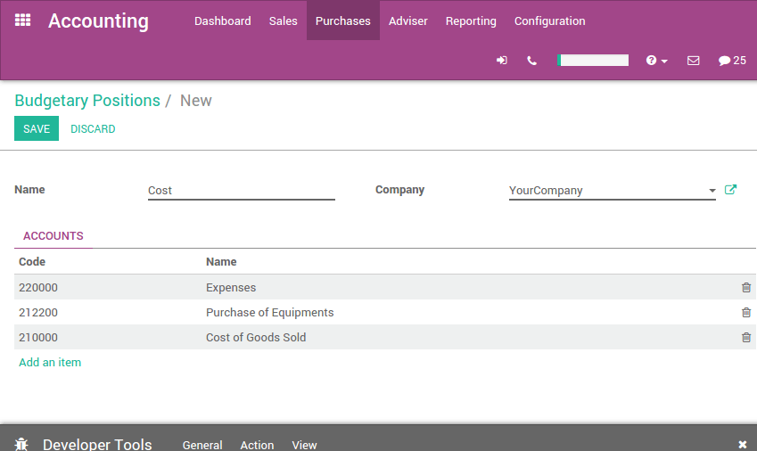
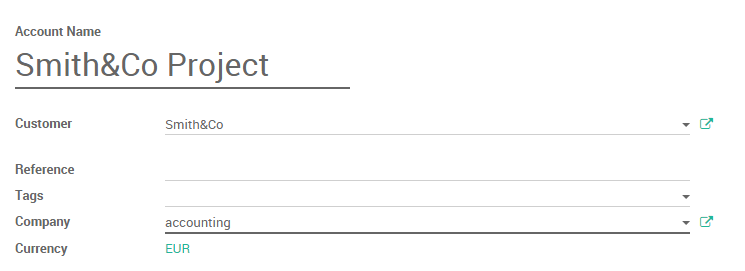
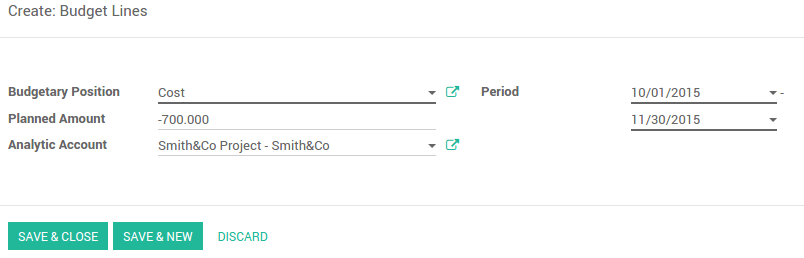

=================================
How to manage a financial budget?
=================================

Overview
========

Managing budgets is an essential part of running a business. Budgets help
people become more intentional with the way money is spent and direct people
to organize and prioritize their work to meet financial goals. They allows 
you to plan your desired financial outcome and then measure your actual 
performance against the plan. Odoo manages budgets using both General and Analytic 
Accounts.

We will use the following example to illustrate. We just started a
project with Smith&Co and we would like to budget the incomes and
expenses of that project. We plan to have a revenue of 1000 and we don't
want to spend more than 700.

Configuration 
=============

First we need to install the relevant apps to use budgeting. The main
module is the accounting app. Go in the app module and install the
**Accounting and Finance** app.

.. image:: media/budget01.png
   :align: center

Further configuration is as well necessary. Go to :menuselection:`Accounting
module --> Configuration --> Settings` and enable the **Budget
management** feature

.. image:: media/budget02.png
   :align: center

Budgetary Positions
-------------------

Budgetary positions are lists of accounts for which you want to keep
budgets (typically expense or income accounts). They need to be defined
so Odoo can know it which accounts he needs to go get the budget
information. 

The budgetary positions act as a type of restriction on what can be recorded
in the 'practical amount' column in a budget.

Each budgetary position can have any number of accounts from the general 
ledger (the main chart of accounts) assigned to it, though it must have at least one.  

If you record a transaction that has an analytic account assigned to it that *is* 
included in a budget line but one of the general ledger accounts *is not* included 
in the budgetary position for that same budget line, it will not appear within the 
'practical amount' column of that budget line.

Some budgetary positions might be already installed with your chart of
accounts.

To define the positions enter the :menuselection:`Accounting module --> Configuration -->
Budgetary Positions`.

For our example we need to define what accounts relates to our project's
expenses. Create a position and add items to select the accounts.

.. image:: media/budget03.png
   :align: center

In this case we select the three relevant accounts used wherein we will
book our expenses.

.. image:: media/budget04.png
   :align: center

Click on *Select*.

Save the changes to confirm your Budgetary position.

Repeat this steps to create a revenue budgetary position. Only in this
case select the relevant income accounts.

Analytical account
------------------

Odoo needs to know which costs or
expenses are relevant to a specified budget. To do so we need to link
our invoices and expenses to a defined analytical account. Create an
analytical account by entering the Accounting module and clicking
:menuselection:`Advisers --> Analytic Accounts --> Open Charts`. Create a new Account
called Smith&Co project and select the related partner.

Set a budget
============

Let's now set our targets for our budget. We specified that we expect to
gain 1000 with this project and we would like not to spend more than
700.

To set those targets, enter the accounting app, select :menuselection:`Advisers -->
Budgets` and create a new Budget.

We have to give a name to the budget. In this case we'll call it "Smith
Project". Select the period wherein the budget will be applicable. Next
add an item to specify your targets in the Budget Line.

.. image:: media/budget07.png
   :align: center

Select the Budgetary Position related to the Budget Line. In other
words, select the position that points to the accounts you want to
budget. In this case we will start with our 700 maximum charge target.
Select the "Cost" Budgetary Position and specify the Planned Amount.
As we are recording a cost, we need to specify a **negative amount**.
Finally, select the corresponding analytic account.

Click on **Save & new** to input the revenue budget. The Budgetary
Position is Revenue and the Planned Amount is 1000. Save and close

You'll need to **Confirm** and **Approve** the budget.

Check your budget
=================

You can check your budget at any time. To see the evolution, let's book
some Invoices and Vendors Bills.

.. tip::
	
	if you use analytical accounts remember that you need to specify the account in the invoice and / or purchase line.

.. seealso::

	for more information about booking invoices and purchase orders see:

	* :doc:`../../receivables/customer_invoices/overview`

Go back in the budget list and find the Smith Project.

Via the analytical account, Odoo can account the invoice lines and
purchase lines booked in the accounts and will display them in the
**Practical Amount** column.

.. image:: media/budget09.png
   :align: center

.. note::

	The theoretical amount represents the amount of money you theoretically could
	have spend / should have received in function of the date. When your budget
	is 1200 for 12 months (january to december), and today is 31 of january, the
	theoretical amount will be 1000, since this is the actual amount that could
	have been realised.

