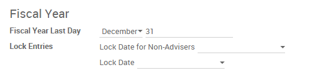

=====================================================
How to do a year end in Odoo? (close a fiscal year)
=====================================================

Before going ahead with closing a fiscal year, there are a few steps one
should typically take to ensure that your accounting is correct, up to
date, and accurate:

- Make sure you have fully reconciled your **bank account(s)** up to
  year end and confirm that your ending book balances agree with
  your bank statement balances.

-  Verify that all **customer invoices** have been entered and approved.

-  Confirm that you have entered and agreed all **vendor bills**.

-  Validate all **expenses**, ensuring their accuracy.

- Corroborate that all **received payments** have been entered and
  recorded accurately.

Year-end checklist
==================

- Run a **Tax report**, and verify that your tax information is correct.

- Reconcile all accounts on your **Balance Sheet**:

  - Agree your bank balances in Odoo against your actual bank balances
    on your statements. Utilize the **Bank Reconciliation** report to
    assist with this.

  - Reconcile all transactions in your cash and bank accounts by
    running your **Aged Receivables** and **Aged Payables** reports.

  - Audit your accounts, being sure to fully understand the
    transactions affecting them and the nature of the
    transactions, making sure to include loans and fixed assets.

- Run the optional **Payments Matching** feature, under the **More**
  dropdown on the dashboard, validating any open **Vendor Bills** and
  **Customer Invoices** with their payments. This step is optional,
  however it may assist the year-end process if all outstanding
  payments and invoices are reconciled, and could lead finding
  errors or mistakes in the system.

- Your accountant/bookkeeper will likely verify your balance sheet
  items and book entries for:

  - Year-end manual adjustments, using the **Adviser Journal Entries**
    menu (For example, the **Current Year Earnings** and **Retained
    Earnings** reports).

  - **Work in Progress**.

  - **Depreciation Journal Entries**.

  - **Loans**.

  - **Tax adjustments**.

If your accountant/bookkeeper is going through end of the year auditing,
they may want to have paper copies of all balance sheet items (such as
loans, bank accounts, prepayments, sales tax statements, etc...) to
agree these against your Odoo balances.

During this process, it is good practice to set the **Lock date for
Non-Advisers** to the last day of the preceding financial year, which is
set under the accounting configuration. This way, the accountant can be
confident that nobody is changing the previous year transactions
while auditing the books.

Closing the fiscal year
=======================

In Odoo there is no need to do a specific year end closing entry in order to
close out income statement accounts. The reports are created in
real-time, meaning that the **Income statement** corresponds directly with
the year-end date you specify in Odoo. Therefore, any time you generate
the **Income Statement**, the beginning date will correspond with the
beginning of the **Fiscal Year** and the account balances will all be 0.

Once the accountant/bookkeeper has created the journal entry to allocate
the **Current Year Earnings**, you should set the **Lock Date** to the last day
of the fiscal year. Making sure that before doing so, you confirm
whether or not the current year earnings in the **Balance Sheet** is
correctly reporting a 0 balance.

.. seealso::
  * :doc:`../configuration/fiscal_year`