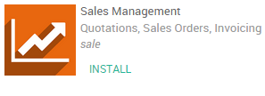
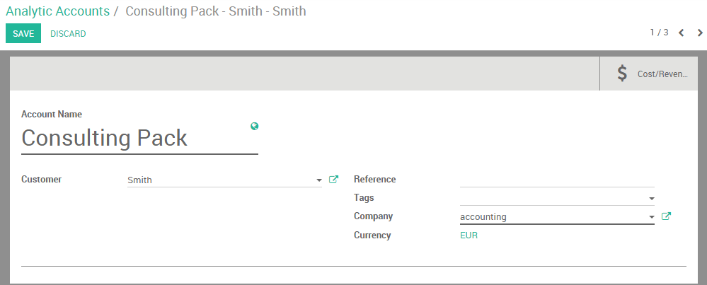

==========================================================
How to track costs of purchases, expenses, subcontracting?
==========================================================

Overview
========

Thanks to analytical accounting we can track costs of purchases,
expenses and subcontracting in the accounting module.

We'll take the following example. We sold a consulting package for a
customer. The package is all inclusive meaning no extra cost can be
added. We would however like to follow which cost were attached to this
transaction as we need to pay for purchases, expenses, and
subcontracting costs related to the project.

Configuration
=============

The following modules needs to be installed to track cost. Enter the app
module and install the following apps:

+---------------------------------+---------------------------------+---------------------------------+
| .. image:: media/purchase01.png | .. image:: media/purchase02.png | .. image:: media/purchase03.png |
+=================================+=================================+=================================+
+---------------------------------+---------------------------------+---------------------------------+

Please note that the applications provided by these apps only allows us
to **track** the costs. We won't be able to automatically re invoice
those costs to our customers. To track and **re invoice costs** you
should install the Sales management app as well.

Enable Analytical accounting
----------------------------

Next step is to activate the analytical accounting. In the accounting
app, select :menuselection:`Configuration --> Settings` and thick the Analytic
accounting box.

.. image:: media/purchase05.png
   :align: center

Moreover, scroll down and tick the **Analytic accounting for purchases**
box.

.. image:: media/purchase06.png
   :align: center

Don't forget to save your changes.

Create an Analytical account.
=============================

First of all you should create an Analytical account on which you can
point all your expenses. Enter the accounting app, select
:menuselection:`Configuration --> Analytic Accounts`. Create a new one. In this
case we will call it "consulting pack" for our customer Smith&Co.

We will point all our costs to this account to keep track of them.

Record an expense
=================

We start by booking an expense. Our
IT technician had to take a train to go see our customer. He paid for
his ticket himself.

Create an expense product
-------------------------

We first need to create an expense product. Enter the **Expense** module,
Click on :menuselection:`Configuration --> Expense Products`. Create a new product
called Train ticket and set the cost price to 15.50 euros. Make sure the **Can be
expensed** box is ticked.

.. image:: media/purchase08.png
   :align: center

Book the expense
----------------

Enter the Expense module, click on :menuselection:`My expenses --> Create`. Select the
Train ticket product and link it to the analytical account discussed
above.

.. image:: media/purchase09.png
   :align: center

Submit to manager and wait for the manager to approve and post the
journal entries.

Create a Purchase Order linked to the analytical account
========================================================

Purchase Product
----------------

We also need to buy a software for our customers. In the purchase app
create a purchase order for the software product.
Within the line we can link the product's cost with the analytical
account. Specify the order line and select the correct analytical
account. Confirm the sale.

.. image:: media/purchase10.png
   :align: center

Accept the delivery and enter the invoice. Once the invoice is entered the cost
price (**Vendor Price** field) will be booked in the analytical account.

Subcontracting
--------------

The purchase module can be used in the same way as seen previously to
handle subcontracting. if we purchase a service from another company we
can re invoice this cost by linking the purchase order line to the
correct analytical account. We simply need to create the correct vendors
product.

.. note::

	You can also track cost with timesheets, see: :doc:`timesheets`

Track costs in accounting
=========================

Now that everything is booked and points to the analytical account.
Simply open it to check the costs related to that account.

Enter the accounting module, click on :menuselection:`Advisers --> Analytic Accounts
--> Open Charts`.

Select "consulting pack - Smith" and click on the cost and revenue
button to have an overview of all cost linked to the account.

.. image:: media/purchase11.png
   :align: center

.. note::

	If you would like to have the revenue as well you should
	invoice the Consulting Pack in the Invoice menu and link the invoice
	line to this same analytical account.
