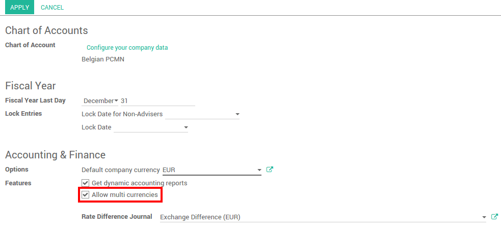
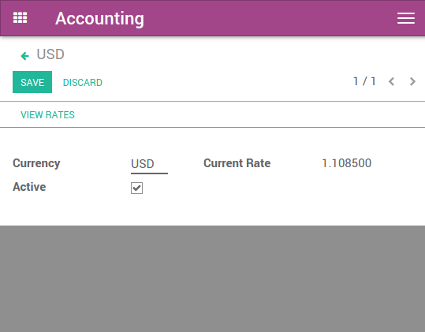
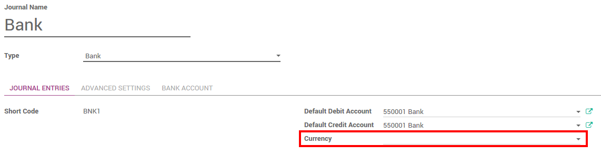

=================================
Record exchange rates at payments
=================================

Overview
========

Any company doing international trade faces the case where the payments
are in a different currency.

After receiving their payments, you have the option to convert the
amount into your company currency. Multi currency payment implies rates
fluctuations. The rate differences are automatically recorded by Odoo.

Configuration
=============

Enable multi-currencies
-----------------------

In the accounting module, Go to :menuselection:`Configuration --> Settings` 
and flag **Allow multi currencies**, then click on **apply**.

Configure the currency rates in :menuselection:`Configuration --> Currencies`.
Write down the rate and make sure the currency is active.

In this document, the base currency is **Euro** and we will record payments
in **Dollars**.

.. image:: media/exchange_rate08.png
   :align: center

.. tip:: 
    You can automatically fetch the currency rates from the **European
    Central Bank** or from **Yahoo**. Please read the document : 
    :doc:`how_it_works`.

Configure your journal
----------------------

In order to register payments in other currencies, you have to **remove
the currency constraint** on the journal. Go to the accounting
application, Click on **More** on the journal and **Settings**.

.. image:: media/exchange_rate06.png
   :align: center

Check if the **Currency** field is empty or in the foreign currency in which
you will register the payments. If a currency is filled in, it means
that you can register payments only in this currency.

Record a payment in a different currency
========================================

In the **Accounting** application, go to :menuselection:`Sales --> Payments`. 
Register the payment and indicate that it was done in the foreign currency. Then
click on **confirm**.

.. image:: media/exchange_rate05.png
   :align: center

The journal entry has been posted but not allocated.

Go back to your invoice (:menuselection:`Sales --> Customer Invoices`) and click on
**Add** to allocate the payment.

.. image:: media/exchange_rate04.png
   :align: center

Record a bank statement in a different currency
===============================================

Create or import the bank statement of your payment. The **Amount** is in
the company currency. There are two complementary fields, the **Amount currency**, 
which is the amount that was actually paid and the **Currency** in which it was paid.

.. image:: media/exchange_rate07.png
   :align: center

When reconciling it, Odoo will directly match the payment with the right
**Invoice**. You will get the invoice price in the invoice currency and the
amount in your company currency.

.. image:: media/exchange_rate09.png
   :align: center

Check the exchange rate differences
===================================

Go to :menuselection:`Adviser --> Journal Entries` and look for the **Exchange difference**
journal entries. All the exchange rates differences are recorded in it.

.. image:: media/exchange_rate01.png
   :align: center

.. tip::
    The Exchange difference journal can be changed in your accounting settings.

.. seealso::
    * :doc:`../../bank/reconciliation/configure`
    * :doc:`../../bank/reconciliation/use_cases`