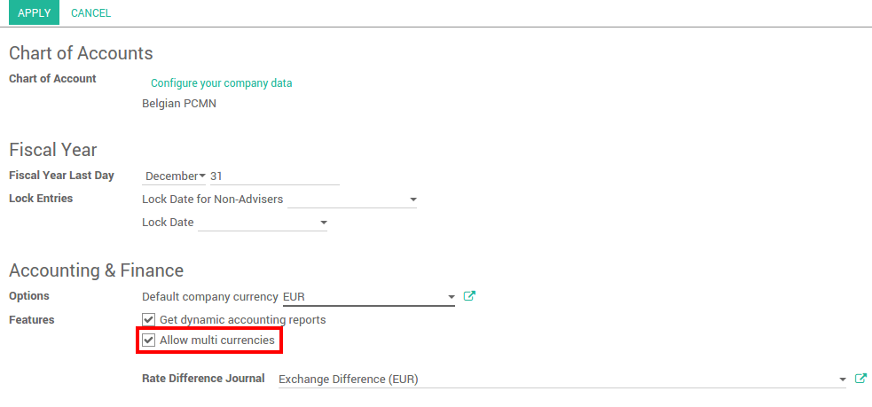
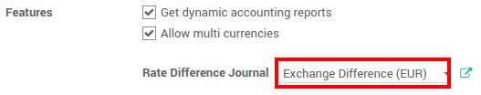
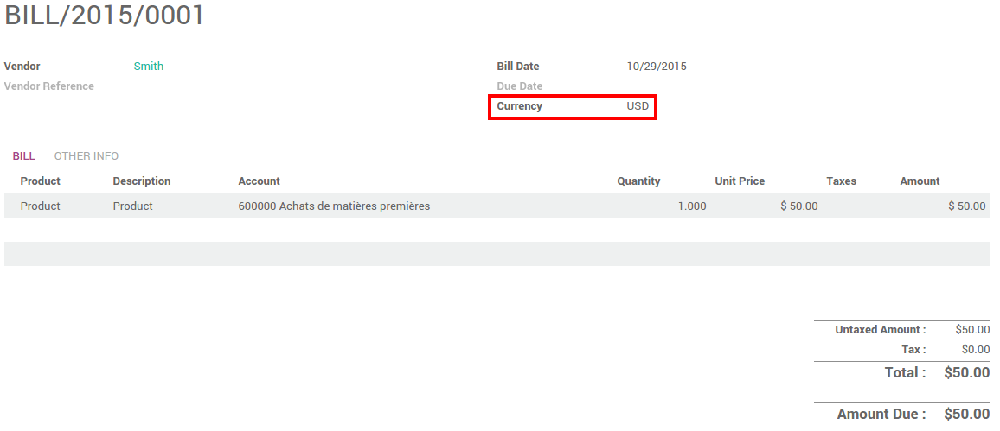
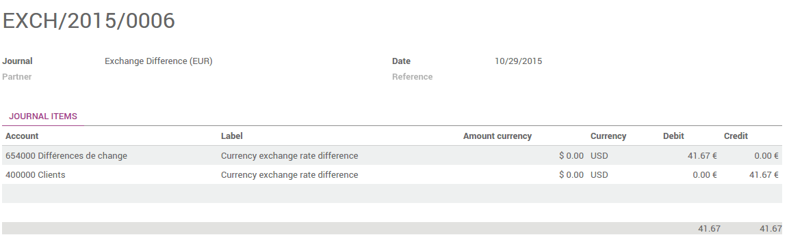

=====================================
How is Odoo's multi-currency working?
=====================================

Overview
========

Choosing to use the multi-currency option in Odoo will allow you to send
sales invoices, quotes and purchase orders or receive bills and payments
in currencies other than your own. With multi-currency, you can also set
up bank accounts in other currencies and run reports on your foreign
currency activities.

Configuration
=============

Turn on multi-currency
----------------------

In the accounting module, Go to :menuselection:`Configuration --> Settings` and flag
**Allow multi currencies**, then click on **Apply**.

Exchange Rate Journal
---------------------

The **Rate Difference Journal** records the differences between the payment
registration and the expected amount. For example, if a payment is paid
1 month after the invoice was issued, the exchange rate has probably
changed. The fluctuation implies some loss or profit that are recorded
by Odoo.

You can change it in the settings:

View or edit rate being used
----------------------------

You can manually configure the currency rates in :menuselection:`Configuration -->
Currencies`. Open the currencies you want to use in Odoo and edit it.
Make sure the currency is active.

.. image:: media/works03.png
   :align: center

Click on **View Rates** to edit it and to see the history :

.. image:: media/works04.png
   :align: center

Click on **Create** to add the rate. Fill in the date and the rate.
Click on **Save** when you are done.

.. image:: media/works05.png
   :align: center

Live Currency Rate
------------------

By default, the currencies need to be updated manually. But you can
synchronize it with `Yahoo <https://finance.yahoo.com/currency-converter/>`__ or
the `European Central Bank <http://www.ecb.europa.eu>`__. In 
:menuselection:`Configuration --> Settings`, go to the **Live Currency Rate** section.

Choose the interval : Manually, Daily, Weekly or Monthly. You can always
force the update by clicking on **Update Now**. Select the provider, and you
are set !

.. image:: media/works06.png
   :align: center

.. note::

	Only the **active** currencies are updated

Configure your charts of account
--------------------------------

In the accounting application, go to :menuselection:`Adviser --> Charts of Accounts`.
On each account, you can set a currency. It will force all moves for
this account to have the account currency.

If you leave it empty, it means that it can handle all currencies that
are Active.

.. image:: media/works07.png
   :align: center

Configure your journals
-----------------------

In order to register payments in other currencies, you have to remove
the currency constraint on the journal. Go to the accounting
application, Click on **More** on the journal and **Settings**.

.. image:: media/works08.png
   :align: center

Check if the currency field is empty or in the foreign currency in which
you will register the payments. If a currency is filled in, it means
that you can register payments only in this currency.

.. image:: media/works09.png
   :align: center

How is Odoo's multi-currency working?
=====================================

Now that you are working in a multi-currency environment, all
accountable items will be linked to a currency, domestic or foreign.

Sales Orders and Invoices
-------------------------

You are now able to set a different currency than the company one on
your sale orders and on your invoices. The currency is set for the whole
document.

.. image:: media/works10.png
   :align: center

Purchases orders and Vendor Bills
---------------------------------

You are now able to set a different currency than the company one on
your purchase orders and on your vendor bills. The currency is set for
the whole document.

Payment Registrations
---------------------

In the accounting application, go to **Sales > Payments**. Register the
payment and set the currency.

.. image:: media/works12.png
   :align: center

Bank Statements
---------------

When creating or importing bank statements, the amount is in the company
currency. But there are now two complementary fields, the amount that
was actually paid and the currency in which it was paid.

.. image:: media/works13.png
   :align: center

When reconciling it, Odoo will directly match the payment with the right
Invoice. You will get the invoice price in the invoice currency and the
amount in your company currency.

Exchange Rate Journal
---------------------

Go to :menuselection:`Adviser --> Journal Entries` and look for the Exchange difference
journal entries. All the exchange rates differences are recorded in it.

.. seealso::

	* :doc:`invoices_payments`
	* :doc:`exchange`
