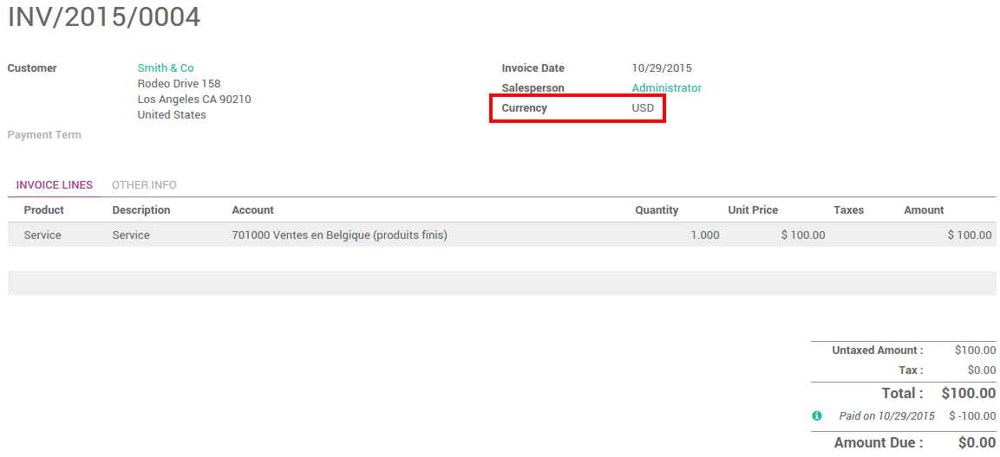

========================================================
How to manage invoices & payment in multiple currencies?
========================================================

Overview
========

Odoo provides multi-currency support with automatic currency gross or
loss entry adjustment. There are a few things Odoo has been to ease the
user's life.

All the account transactions will be done using the company currency.
However you can see two extra fields with the journal entry where
secondary currency and amount will visible. You can create
multi-currency journals of force a specific currency.

When creating an invoice, the currency can be changed very easily;
however Odoo takes the company currency as a default assignment. It will
convert all the amounts automatically using that currency.

Configuration
=============

Enable Multi-Currency
---------------------

For information about enabling Multi-Currency, please read the document:
:doc:`how_it_works`

Configure your journal
----------------------

In order to register payments in other currencies, you have to remove
the currency constraint on the journal. Go to the accounting
application, on the journal, click on :menuselection:`More --> Settings`.

.. image:: media/invoice01.png
   :align: center

Check if the currency field is empty or in the foreign currency in which
you will register the payments. If a currency is filled in, it means
that you can register payments only in this currency.

.. image:: media/invoice02.png
   :align: center

Multi-currency invoices & Vendor Bills
======================================

Now that you are working in a multi-currency environment, all
accountable items will be linked to a currency, domestic or foreign.

Invoices
--------

You are now able to set a different currency than the company one on
your sale orders and on your invoices. The currency is set for the whole
document.

Vendor Bills
------------

You are now able to set a different currency than the company one on
your purchase orders and on your vendor bills. The currency is set for
the whole document.

.. image:: media/invoice04.png
   :align: center

Multi-currency Payments
=======================

In the accounting application, go to :menuselection:`Sales --> Payments`. Register the
payment and indicate that it was done in the foreign currency. Then
click on **Confirm**.

.. image:: media/invoice05.png
   :align: center

The journal entry has been posted but not allocated.

Go back to your invoice (:menuselection:`Sales --> Customer Invoices`) and click on
**Add** to allocate the payment.

.. image:: media/invoice06.png
   :align: center

Multi- Currency Bank Statements
===============================

When creating or importing bank statements, the amount is in the company
currency. But there are now two complementary fields, the amount that
was actually paid and the currency in which it was paid.

.. image:: media/invoice07.png
   :align: center

When reconciling it, Odoo will directly match the payment with the right
invoice. You will get the invoice price in the invoice currency and the
amount in your company currency.

.. image:: media/invoice08.png
   :align: center

Exchange Rate Journal
=====================

Go to :menuselection:`Adviser --> Journal Entries` and look for the **Exchange
Difference** journal entries. All the exchange rates differences are recorded in it.

.. image:: media/invoice09.png
   :align: center

.. seealso::
	
	* :doc:`how_it_works`
	* :doc:`exchange`
