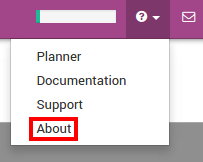

==========================================================
How to create customized reports with your own formulas?
==========================================================

Overview
========

Odoo 9 comes with a powerful and easy-to-use reporting framework.
Creating new reports (such as tax report or balance sheet for a
specific country) to suit your needs is now easier than ever.

Activate developer mode
===========================

In order to have access to the financial report creation interface,
**developer mode** needs to be activated. To do that, first click
**?** at top right, then **About**.

Click on: **Activate the developer mode**.

.. image:: media/customize03.png
   :align: center

Create your financial report
============================

First, you need to create your financial report. To do that, go to
:menuselection:`Accounting --> Configuration --> Financial Reports`

.. image:: media/customize02.png
   :align: center

Once the name is filled, there are two other parameters that need to be
configured:

-  **Show Credit and Debit Columns**

-  **Analysis Period**:

   -  Based on date ranges (e.g. Profit and Loss)

   -  Based on a single date (e.g. Balance Sheet)

   -  Based on date ranges with 'older' and 'total' columns and last 3
      months (e.g. Aged Partner Balance)

   -  Based on date ranges and cash basis method (e.g. Cash Flow
      Statement)

Add lines in your custom reports
=================================

After you've created the report, you need to fill it with lines. They
all need a **name**, a **code** (it is used to refer to the line), a 
**sequence number** and a **level** (used for line rendering).

.. image:: media/customize04.png
   :align: center

In **formulas** field you can add one or more formulas to assign a
value to the balance column (and debit and credit columns if applicable –
separated by ';')

You have several objects available in the formula :

-  ``Ndays``: Number of days in selected period (for reports with
   date range)

-  Another report, referenced by its code. Use ``.balance`` to get its
   balance value (also available ``.credit``, ``.debit`` and
   ``.amount_residual``)

A line can also be based on the sum of account move lines on a selected
domain. In which case you need to fill that domain field with an Odoo
domain on the account move line object. Then an extra object is
available in formulas field, namely ``sum``, the sum of the account
move lines in the domain. You can also use group by field to group
the account move lines with one of their columns.

Other useful fields:

-  **Type**: Type of the formula result.

-  **Is growth good when positive**: Used when computing the comparison
   column. Check if growth is good (displayed in green) or not.

-  **Special date changer**: If a specific line in a report should not use
   the same dates as the rest of the report.

-  **Show domain**: How the domain of a line is displayed. Can be foldable
   (``default`` hidden at the start but can be unfolded), ``always``
   (always displayed) or ``never`` (never shown).

.. seealso::
    * :doc:`main_reports`
