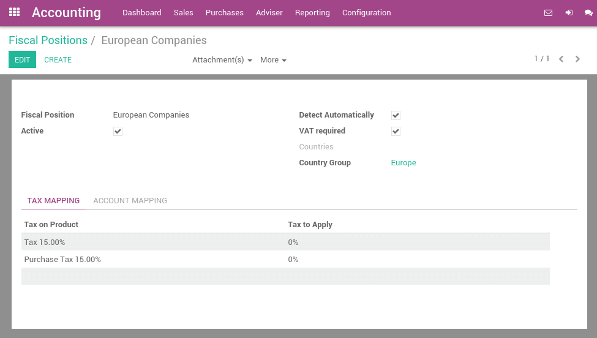
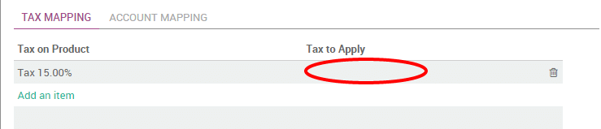
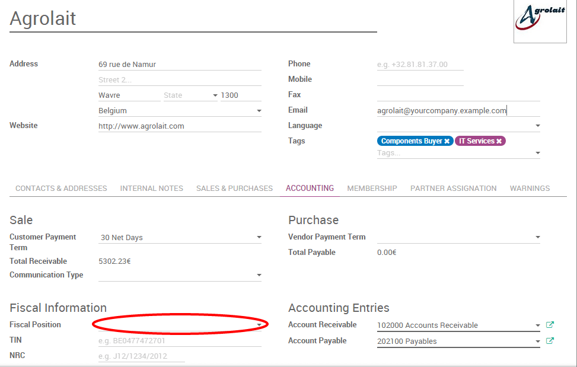

=========================================================
How to apply specific taxes by country, state or city ?
=========================================================

In Odoo, the default tax to apply on a product/service is set on the
**product form**. But, some customers may have specific tax rates because of
their status (in some countries, construction companies are VAT exempts)
or their location (customers in a different country, state and/or city
may be subjected to another tax rate).

In order to select the right tax to apply according to the customer or
product, Odoo uses the concept of **fiscal positions**. If a customer has a
specific fiscal position, the default tax may be replaced by another
one. (as an example, construction companies have 0% instead of 21% in
Belgium for construction related work).

As an example, in Belgium, for the VAT tax, there are 3 fiscal positions
that depend on on the country of the customer and some companies (like
construction companies) benefit from a specific fiscal treatments:

-  **Belgian companies:** with 21% VAT (default, on product form)

-  **European companies:** with 0% VAT (intra-EU)

-  **Other countries:** 0% (but a different tax since it uses different
   accounts)

-  **Construction companies:** with 0% VAT, only for construction companies
   in Belgium

Configuration
=============

Set the right taxes on your products
------------------------------------

The main taxes are automatically configured according to the chart of
accounts of your country.

But if you want to set a specific tax on a specific product, you can set
the **sales and purchases taxes** on the **product form**, under the **Accounting
tab**. These taxes are the default one (used when you sell to companies
that are in the same country/state than you)

.. image:: media/application05.png
   :align: center

.. tip::
    If you work in a multi-company environment, the sales and 
    purchase taxes may have a different value according to the 
    company you work for. You can login into two different companies 
    and change this field for each company.

Defining Fiscal Positions
-------------------------

The main fiscal positions are automatically created according to the
chart of accounts of your country. But you may have to create fiscal
positions manually for specific use cases.

To define fiscal positions, from the **Accounting** application, go to
:menuselection:`Configuration --> Fiscal Positions`.

Fiscal position is just a set of rules that maps default taxes (as defined on
product form) into other taxes. In the screenshot below, european
customers have a VAT of 0% instead of the default 15%, for both sales
and purchases.

.. note::
    You can also map the **income / expense account** according to the fiscal
    position. For example, in Belgium, revenues from sales are not posted in
    the same account than revenues from sales in foreign countries.

Apply fiscal positions automatically
------------------------------------

If you check the box **Detect Automatically**, the fiscal position will be
applied automatically if the **Country**, **State**, **City** or even the 
**Country Group** matches. You can also apply the fiscal position only 
to companies having a valid **VAT number**.

You can also set a target **Country/State/City**. The fiscal position will
be applied if the destination address of the customer matches these
criteria.

.. image:: media/application04.png
   :align: center

Specific use cases
------------------

If, for some fiscal positions, you want to remove a tax, instead of
replacing by another, just keep the **Tax to Apply** field empty.

If, for some fiscal positions, you want to replace a tax by two other
taxes, just create two lines having the same **Tax on Product**. You can
also create one that is a grouping of two other taxes, depending on how
you want to make them appear on the invoice.

Using fiscal positions
======================

If you keep the field **Fiscal Position** empty on customers 
:menuselection:`Accounting --> Sales --> Customers`, the fiscal position 
is applied automatically on sales order, purchase orders, web orders and invoices.

But, if you set the fiscal position, Odoo will use this specific fiscal
position for this customer on orders (example: construction companies).
In such a case, it's recommended to set the fiscal position on the
customer form. Odoo will automatically reuse this value for orders and
invoices, without trying to auto-detect the fiscal position.

If you set the fiscal position at the sale order or invoice level, it
will only apply to this document only and not to future orders/invoices
of the same customer.

For eCommerce orders, the tax of the visitor's cart will automatically
update and apply the new tax after the visitor has logged in or filled
in his shipping address.

.. seealso::

  * :doc:`creation`