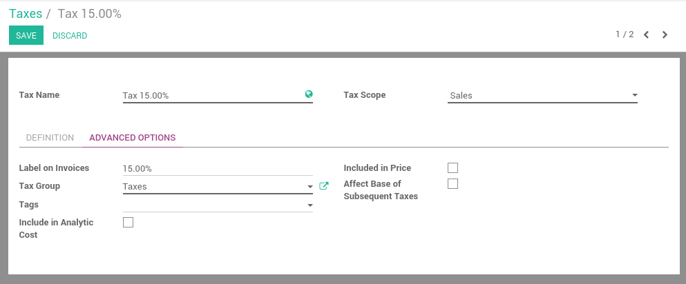

========================
How to define new taxes?
========================

Odoo's tax engine is very flexible and support many different type of
taxes: value added taxes (VAT), eco-taxes, federal taxes, retention,
withholding taxes, etc. For most countries, the chart of account you
setup is automatically pre-configured with the main taxes of the
country.

This section details how you can define new taxes for specific use
cases.

Managing Taxes
==============

Defining new taxes
------------------

In order to create new taxes, use the menu :menuselection:`Configuration --> Taxes` in the
accounting application. From this menu, you will get all the taxes you
can use: sales taxes and purchase taxes.

.. image:: media/create01.png
   :align: center

When you create a new tax, you can set the following information:

- **Scope**: Sales, Purchases or None (e.g. deprecated tax)

- **Tax Account**: is the account where the tax journal item will be
  posted. This field is optional, if you keep it empty, Odoo posts
  the tax journal item in the income account.

- **Label on Invoices**: a short text on how you want this tax to be
  printed on invoice line. For example, a tax named "21% on
  Services" can have the following label on invoice "21%".

- **Tax Group**: defines where this tax is summed in the invoice footer.
  All the tax belonging to the same tax group will be grouped on
  the invoice footer. Examples of tax group: VAT, Retention.

- **Include in Analytic Cost**: the tax is counted as a cost and, thus,
  generate an analytic entry if your invoice uses analytic
  accounts.

- **Tags**: are used for custom reports. (usually, you can keep this field
  empty)

Taxes allow different computation mechanism:

- **Fixed**, example: an eco-tax of $1.34 per battery

- **Percentage**, example: 15% sales tax

- **Percentage of price**, tax included: example in brazil

- **Group of taxes**: allows to have a compound tax

.. image:: media/create02.png
   :align: center

.. note::

  if you need more advanced tax mechanism, you can install the
  module **account_tax_python** and you will be able to define new taxes
  with Python code.

If a tax is included in price, it means that the price set on the
product form includes this tax. As an example, let's say you have a
product with a sale tax of 10%. The sale price on the product form is
$100.

- If the tax is not included in the price, you will get:

  - Price without tax: $100

  - Taxes: $10

  - Total to pay: $110

- If the tax is included in the price

  - Price without tax: 90.91

  - Taxes: $9.09

  - Total to pay: $100

Stop using a tax
----------------

If you want to avoid using a tax, you can not delete it because the tax
is probably used in several invoices. So, in order to avoid users to
continue using this tax, you should set the field **Tax Scope** to **None**.

Setting your default taxes
==========================

Once you have created your taxes, you can define which tax is the
default one when creating new products (for sales and purchase taxes).
To set the default taxes, in the accounting application, go in the menu
:menuselection:`Configuration --> Settings`.

.. image:: media/create04.png
   :align: center

Once taxes are set by default, when you create a new product, Odoo will
propose you the right taxes by default on the product form.

.. note::

  Setting the default taxes impact the creation of product, but not
  sales order or invoices. The tax used on sales order or invoices is
  defined by the product on the sale order line.

.. seealso::

  * :doc:`application`
  * :doc:`retention`
