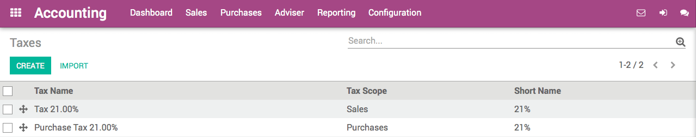

========================
How to create new taxes
========================

Odoo's tax engine is very flexible and support many different type of
taxes: value added taxes (VAT), eco-taxes, federal/states/city taxes, retention,
withholding taxes, etc. For most countries, your system is pre-configured with the
right taxes.

This section details how you can define new taxes for specific use cases.

* Go to :menuselection:`Accounting --> Configuration --> Taxes`. From this menu, you
  get all the taxes you can use: sales taxes and purchase taxes.

* Choose a scope: Sales, Purchase or None (e.g. deprecated tax).

* Select a computation method:

  * **Fixed**: eco-taxes, etc.

  * **Percentage of Price**: most common (e.g. 15% sales tax)

  * **Percentage of Price Tax Included**: used in Brazil, etc.

  * **Group of taxes**: allows to have a compound tax

.. image:: media/create02.png
   :align: center

* If you use Odoo Accounting, set a tax account (i.e. where the tax journal item will be
  posted). This field is optional, if you keep it empty, Odoo posts
  the tax journal item in the income account.

.. tip::
    If you want to avoid using a tax, you can not delete it because the tax
    is probably used in several invoices. So, in order to avoid users to
    continue using this tax, you should set the field *Tax Scope* to *None*.

.. note::
    If you need more advanced tax mechanism, you can install the
    module **account_tax_python** and you will be able to define new taxes
    with Python code.

Advanced configuration
======================

* **Label on Invoices**: a short text on how you want this tax to be
  printed on invoice line. For example, a tax named "15% on
  Services" can have the following label on invoice "15%".

* **Tax Group**: defines where this tax is summed in the invoice footer.
  All the tax belonging to the same tax group will be grouped on
  the invoice footer. Examples of tax group: VAT, Retention.

* **Include in Analytic Cost**: the tax is counted as a cost and, thus,
  generate an analytic entry if your invoice uses analytic
  accounts.

* **Tags**: are used for custom reports. Usually, you can keep this field
  empty.

.. seealso::

  * :doc:`application`
  * :doc:`tax_included`
