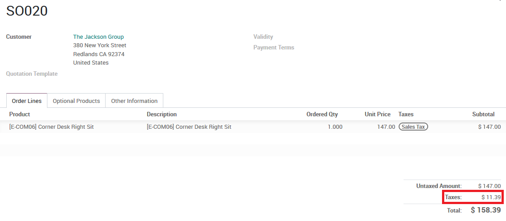
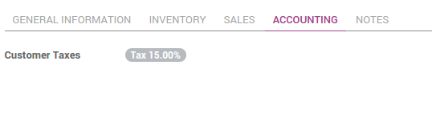

=========================================================
How to get correct tax rates in the US thanks to TaxCloud
=========================================================

The **TaxCloud** integration allows you to calculate the sales tax for every
address in the United States and keeps track of which product types are
exempt from sales tax and in which states each exemption applies.
TaxCloud calculates sales tax in real-time for every state, city, and
special jurisdiction in the United States.

Configuration
=============

In Tax Cloud
------------
* Create a free account on `*TaxCloud*
  <https://taxcloud.net/#register>`__ website.
* Register your website on TaxCloud to get an *API ID* and an *API Key*.

.. image:: media/taxcloud01.png
  :align: center

In Odoo
-------
* Go to :menuselection:`Invoicing/Accounting --> Configuration --> Settings`
  and check *Compute sales tax automatically using TaxCloud*. Click *Apply*.

.. image:: media/taxcloud02.png
  :align: center

* Still in those settings, enter your TaxCloud credentials.
* Hit *Sync TaxCloud Categories (TIC)* to import TIC product categories
  from TaxCloud (Taxability Information Codes). Some categories may imply 
  specific rates.

.. image:: media/taxcloud03.png
  :align: center

* Set default *TIC Code* and taxe rates. This will apply to any new 
  product created. A default sales tax is needed to trigger the 
  tax computation.

* For products under a specific category, select it in its detail form 
  (in *Sales* tab).

* Make sure your company address is well defined (especially the state 
  and the zip code). Go to :menuselection:`Settings --> General Settings` 
  and click *Configure your company data*.

How it works
============

Automatic tax assignation works thanks to fiscal positions
(see :doc:`application`).
A specific fiscal position is created when installing *TaxCloud*.
Everything works out-of-the-box.

This fiscal position is set on any sales order, web order, or invoice
when the customer country is *United States*. This is triggering the 
automated tax computation.

.. image:: media/taxcloud04.png
  :align: center

Add a product with a default sales tax. Odoo will automatically
send a request to TaxCloud, get the correct tax percentage based on the
customer location (state and zip code) and product TIC category, create
a new tax rate if that tax percentage does not already exist in 
your system and return it in the order item line (e.g. 7.0%).

How to create specific tax mappings using TaxCloud
==================================================

You can create several fiscal positions using TaxCloud.
Check *Use TaxCloud API* to do so. Such fiscal postions can be
assigned to customers in their detail form in order to get them by default
whenever they buy you something.

.. seealso::
  * :doc:`default_taxes`
  * :doc:`application`
