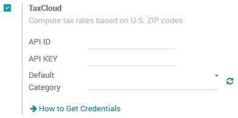
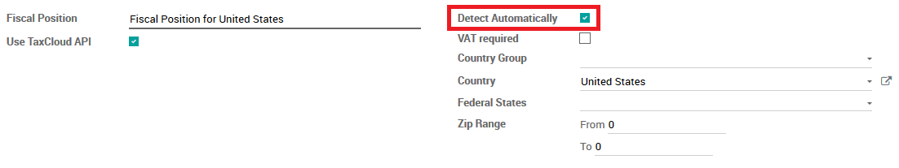

=======================================
Manage Your Sales Tax with TaxCloud API
=======================================

The **TaxCloud** module allows you to calculate the sales tax for every
address in United States and keeps track of which type of products are
exempt from sales tax and in which states each exemption applies.
TaxCloud calculates sales tax in real-time for every state, city, and
special jurisdiction in the United States.

Configuration
=============

Install the TaxCloud module
---------------------------

In the **Accounting** module, click on :menuselection:`Configuration --> Settings`.
Under :menuselection:`Invoicing and Payments --> Taxes`, check the box **Compute sales
tax automatically using TaxCloud**.

.. image:: media/taxcloud01.png
  :align: center

Configure TaxCloud API
----------------------

To configure your TaxCloud API, go to the **Accounting** module, click
on :menuselection:`Configuration -> Settings`.
** Under **TaxCloud Configuration,** link your Account (API ID and 
API Key). For more information, please refer to the 
`*Taxcloud* <http://taxcloud.net>`__ website.

Synchronize the TICs(Taxability information codes) category
~~~~~~~~~~~~~~~~~~~~~~~~~~~~~~~~~~~~~~~~~~~~~~~~~~~~~~~~~~~

After link with TaxCloud API, click on **Sync TaxCloud
Category (TIC)** to synchronize the TICs(Taxability information codes)
for product.

Company configuration
---------------------

In order to compute the right tax rate, the provider needs your company
information. Be sure your address and default TIC category are correctly
encoded.

.. image:: media/taxcloud04.png
  :align: center

Set default TIC category on your company. This ensures if you are
selling the same TIC category product you aren’t required to fill the
TIC on each product or in case of a missing TIC category on product it
will automatically reference the default category for your company.

.. image:: media/taxcloud05.png
  :align: center

To check your information, go to the **Settings** app and click on
**General Settings.** Click on the first link **Configure your company
data.**

Product configuration
---------------------

Set the correct sales tax and TIC category on the product. The main
taxes are automatically configured according to the chart of accounts
for the US.

If you want to set a specific tax rate on a product, you can set the
sales tax on the **product form** under the **Accounting** tab.

.. image:: media/taxcloud06.png
  :align: center

You can set the TIC Category on the **Product form** under the
**Sales** tab.

.. image:: media/taxcloud07.png
  :align: center

Customer configuration
----------------------

In order to compute the right tax, the provider needs customer information. 
Be sure customer address is correctly encoded.

.. image:: media/taxcloud08.png
  :align: center

The main fiscal positions are automatically created for TaxCloud in the
**US** by default but you may need to create fiscal position for specific
user cases.

To define fiscal position:

-   Navigate to the **Accounting** app

-   Go to :menuselection:`Configuration --> Fiscal Position`

-   Default fiscal position (country) is already set to US (you can
    define the fiscal position in the Customer Form of the
    **Accounting tab**).

For more information on fiscal position, see the Odoo documentation on
:doc:`application`.

Manage your sales tax
=====================

Get sales tax automatically by TaxCloud
---------------------------------------

When the fiscal position(tax mapping on fiscal position) is applied
(automatically) on a sales order, web order, or invoices it will send a
request to TaxCloud and return a sales tax calculation.

For example, to get sales tax automatically on a sales order: in the
menu click :menuselection:`Sales --> Sales orders` and create new sales order. 
Select a customer in the United States and TaxCloud will automatically
apply the US fiscal position on the sales order.

.. image:: media/taxcloud09.png
  :align: center

Add product with sales tax on an order line and Odoo will automatically
send a request to TaxCloud, get the correct tax percentage based on the
customer’s State and Product TIC category, create new a new tax rate if
that tax percentage does not already exist on your list and return the
new tax rate (example: 7.0%).

.. image:: media/taxcloud10.png
  :align: center

You can also add a tax mapping line on the fiscal position with the new
tax. Odoo will check if the tax exists for the customer State and
product TIC category in the fiscal position mapping line and if it does
not exist it will send a request to TaxCloud to retrieve the new tax
rate.

.. image:: media/taxcloud11.png
  :align: center

.. seealso::
  * :doc:`application`
