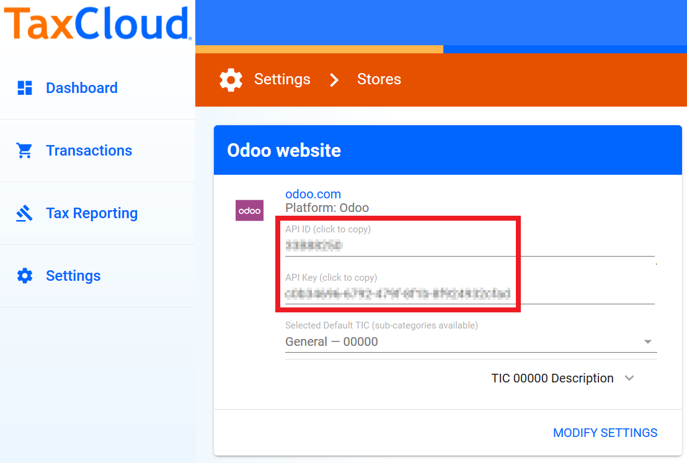
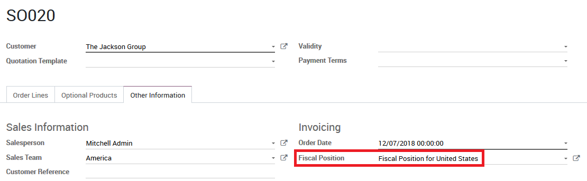

================================================================
How to get correct tax rates in the United States using TaxCloud
================================================================

The **TaxCloud** integration allows you to correctly calculate the sales
tax for every address in the United States and keeps track of which products
are exempt from sales tax and in which states each exemption applies.
TaxCloud calculates sales tax in real-time for every state, city, and
special jurisdiction in the United States.

Configuration
=============

In TaxCloud
-----------
* Create a free account on `TaxCloud
  <https://taxcloud.com/#register>`__ website.
* Register your Odoo website on TaxCloud to get an *API ID* and an *API Key*.

* In Settings on TaxCloud, click *Locations* to enter the location of your Office(s) & Warehouse(s).
* In Settings on TaxCloud, click *Manage Tax States* to verify the states where you collect sales tax.

In Odoo
-------
* Go to :menuselection:`Invoicing / Accounting --> Configuration --> Settings`
  and check *TaxCloud - Compute tax rates based on U.S. ZIP codes*.
* Enter your TaxCloud credentials.
* Click SAVE to store your credentials.

.. image:: media/taxcloud02.png
  :align: center

* Click the Refresh Icon next to *Default Category* to import the TIC product categories
  from TaxCloud (Taxability Information Codes). Some categories may imply specific rates.
* Select your default *TIC Code*. This will apply to any new
  product created.
* Set a specific TaxCloud Category on the *General Information* tab of the Product,
  or on the Product Category.
* Make sure your company address is complete (including the state
  and the zip code). Go to :menuselection:`Settings --> Users & Companies --> Companies`
  to open and edit your Company record.

How it works
============

Salestax is calculated in Odoo based on fiscal positions
(see :doc:`application`).
A Fiscal Position for the United States is created when installing *TaxCloud*.
Everything works out-of-the-box.

You can configure Odoo to automtically detect which Customers should use this fiscal
position.  Go to :menuselection:`Accounting --> Configuration --> Fiscal Positions`
to open and edit the record.

.. image:: media/taxcloud03.png
  :align: center

Now, this fiscal position is automatically set on any sales order, web order, or invoice
when the customer country is *United States*. This triggers the
automated tax computation.

Add your product(s). You have two options to get Sales Tax on the Order.  You can confirm it,
or you can save it and from the *Action* Menu choose **Update Taxes with TaxCloud**.

.. seealso::
  * :doc:`application`
