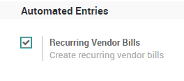
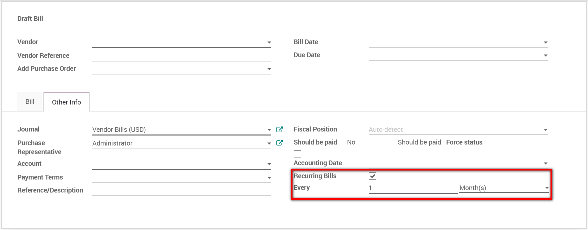
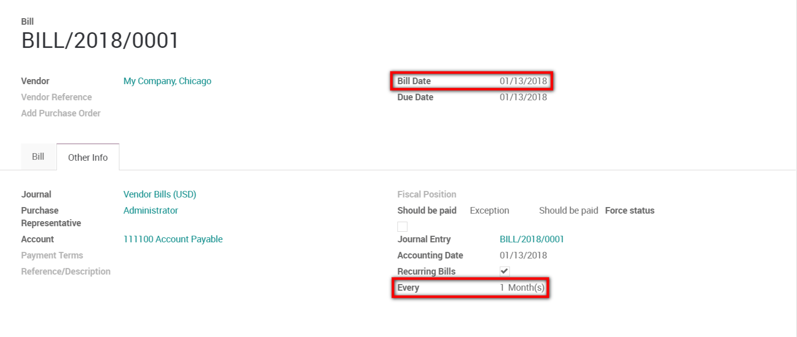
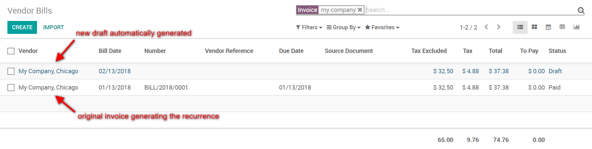
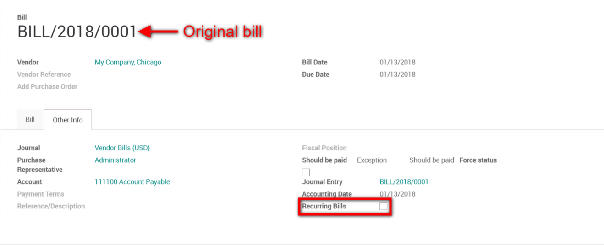

===============================
Generate recurring vendor bills
===============================

You may receive vendor bills for a fixed amount on a regular basis: for
instance, for water, gas, electricity or phone bills. For such cases,
the recurring vendor bills feature will save you a lot of time. Indeed,
all you need to do is to create a bill once, set a frequency of
recurrence and the rest will follow. Your next bills will automatically
appear in your feed.

How to activate the recurring vendor bills feature
--------------------------------------------------

For this feature to work, go in
:menuselection:`Invoicing/Accounting --> Configuration --> Settings` and
tick the box in front of Recurring Vendor Bills to activate
the feature. Finally, do not forget to save your settings from the
top-left corner of your screen.

Generate recurring vendor bills
-------------------------------

You can either select an existing bill or create a new one for this
purpose. Once you are editing the vendor bill, access the "other info"
tab. On the bottom right corner, you can see that the option "recurring
bills" is available. Tick the box and set the frequency you would like
to have. It can be every (other) day, week, month, or year. Finally, do
not forget to save the bill.

.. tip::
    The recurring bills will only be generated if the bill is
    validated. If the bill is cancelled, recurring bills won’t be generated
    anymore.

The recurrency depends on the bill date and on the recurrency defined. In
the example below, the bill date is on the 13th of January and the recurrency
set is "every 1 month(s)". In this case, the next bill will be generated on
the 13th of February.

Where will the next bills appear ?
~~~~~~~~~~~~~~~~~~~~~~~~~~~~~~~~~~

The next recurring bills will appear automatically on your vendor bill
list once their recurrence date is reached. They will be created in
draft, you will just have to verify and validate them.

How can I end the recurrence ?
~~~~~~~~~~~~~~~~~~~~~~~~~~~~~~

To end the recurrence, simply go back on the original bill generating
the recurrence and untick the box "Recurring Bills".

