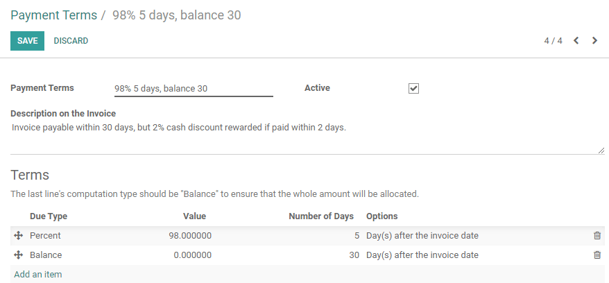

============================
How to setup cash discounts?
============================

Cash discounts are an incentive (usually a small percentage) that you
offer to customers in return for paying a bill owed before the scheduled
due date. If used properly, cash discounts improve the Days Sales
Outstanding aspect of a business's cash conversion cycle.

For example, a typical cash discount would be: you offer a 2% discount
on an invoice due in 30 days if the customer were to pay within the
first 5 days of receiving the invoice.

Configuration
=============

Payment terms
-------------

In order to manage cash discounts, we will use the payment terms
concept of Odoo (From the Accounting module, go to :menuselection:`Configuration -->
Management --> Payment terms --> Create`).

Let's start with the above example: a 2% discount on an invoice due in
30 days if the customer were to pay within the first 5 days.

A typical payment term of 30 days would have only one installment:
balance in 30 days. But, in order to configure the cash discount, you
can configure the payment term with two installments:

-  98% within 5 days
-  balance within 30 days

To make it clear that it's not a payment term but a cash discount, don't
forget to set a clear description that will appear on the invoice:
Invoice is due within 30 days, but you can benefit from a 2% cash
discount if you pay within 5 days.

Bank reconciliation model
-------------------------

In order to speed up the bank reconciliation process, we can create a
model of entry for all cash discounts. To do that, from the Accounting
application dashboard, click on the "More" link on the bank and choose
the option "Reconciliation Models".

.. image:: ./media/discount02.png
   :align: center

Create a new model for cash discounts as follow:

-  **Button Label**: Cash Discount
-  **Account**: Cash Discount (according to your country)
-  **Amount Type**: Percentage
-  **Amount**: 100%
-  **Taxes**: depending on your country, you may put a tax on the cash
       discount if taxes have to be deduced

.. image:: ./media/discount03.png
   :align: center

.. tip::
	
	Even if it's a 2% cash discount, set a 100% amount on the reconciliation model
	as it means 100% of the remaining balance (the 2%). You can use the same
	reconciliation model for all your cash discount. No need to create a model
	per payment term.

Creating an invoice with a cash discount
========================================

When you create a customer invoice, set the right payment term "30 days,
2% cash discount" right after having selected the customer.

.. image:: ./media/discount04.png
   :align: center

Once the invoice is validated, Odoo will automatically split the account
receivable part of the journal entry with two installments having a
different due date: 98% within 5 days, 2% within 30 days.

.. image:: ./media/discount05.png
   :align: center

Payment
=======

Paying the invoice with a cash discount
---------------------------------------

If the customer pays with a cash discount, when processing the bank
statement, you will match the payment (98%) with the related line in the
journal entry.

.. image:: ./media/discount06.png
   :align: center

As you can see in the above screenshot, when selecting the customer, you
also see the 2% remaining of 3$. If you want to accept the cash discount
(if the customer paid within the 5 days), you can click on this line
with 2%, click on "Open Balance", and select your "Cash Discount"
reconciliation model. That way, the invoice is marked as fully paid.

.. note::

	from now on, matching the remaining 2% has to be done manually. In the future,
	we plan to automate the reconciliation of the 2% if the 98% are paid on time.

Paying the invoice in full
--------------------------

If the customer pays the invoice fully, without benefiting from the cash
discount, you will reconcile the payment (in full) with the two lines
from the invoice (98% and 2%). Just click on the two lines to match them
with the payment.

.. image:: ./media/discount07.png
   :align: center

.. seealso::

  * :doc:`overview`
