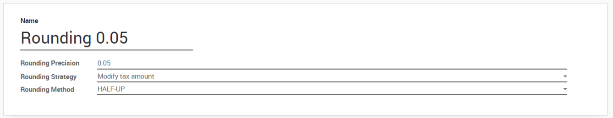

Set up cash roundings
=====================

In some currencies, the smallest coins do not exist. For example, in
Switzerland, there is no coin for 0.01 CHF. For this reason, if invoices
are paid in cash, you have to round their total amount to the smallest
coin that exist in the currency. For the CHF, the smallest coin is 0.05
CHF.

There are two strategies for the rounding:

1. Add a line on the invoice for the rounding

2. Add the rounding in the tax amount

Both strategies are applicable in Odoo.

Configuration 
--------------

First, you have to activate the feature. For this, go in
:menuselection:`Accounting --> Configuration --> Settings`
and activate the Cash Rounding.

.. image:: media/cash_rounding01.png
    :align: center

There is a new menu to manage cash roundings in
:menuselection:`Accounting --> Configuration --> Management --> Cash roundings`.

Now, you can create cash roundings. You can choose between two rounding
strategies:

1. **Add a rounding line**: if a rounding is necessary, Odoo will add a
   line on your customer invoice to take this rounding into
   account. You also have to define the account in which the
   rounding will go.

2. **Modify tax amount:** Odoo will add the rounding to the amount of
   the highest tax.

Apply roundings
---------------

Once your roundings are created, you can apply them on customer
invoices. On the customer invoices, there is a new field called **Cash
Rounding Method** where you can simply choose one of the rounding methods
created previously. If needed, a rounding will be applied to the
invoice.
