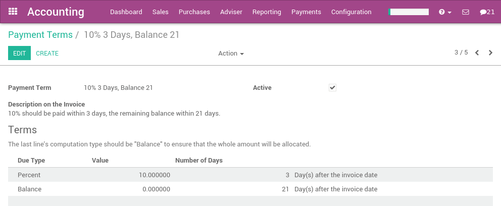

=======================================================
How to define an installment plan on customer invoices?
=======================================================
In order to manage installment plans related to an invoice, you should
use payment terms in Odoo. They apply on both customer invoices and
supplier bills.

Example, for a specific invoice:

-  Pay 50% within 10 days
-  Pay the remaining balance within 30 days

.. note::

	payment terms are not to be confused with a payment in several parts. If,
	for a specific order, you invoice the customer in two parts, that's not a
	payment term but an invoice policy.

Configuration
=============

Configure your usual installment plans from the application :menuselection:`Accounting -->
Configuration > Payment Terms`.

A payment term may have one line (eg: 21 days) or several lines (10%
within 3 days and the balance within 21 days). If you create a payment
term with several lines, make sure the latest one is the balance. (avoid
doing 50% in 10 days and 50% in 21 days because, with the rounding, it
may not compute exactly 100%)

.. tip::

	The description of the payment term will appear on the invoice or the sale order.

Payment terms for customers
===========================

You can set payment terms on:

- **a customer**: the payment term automatically applies on new sales
  orders or invoices for this customer. Set payment terms on
  customers if you grant this payment term for all future orders
  for this customer.

- **a quotation**: the payment term will apply on all invoices created
  from this quotation or sale order, but not on other quotations

- **an invoice**: the payment term will apply on this invoice only

If an invoice contains a payment term, the journal entry related to the
invoice is different. Without payment term, an invoice of $100 will
produce the following journal entry (for the clarity of the example, we
did not set any tax on the invoice):

+----------------------+------------+---------+----------+
| Account              | Due date   | Debit   | Credit   |
+======================+============+=========+==========+
| Account Receivable   |            | 100     |          |
+----------------------+------------+---------+----------+
| Income               |            |         | 100      |
+----------------------+------------+---------+----------+

If you do an invoice the 1st of January with a payment term of 10%
within 3 days and the balance within 30 days, you get the following
journal entry:

+----------------------+------------+---------+----------+
| Account              | Due date   | Debit   | Credit   |
+======================+============+=========+==========+
| Account Receivable   | Jan 03     | 10      |          |
+----------------------+------------+---------+----------+
| Account Receivable   | Jan 30     | 90      |          |
+----------------------+------------+---------+----------+
| Income               |            |         | 100      |
+----------------------+------------+---------+----------+

On the customer statement, you will see two lines with different due
dates. To get the customer statement, use the menu Sales > Customers
Statement.

.. seealso::

	* :doc:`overview`
	* :doc:`payment_terms`
