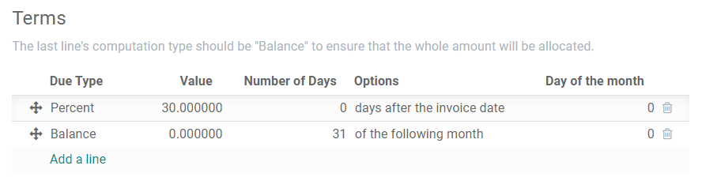
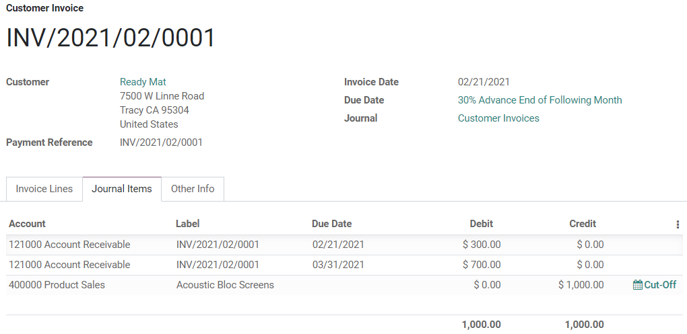

===================================
Payment Terms and Installment Plans
===================================

**Payment Terms** specify all the conditions under which a sale is paid, mostly to ensure customers
pay their invoices correctly and on time.

Payment Terms can be applied to sales orders, customer invoices, supplier bills, and contacts. These
conditions cover:

- The due date
- Some discounts
- Any other condition on the payment

Defining Payment Terms automatically calculates the payments' due dates. This is particularly
helpful for managing installment plans.

An **installment plan** allows the customers to pay an invoice in parts, with the amounts and
payment dates defined beforehand by the seller.

**Examples of Payment Terms:**

- | **Immediate Payment**
  | The full payment is due on the day of the invoice's issuance.
- | **15 Days** (or **Net 15**)
  | The full payment is due 15 days after the invoice date.
- | **21 MFI**
  | The full payment is due by the 21st of the month following the invoice date.
- | **2% 10, Net 30 EOM**
  | 2% :doc:`cash discount <cash_discounts>` if the payment is received within ten days. Otherwise,
    the full payment is due at the end of the month following the invoice date.

.. note::
   Payment terms are not to be confused with down payment invoices. If, for a specific order, you
   issue several invoices to your customer, that is neither a payment term nor an installment plan,
   but an invoicing policy.

.. note::
   This document is about the *Payment Terms* feature, not *Terms & Conditions*.

Configuration
=============

Go to :menuselection:`Accounting --> Configuration --> Payment Terms` and click on *Create*.

The **Description on the Invoice** is the text displayed on the document (sale order, invoice,
etc.).

In the **Terms** section, you can add a set of rules, called *terms*, to define what needs to be
paid and by which due date.

To add a term, click on *Add a line*, and define its *Type*, *Value*, and *Due Date Computation*.

.. important::
   - Terms are computed in the order they are set up.
   - The **balance** should always be used for the last line.

In the following example, 30% is due on the day of issuance, and the balance is due at the end of
the following month.

         month.

Using Payment Terms
===================

Payment Terms can be defined in the **Due Date** field, with the **Terms** drop-down list, on:

- | **Quotations**
  | To set specific payment terms automatically on all invoices generated from a quotation.
- | **Customer Invoices**
  | To set specific payment terms on an invoice.
- | **Vendor Bills**
  | To set specific payment terms on a bill. This is mostly useful when you need to manage vendor
    terms with several installments. Otherwise, setting the *Due Date* is enough.

.. tip::
   You can also define a **Due Date** manually. If Payment Terms are already defined, empty the
   field so you can select a date.

Payment Terms can be defined with the **Payment Terms** field on:

- | **Contacts**
  | To set specific payment terms automatically on new sales orders, invoices, and bills of a
    contact. This can be modified in the contact’s *Form View*, under the *Sales & Purchase* tab.

Journal Entries
===============

Invoices with specific Payment Terms generate different *Journal Entries*, with one *Journal Item*
for every computed *Due Date*.

This makes for easier *Follow-ups* and *Reconciliation* since Odoo takes each due date into account,
rather than just the balance due date. It also helps to get an accurate *Aged Receivable report*.

         Due Dates

In this example, an invoice of $1000 has been issued with the following payment terms: *30% is due
on the day of issuance, and the balance is due at the end of the following month.*

+----------------------+-------------+---------+---------+
| Account              | Due date    | Debit   | Credit  |
+======================+=============+=========+=========+
| Account Receivable   | February 21 | 300     |         |
+----------------------+-------------+---------+---------+
| Account Receivable   | March 31    | 700     |         |
+----------------------+-------------+---------+---------+
| Product Sales        |             |         | 1000    |
+----------------------+-------------+---------+---------+

The $1000 debited on the Account Receivable is split into two distinct *Journal Items*. Both of
them have their own **Due Date**.

.. seealso:: 
   - :doc:`cash_discounts`
   - `Odoo Tutorials: Terms and Conditions (T&C) and Payment Terms <https://www.odoo.com/r/fpv>`_