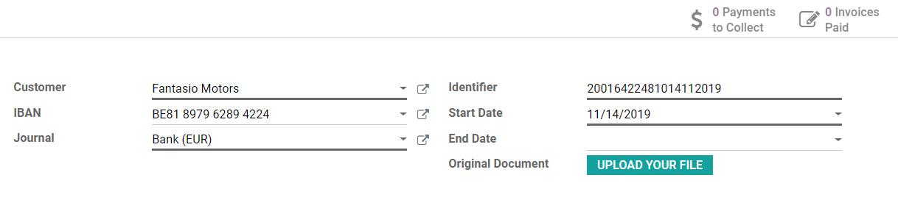
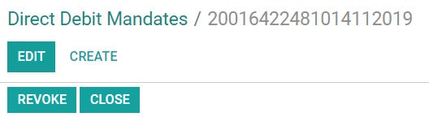
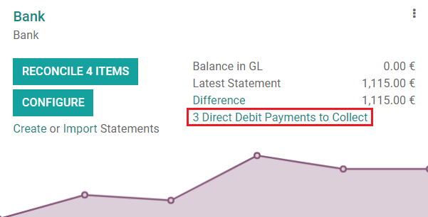
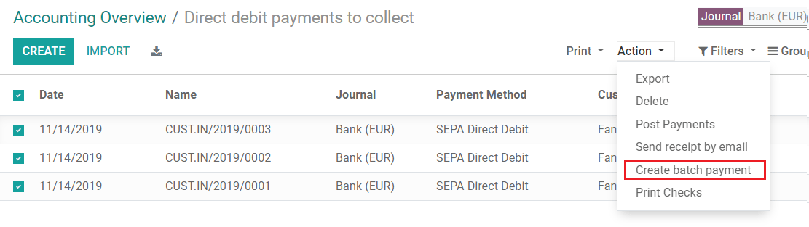

=======================================
Batch Payments: SEPA Direct Debit (SDD)
=======================================
SEPA, the Single Euro Payments Area, is a payment-integration 
initiative of the European Union for simplification of bank transfers
denominated in EURO. With **SEPA Direct Debit**, your customers can 
sign a **mandate** that authorizes you to collect future payments 
from their bank accounts automatically.

You can record your customer mandates in Odoo, and generate XML 
files containing pending payments made with an SDD mandate.

.. note::
   | SDD is supported by all SEPA countries, which includes the 28 member states of the European Union as well as additional countries. 
   | `List of all SEPA countries <https://www.europeanpaymentscouncil.eu/document-library/other/epc-list-sepa-scheme-countries>`_.

Configuration
=============
Go to :menuselection:`Accounting --> Configuration --> Settings` 
nd activate the **SEPA Direct Debit (SDD)** feature. Enter the 
**Creditor Identifier** of your company. This number is provided 
by your bank, or the authority responsible for delivering them. 

.. image:: media/batch_sdd01.png
   :align: center

SEPA Direct Debit Mandates
==========================
Create a mandate
----------------
The SEPA Direct Debit Mandate is the document that your customers 
sign to authorize you to collect money directly from their bank accounts.

To create a new one, go to :menuselection:`Accounting --> Customers 
--> Direct Debit Mandates`, click on *Create*, and fill out the 
new mandate’s form. 

First, export the PDF file by clicking on *Print*. 
It is then up to your customer to sign this document. 
Once done, upload the signed file in the **Original Document** 
field, and click on *Validate* to start running the mandate.

.. tip:: 
   First, make sure, that the **IBAN bank accounts details** 
   are correctly recorded on the debtor’s contact form, under 
   the *Accounting* tab, and in your own *Bank Account* settings.

Close or revoke a mandate 
-------------------------
Direct Debit mandates are closed automatically after their *End Date*. 
If this field is left blank, then the mandate keeps being *Active* 
until it is *Closed* or *Revoked*.

Clicking on **Close** updates the mandate’s end day to the current day. 
This means that invoices made after the present day won’t be processed 
automatically with an SDD payment.

Clicking on **Revoke** disables the mandate immediately. No SDD 
payment can be registered anymore, regardless of the invoice’s date. 
However, payments that have already been registered will still be 
included to the next SDD XML file.

.. note::
   Once a mandate has been *closed* or *revoked*, it cannot be reactivated. 
   If a customer requires to pay with SDD payments again, you will have 
   to create a new mandate from scratch.

Get paid with SDD Batch Payments
================================
Customer Invoices 
-----------------
All new posted invoice issued to customers with an active mandate 
will automatically register payment and have their status marked as *Paid*.

.. tip:: 
   If you have unpaid invoices that could be paid with a new mandate, 
   it is still possible to do it. Go on the invoice, click on *Register Payment* 
   and choose *SEPA Direct Debit* as payment method.

Generate SEPA Direct Debit XML files to submit payments
-------------------------------------------------------
To submit your SDD payments to your bank, you will first generate an 
**XML file** that can be uploaded directly to your bank interface.

The files generated by Odoo follow the SEPA Direct Debit **PAIN.008.001.02** 
specifications as required by the SEPA customer-to-bank Implementation Guidelines, 
which ensures compatibility with the banks.

To generate your XML file for the pending SDD payments, go to the related 
*bank journal* on your *Accounting dashboard*, then click on 
*Direct Debit Payments to Collect*.

Select all the payments in the list that you want to include in 
your SDD XML file, then click on *Action* and select *Create Batch Payment*.

Odoo then takes you to your *Batch Payment*’s form. Click on *Validate* 
and then download the SDD XML file.

.. image:: media/batch_sdd06.png
   :align: center

Finally, upload this file to your bank to process the payments.

.. tip::
   You can retrieve all the generated SDD XML files by going to
   :menuselection:`Accounting --> Configuration --> Customers --> Batch Payments`.

.. seealso::
   * :doc:`../../bank/setup/create_bank_account`
   * `Odoo Academy: SEPA Direct Debit Mandates (SDD) <https://www.odoo.com/r/Zxs>`_
   * `List of all SEPA countries <https://www.europeanpaymentscouncil.eu/document-library/other/epc-list-sepa-scheme-countries>`_.

