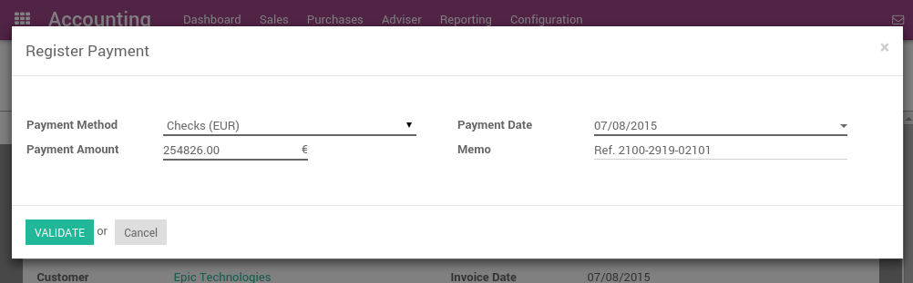

=================================================
How to register credit card payments on invoices?
=================================================

There are two ways to handle payments received by credit cards. Odoo
support both approaches so that you can use the one that better fits
your habits.

1. **Undeposited Funds** (mostly used in european countries): once you
   receive the credit card payment authorization, you record a
   payment by credit card on the invoice (using a Credit card
   journal and posted on the Undeposited Fund account). Then, once
   the credit card payments arrives in your bank account, move money
   from Undeposited Funds to your bank account.

2. **One journal entry only** (mostly used in the U.S.): once your
   receive the credit card payment, you record a payment on your
   bank, paid by credit card, without going through the Undeposited
   Funds. Once you process your bank statement, you do the matching
   with your bank feed and the credit card payment, without creating
   a dedicated journal entry .

We recommend the first approach as it is more accurate (your bank
account balance is accurate, taking into accounts credit cards that have
not been cashed yet). Both approaches require the same effort.

If you use eCommerce and an automated payment gateway, you will only
need to take care of the bank reconciliation part as paid invoice will
be automatically recorded in the right journal. You will use the second
approach.

Even if the first method is cleaner, Odoo support the second approach
because some accountants are used to it (*QuickBooks* and *Peachtree*
users).

Option 1: Undeposited Funds
===========================

Configuration
-------------

On the Accounting module, go to :menuselection:`Configuration --> Journals --> Create`

Create a Journal called 'Credit card payments' with the following data:

-  **Journal Name**: Credit card
-  **Default debit account**: Credit cards
-  **Default credit account**: Credit cards

The account type should be "Credit Card". Once it's done, don't forget to set the "Credit cards" account as "Allow
Reconciliation".

.. image:: ./media/credit01.png
  :align: center

From credit card payments to bank statements
--------------------------------------------

The first way to handle credit cards is to create a credit card journal.
Thus, credit cards become a payment method in itself and you will record
two transactions.

Once you receive a customer credit card payment, go to the related
invoice and click on Register Payment. Fill in the information about the
payment:

-  **Payment method**: Credit card

-  **Memo**: write the invoice reference

This operation will produce the following journal entry:

+----------------------+-------------------+----------+----------+
| Account              | Statement Match   | Debit    | Credit   |
+======================+===================+==========+==========+
| Account Receivable   |                   |          | 100.00   |
+----------------------+-------------------+----------+----------+
| Credit Cards         |                   | 100.00   |          |
+----------------------+-------------------+----------+----------+

The invoice is marked as paid as soon as you record the credit card
payment.

Then, once you get the bank statements, you will match this statement
with the credit card that is in the 'Credit card' account.

+----------------+-------------------+----------+----------+
| Account        | Statement Match   | Debit    | Credit   |
+================+===================+==========+==========+
| Credit cards   | X                 |          | 100.00   |
+----------------+-------------------+----------+----------+
| Bank           |                   | 100.00   |          |
+----------------+-------------------+----------+----------+

If you use this approach to manage credit cards payments, you get the
list of credit cards payments that have not been cashed in the "Credit
card" account (accessible, for example, from the general ledger).

.. note::

	Both methods will produce the same data in your accounting at the end of the
	process. But, if you have credit cards that have not been cashed, this one
	is cleaner because those credit cards have not been reported yet on your bank
	account.

Option 2: One journal entry only
================================

Configuration
-------------

There is nothing to configure if you plan to manage your credit cards
using this method.

From credit card payments to bank statements
--------------------------------------------

Once you receive a customer credit card payment, go to the related
invoice and click on Register Payment. Fill in the information about the
payment:

-  **Payment method**: the bank that will be used for the deposit

-  **Memo**: write the credit card transaction number

.. image:: ./media/credit03.png
  :align: center

The invoice is marked as paid as soon as the credit card payment has
been recorded. Once you receive the bank statements, you will do the
matching with the statement and this actual payment (technically: point
this payment and relate it to the statement line).

With this approach, you will get the following journal entry in your
books:

+----------------------+-------------------+----------+----------+
| Account              | Statement Match   | Debit    | Credit   |
+======================+===================+==========+==========+
| Account Receivable   | X                 |          | 100.00   |
+----------------------+-------------------+----------+----------+
| Bank                 |                   | 100.00   |          |
+----------------------+-------------------+----------+----------+

.. tip::

	You may also record the payment directly without going on the customer
	invoice, using the top menu :menuselection:`Sales --> Payments`. This method may be more
	convenient if you have a lot of credit cards to record in a batch but you
	will have to reconcile entries afterwards (matching payments with invoices).

If you use this approach to manage received credit cards, you can use
the report "Bank Reconciliation Report" to verify which credit cards
have been received or paid by the bank (this report is available from
the "More" option from the Accounting dashboard on the related bank
account).

.. image:: ./media/credit04.png
  :align: center

.. seealso::
   
   * :doc:`recording`
   * :doc:`../../bank/feeds/paypal`
   * :doc:`check`
   * :doc:`followup`
