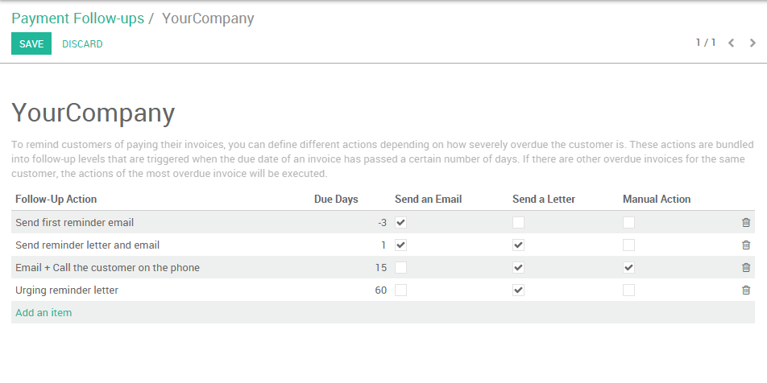
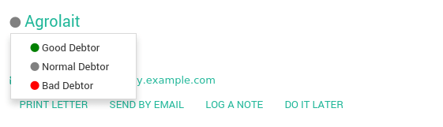
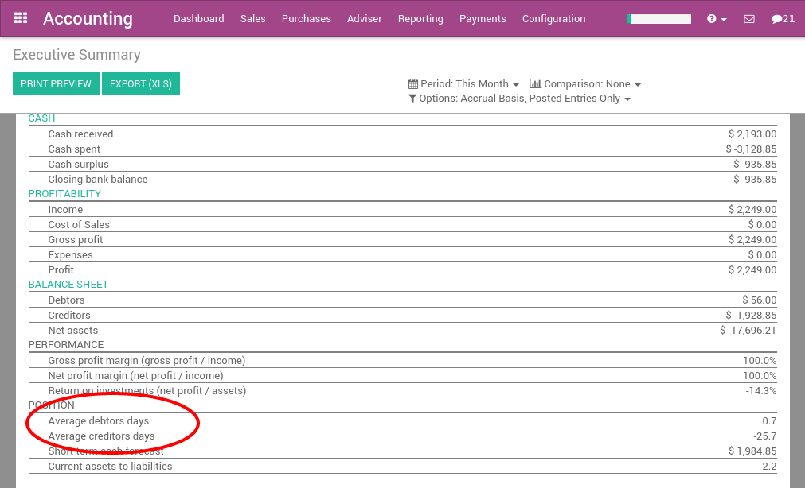

=================================================
How to get paid and organize customer follow-ups?
=================================================

Getting paid and organizing customer reminders is always a difficult
task, however it is critical for the health of the company to stay
diligent about outstanding receivables. Fortunately, Odoo provides the
right tools to track receivables, automate customer statements, and
measure your performance.

Customer follow-ups: A step by step guide
=========================================

Cleaning up outstanding payments
--------------------------------

If you have any unreconciled transactions in your bank account, you will
need to process them first before you begin analyzing your customers
statements. This ensures that you have recorded all of the latest
customer payments before sending out reminders to any customers with
outstanding balances.

.. image:: ./media/followup01.png
  :align: center

Checking the Aged Receivables report
------------------------------------

After you have reconciled all of your bank accounts, you can then
generate an accurate Aged Receivables Report from the Reports menu. This
report will display all of the customers and their outstanding balances
on open invoices.

.. image:: ./media/followup02.png
  :align: center

The report displays this information in time increments to better paint
a picture of the outstanding balances your customers hold and for how
long they have held these outstanding balances. You can then
appropriately focus your efforts on the appropriate customers.

You can then select any of the customers on this list and Odoo will open
up their invoice details in the form of the Customer Follow-Up letter,
also known as the **Customer Statement**.

.. image:: ./media/followup03.png
  :align: center

From the customer statement, you can:

- Change and customize the message that is sent to the customer

- Send a reminder email to the customer

- Send a printed reminder letter to the customer

- Send automated printed reminders by utilizing our Docsaway
  integration

- Zoom in on the different open invoices or payments

- Remove an invoice or payment from the report (in case of conflict)

- Log any call notes made to the customer

- Schedule your next follow up task to stay on top of customer payments
  (e.g. call back in 15 days if not payments are made)

You can set reminders for when you would like to next contact the
particular customer. Selecting **Manual** will open up the follow up
scheduling tool, while selecting **Auto** will automatically recommend that
you contact the customer 15 days from then if the customer has not yet
paid for the invoice. Installing the **Follow-Up Plans** module will allow
you to define automated actions and intervals to send reminders.

.. image:: ./media/followup04.png
  :align: center

If you have already sent out a reminder to a customer a few days ago, a
warning message will appear at the top of the screen, reminding you that
you should not send another reminder so soon since one was already sent
recently. Every time you log a note, Odoo will automatically set the
next reminder date, unless you choose to manually set it by selecting
the next reminder button at the top right of the screen.

.. tip::
	
	You can also specify the expected payment date on an invoice line directly,
	therefore defining the next reminder in case the invoice has not been paid.

Sending customer statements
---------------------------

Send your customers reminders in batches in the menu :menuselection:`Sales -->
Customer Statements`.

Here Odoo will open all the statements awaiting to be processed, which
is determined by the last reminder they received. You can choose to
process them one by one, send multiple letters or emails in batches, or
set a next action date for the next time they'll be contacted.

.. note::

	If an invoice has not yet been paid, Odoo will remind you to contact at
	particular customer based after their next action date.

You can access the customer statement report daily and Odoo will only
display the customers you need to contact on any given day. This is
based on:

- Customers you have not yet received a payment from

- Customers that have not been reminded over the last X days ("X" being
  defined as the overdue date of the invoice after the first
  reminder, then the next action date set at every reminder)

Setting up your dunning process
-------------------------------

The **Payment Follow-up Management** module allows you to define
reminder plans. After installing it from the **Apps** menu, go to the
**Follow-up Levels** menu in the accounting configuration to set up your
dunning process.

Some Examples are:

- **Email**: 3 days before overdue date

- **Email+Letter**: at the overdue date

- **Email+Call**: 15 days after the overdue date

- **Email+Letter**: 60 days after the overdue date

Thanks to this module, you can send every email and letters in batches
for all your customers at once. The next reminder will automatically be
computed based on your configured follow-up plan.

The module will also add a red/green dot on each customer, this will
allow you to easily mark customer status's with the following options:
"Good Debtor, Normal Debtor, or bad debtors.

DSO: Measuring your performance
===============================

The DSO (Days of Outstanding Sales) is a measure of the average number
of days that a company takes to collect revenue after a sale has been
made. DSO is calculated by dividing the amount of accounts receivable
during a given period by the total value of credit sales during the same
period, and multiplying the result by the number of days in the period
measured.

You can get the DSO of your company from the Executive Summary report
under Reporting (check the KPI average debtors days).

.. seealso::

	* :doc:`recording`
	* :doc:`check`
