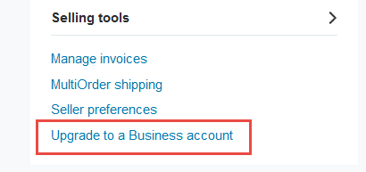

==========================================
How to accept paypal payments on invoices?
==========================================

The "Paypal Payment Acquirer" module allows you to accept payments via
paypal, for your sales orders, invoices, or online orders. As paypal
accepts payments through credit cards (VISA, Mastercard, …), you will be
able to process most payment methods.

Paypal support two modes:

- Paypal Merchant Account: the user is redirected to paypal to do the
  payment (either with a credit card or a paypal account)

- PayPal PayFlow Pro (S2S, Server 2 Server): the user is not redirected
  to paypal and the payment can be done in the background. This
  method is mostly used for subscription businesses where you need
  to charge your customers periodically.

As of today, Odoo only support the normal Paypal Merchant Account.

Configuration
=============

Install the "PayPal Payment Acquirer" module
--------------------------------------------

Start by installing the **PayPal Payment Acquirer** module.

Once the module is installed, you should see a new payment acquirer in
the Setting application, menu "Payment Acquirers".

.. image:: ./media/paypal01.png
  :align: center

By default, Paypal is configured to work in a test environment,
out-of-the-box. It means you can already test the full order to payment
flow with the paypal sandbox, without having to configure the next
steps.

Creating and configuring a PayPal merchant account
--------------------------------------------------

Create a basic Paypal account
^^^^^^^^^^^^^^^^^^^^^^^^^^^^^

a. Existing or newly created Personal Paypal account can be used.

b. Or upgrade your account to Business account (merchant) if needed
   

  Paypal Account Summary page

Paypal Configuration
^^^^^^^^^^^^^^^^^^^^

1. Access "Seller preferences" menu from `PayPal website <https://www.paypal.com/myaccount/home>`__

   .. image:: ./media/paypal03.png

.. _WebsitePreferences:

2. Access "Website preferences" and configure Auto Return (Payment Data Transfer
   must be left to Off)

   * **Database name**: yourcompany
   * **Website URL**: https://yourcompany.odoo.com/
   * **Return URL**: https://yourcompany.odoo.com/shop/confirmation

   .. image:: ./media/paypal04.png
   .. image:: ./media/paypal05.png

   These settings will redirect your buyer to your web confirmation page.

   .. image:: ./media/paypal06.png

3. Access and edit Instant payment notifications settings - IPN

   .. image:: ./media/paypal07.png
   .. image:: ./media/paypal08.png

   Example

   - **Database name**: "yourcompany"
   - **Website URL**: https://yourcompany.odoo.com/
   - **Notification URL**: https://yourcompany.odoo.com/payment/paypal/ipn/

   .. tip:: Verify that your Notify URL uses the correct protocol (HTTP / HTTPS).
            If you use the odoo.com domain, we advise you to use HTTPS.

4. Set the encoding to UTF-8 from the menu :menuselection:`Settings --> 
   Language Encoding --> More Options --> More selling tools`

   .. image:: ./media/paypal09.png
   
   .. image:: ./media/paypal10.png
   
   .. image:: ./media/paypal11.png
   
5. Record your Merchant Paypal ID (personal or business account
   both will have it) it will be entered in Odoo backend :menuselection:`Paypal
   Settings --> Account Options`.

   .. image:: ./media/paypal12.png

   .. image:: ./media/paypal13.png

6. If you want your customers to be able to pay through Paypal
   while not having a Paypal account- following setting "Paypal Account
   Optional" needs to be set to **ON**. All users will be able to
   choose Credit/debit card payment option - Paypal account not
   required.

   .. image:: ./media/paypal14.png

Setup your Paypal Payment Acquirer account credentials in Odoo
--------------------------------------------------------------

* :menuselection:`Settings --> Payments --> Payment Acquirers --> Paypal`

* **Paypal Email ID**: your paypal account email address

* **Paypal Merchant ID**: ID retrieved at previous step

.. image:: ./media/paypal15.png
  :align: center

.. todo:: section How to test an order

Troubleshooting
===============

If your eCommerce customer gets this Error Message after completing
Paypal payment instead of being redirected to your database:

.. image:: ./media/paypal16.png
  :align: center

Verify the settings you have `configured in Paypal <WebsitePreferences_>`_:

* Auto Return should be on (the value can be quite generic, like
  <odoo_instance>/shop/confirmation; the correct URL will be set for each
  transaction)

* Payment Data Transfer should be off

.. warning:: On-premise databases must be accessible through classic HTTP/HTTPS
          ports (80/443) for Paypal to work correctly, usually through a reverse
          proxy. Contact your integrating partner if you are unsure this is the
          case. Databases hosted on odoo.com are already configured correctly.

.. seealso::

  * :doc:`credit_cards`
