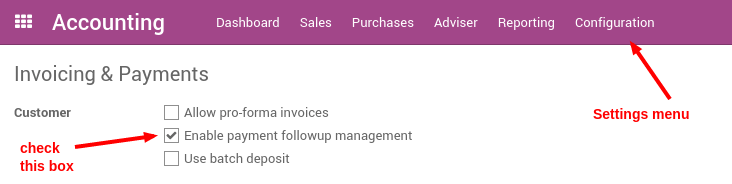
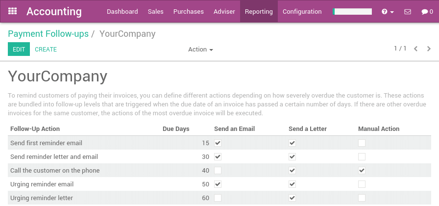
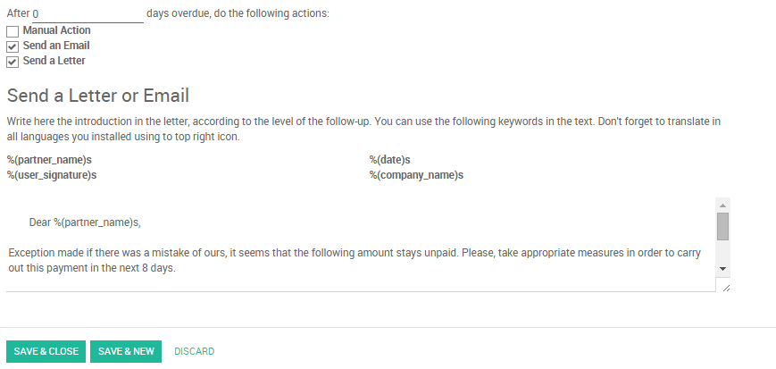
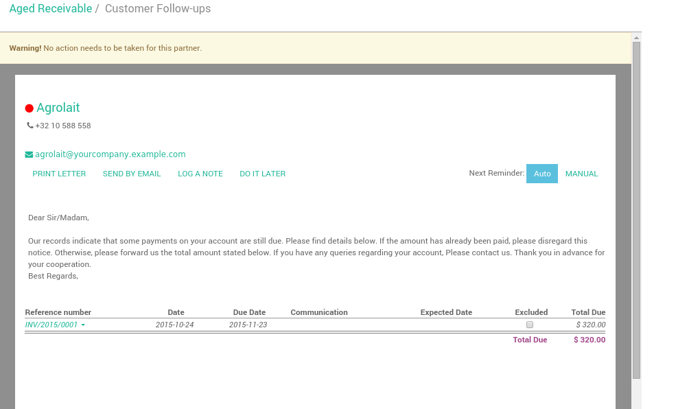
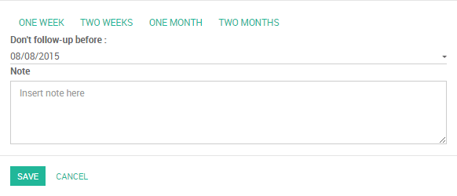
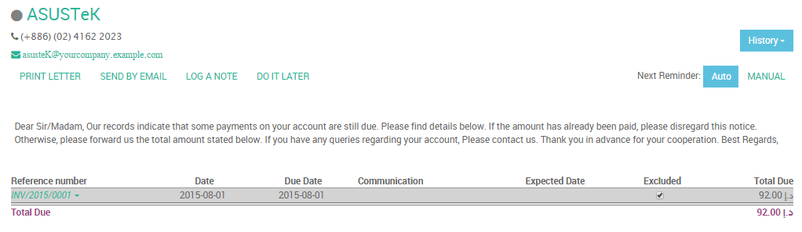

==========================================================
How to automate customer follow-ups with plans?
==========================================================

With the Odoo Accounting application, you get a dynamic aged receivable
report, customer statements and you can easily send them to customers.

If you want to go further in the automation of the credit collection
process, you can use follow-up plans. They will help you automate all
the steps to get paid, by triggering them at the right time: send
customer statements by emails, send regular letter (through the Docsaway
integration), create a task to manually call the customer, etc...

Here is an example of a plan:

+--------------------------+--------------------------+-------------------+
| When?                    | What?                    | Who?              |
+==========================+==========================+===================+
| 3 days before due date   | Email                    | automated         |
+--------------------------+--------------------------+-------------------+
| 1 day after due date     | Email + Regular Letter   | automated         |
+--------------------------+--------------------------+-------------------+
| 15 days after due date   | Call the customer        | John Mac Gregor   |
+--------------------------+--------------------------+-------------------+
| 35 days after due date   | Email + Letter + Call    | John Mac Gregor   |
+--------------------------+--------------------------+-------------------+
| 60 days after due date   | Formal notice            | Bailiff           |
+--------------------------+--------------------------+-------------------+

Configuration
=============

Install Reminder Module
-----------------------

You must start by activating the feature, using the menu 
:menuselection:`Configuration --> Settings` of the Accounting application. 
From the settings screen, activate the feature **Enable payment follow-up management**.

Define Payment Follow-ups Levels
--------------------------------

To automate customer follow ups, you must configure your follow–up
levels using the menu :menuselection:`Accounting --> Configuration --> Payment Follow-ups`.
You should define one and only one follow-up plan per company.

The levels of follow-up are relative to the due date; when no payment
term is specified, the invoice date will be considered as the due date.

For each level, you should define the number of days and create a note
which will automatically be added into the reminder letter.

Odoo defines several actions for every reminder:

-  **Manual Action:** assign a responsible that will have to call the customer
-  **Send an Email:** send an email to customer using the provided text
-  **Send a Letter:** send a letter by regular mail, using the provided note

.. Note:: 
    As you need to provide a number of days relative to the due date,
    you can use a negative number. As an example, if an invoice is issued
    the January 1st but the due date is January 20, if you set a reminder 3
    days before the due date, the customer may receive an email in January
    17.

Doing your weekly follow-ups
============================

Once everything is setup, Odoo will prepare follow-up letters and emails
automatically for you. All you have to do is to the menu 
:menuselection:`Sales --> Customers Statement` in the accounting application.

Odoo will automatically propose you actions based on the follow-up plan
you defined, invoices to pay and payment received.

You can use this menu every day, once a week or once a month. You do not
risk to send two times the same reminder to your customer. Odoo only
proposes you the action you have to do. If you do it every day, you will
have a few calls to do per day. If you do it once a month, you will have
much more work once you do it.

It's up to you to organize the way you want to work. But it's a good
practice to reconcile your bank statements before launching the
follow-ups. That way, all paid invoices will be reconciled and you will
not send a follow-up letter to a customer that already paid his invoice.

From a customer follow-up proposition, you can:

-  Get the customer information to contact him

-  Drill down to the customer information form by clicking on its name

-  Change the text (or the email or letter) and adapt to the customer

-  Change the colored dot to mark the customer as being a good, normal
   or bad debtor

-  Log a note is you called the customer

-  Exclude some invoices from the statement table (litigation)

-  Send an email with the statement

-  Print a letter, or send a regular mail (if you installed the Docsaway
   integration)

-  Plan the next reminder (but it's better to keep in automatic mode so that Odoo
   will stick to the follow-up plan of the company)

-  Drill down to an invoice

-  Change the expected payment date of an invoice (thus, impacting the
   next time Odoo will propose you to send a reminder)

.. note::
    You can force a customer statement, even if Odoo do not proposes
    you to do it, because it's not the right date yet. To do this, you
    should go to the Aged Receivable report (in the report menu of the
    Accounting application). From this report, you can click on a customer
    to get to his customer statement.

How to exclude an invoice from auto follow up?
===============================================

To see all **overdue invoices** or **on need of action**,

Go to :menuselection:`Accounting --> Sales --> Customers Statement`

.. image:: ./media/automated_followups05.png
  :align: center

Exclude a specific invoice for a specific date
------------------------------------------------

Odoo can exclude an invoice from follow-ups actions for specific date by
clicking on **Log a Note**, then choose one of the ready options (*one week*, 
*two weeks*, *one month*, *two months*), So Odoo will calculate the
required date according to the current date.

Another way to achieve it is the following: click on the required invoice, 
then choose **Change expected payment date/note**, then enter a new payment date and note.

.. image:: ./media/automated_followups07.png
  :align: center

Exclude a specific invoice forever
-----------------------------------

Odoo can exclude an invoice for a specific customer by clicking on
the checkbox **Excluded**

.. note::
    If you click on **History**, you can see all follow ups actions.

