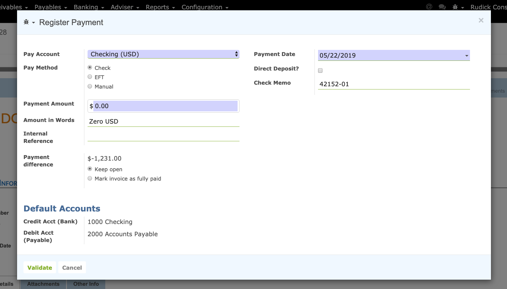

======================
Paying Vendor Invoices
======================

Summary
-------

Once you have your vendor invoices entered into Twenty20 and in the "OPEN" state, 
they are ready to be paid. Twenty20 has a variety of ways to pay invoices, but each of the ways
results in a payment being made and entered into the system that can be printed on your check stock. 
Checks can be printed either one at a time or in batch. During the bank reconciliation process 
we will match the checks you sent with the transactions shwoing on the actual bank statements.

Pay a vendor invoice with a check
================================

Paying a vendor with a check is done in three steps:

1. Registering a payment you'd like to do on the invoice
2. Printing checks in batch for all registered payments
3. Reconcile bank statements

Register a payment by check
---------------------------

To register a payment on a invoice, open any vendor invoice from the menu
:menuselection:`Accounting --> Payables --> Select Invoices for payment`. Once the vendor invoice is
validated, you can register a payment. Set the **Pay Account** to the account that you would like to use to make the payment, Enter the amount to pay
and validate the payment dialog.

Explanation of the fields of the payment screen:

.. demo:fields:: account.action_account_payments

.. demo:action:: account.action_account_payments
	
	Try paying a vendor invoice with a check

.. _PrintChecks:

Print checks
------------

From the accounting dashboard, on your bank account, you should see a
link "X checks to print". Click on this link and you will get the list
of all checks that are not printed yet. From this screen, you can print
all checks in batch or review them one by one.

If you want to review every payment one by one before printing the
check, open on the payment and click on **Print Check** if you accept it. A dialog
will ask you the number of the check. It automatically proposes you the
next number, but you can change it if it does not match your next check
number.

To print all checks in batch, select all payments from the list view and
Print Check from the top "print" menu.

.. image:: ./media/check03.png
  :align: center

.. _ReconicleBankStatements:

Reconcile Bank Statements
-------------------------

Once you process your bank statement, when the check is credited from
your bank account, Twenty20 will propose you automatically to match it with
the payment. This will mark the payment as **Reconciled**.

.. tip::

	to review checks that have not been credited, open the list of
	payments and filter on the Sent state. Review those payments that have a
	date more than 2 weeks ago.

Pay anything with a check
=========================

You can register a payment that is not related to a vendor invoice. To do
so, use the top menu :menuselection:`Purchases --> Payments`. Register your
payment and select a payment method by check.

If you pay a specific vendor invoice, put the reference of the invoice in
the **Memo** field.

.. image:: ./media/check04.png
  :align: center

Once your payment by check is registered, don't forget to **Confirm** it.
Once confirmed, you can use **Print Check** directly or follow the preceding
flow to print checks in batch:

-  `Print checks <PrintChecks_>`_

-  `Reconcile bank statements <ReconicleBankStatements_>`_
