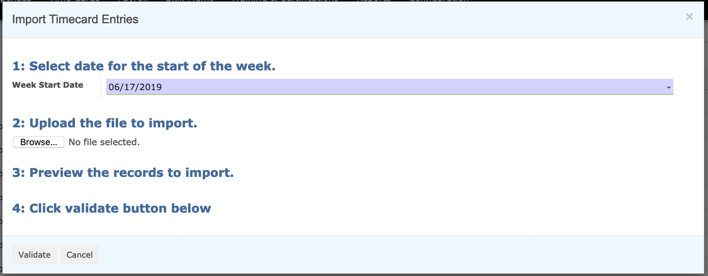

===========
Importing Time
===========

Overview
========

.. note::

	In order to import time, it is necessary that the time
	import file is formatted correctly. Please contact Twenty20 for assistance.

Video Demonstration
========

.. youtube:: goxiyanQE84
    :align: right
    :width: 700
    :height: 394

Step by Step
========

1-  Open the Open the menu :menuselection:`Human Resources --> Time Cards`, then click on the
**Import Timecard Entries** button.

2-  Enter the start date of the time to be imported

3-  Select the file to import

4-  Cick **Validate**

5-  If everything looks correct, click **Import** button at the bottom of the page
