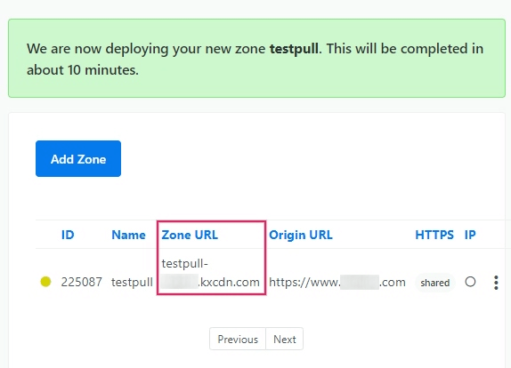

=======================================
Set up a content delivery network (CDN)
=======================================

.. _reference/cdn/keycdn:

Deploying with KeyCDN
=====================

A :abbr:`CDN (Content Delivery Network)` or *content distribution network*, is a geographically
distributed network of servers that provides high speed internet content. The :abbr:`CDN (Content
Delivery Network)` provides quick, high-quality content delivery for content-heavy websites.

This document will guide you through the setup of a KeyCDN_ account with an Odoo powered website.

Create a pull zone in the KeyCDN dashboard
------------------------------------------

On the KeyCDN dashboard, start by navigating to the :menuselection:`Zones` menu item on the left. On
the form, give a value to the :guilabel:`Zone Name`, which will appear as part of the :abbr:`CDN
(Content Delivery Network)`'s :abbr:`URL (Uniform Resource Locator)`. Then, set the :guilabel:`Zone
Status` to :guilabel:`active` to engage the zone. For the :guilabel:`Zone Type` set the value to
:guilabel:`Pull`, and then, finally, under the :guilabel:`Pull Settings`, enter the
:guilabel:`Origin URL`— this address should be the full Odoo database :abbr:`URL (Uniform Resource
Locator)`.

.. example::
   Use ``https://yourdatabase.odoo.com`` and replace the *yourdatabase* subdomain prefix with the
   actual name of the database. A custom :abbr:`URL (Uniform Resource Locator)` can be used, as
   well, in place of the Odoo subdomain that was provided to the database.

.. image:: cdn/keycdn-zone.png
   :align: center
   :alt: KeyCDN's Zone configuration page.

Under the :guilabel:`General Settings` heading below the zone form, click the :guilabel:`Show all
settings` button to expand the zone options. This should be the last option on the page. After
expanding the :guilabel:`General Settings` ensure that the :guilabel:`CORS` option is
:guilabel:`enabled`.

Next, scroll to the bottom of the zone configuration page and :guilabel:`Save` the changes. KeyCDN
will indicate that the new zone will be deployed. This can take about 10 minutes.

.. note::
   A new :guilabel:`Zone URL` has been generated for your Zone, in this example it is
   ``pulltest-xxxxx.kxcdn.com``. This value will differ for each database.

Copy this :guilabel:`Zone URL` to a text editor for later, as it will be used in the next steps.

Configure the Odoo instance with the new zone
---------------------------------------------

In the Odoo :guilabel:`Website` app, go to the :menuselection:`Settings` and then activate the
:guilabel:`Content Delivery Network (CDN)` setting and copy/paste the :guilabel:`Zone URL` value
from the earlier step into the :guilabel:`CDN Base URL` field. This field is only visible and
configurable when :doc:`Developer Mode <../../applications/general/developer_mode>` is activated.

.. note::
   Ensure that there are two *forward slashes* (`//`) before the :guilabel:`CDN Base URL` and one
   forward slash (`/`) after the :guilabel:`CDN Base URL`.

:guilabel:`Save` the settings when complete.

.. image:: cdn/cdn-base-url.png
   :align: center
   :alt: Activate the CDN setting in Odoo.

Now the website is using the CDN for the resources matching the :guilabel:`CDN filters` regular
expressions.

In the HTML of the Odoo website, the :abbr:`CDN (content delivery network)` integration is evidenced
as working properly by checking the :abbr:`URL (Uniform Resource Locators)` of images. The *CDN Base
URL* value can be seen by using your web browser's :guilabel:`Inspect` feature on the Odoo website.
Look for it's record by searching within the :guilabel:`Network` tab inside of devtools.

.. image:: cdn/test-pull.png
   :align: center
   :alt: The CDN Base URL can be seen using the inspect function on the Odoo website.

Prevent security issues by activating cross-origin resource sharing (CORS)
--------------------------------------------------------------------------

A security restriction in some browsers (such as Mozilla Firefox and Google Chrome) prevents a
remotely linked CSS file to fetch relative resources on this same external server.

If the :abbr:`CORS (Cross-Origin Resource Sharing)` option isn't enabled in the :guilabel:`CDN
Zone`, the more obvious resulting problem on a standard Odoo website will be the lack of *Font
Awesome* icons because the font file declared in the *Font Awesome* CSS won't be loaded from the
remote server.

When these cross-origin resource issues occur, a security error message similar to the output
below will appear in the web browser's developer console:

``Font from origin 'http://pulltest-xxxxx.kxcdn.com' has been blocked from loading /shop:1 by
Cross-Origin Resource Sharing policy: No 'Access-Control-Allow-Origin' header is present on the
requested resource. Origin 'http://yourdatabase.odoo.com' is therefore not allowed access.``

.. image:: cdn/odoo-security-message.png
   :align: center
   :alt: Error message populated in the browser console.

Enabling the :abbr:`CORS (Cross-Origin Resource Sharing)` option in the :abbr:`CDN (Content Delivery
Network)` settings fixes this issue.

.. _KeyCDN: https://www.keycdn.com
