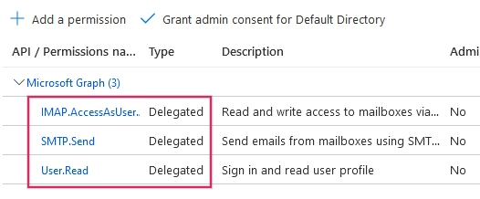
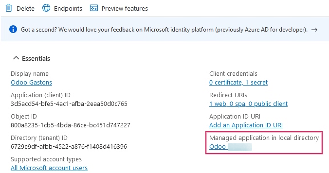
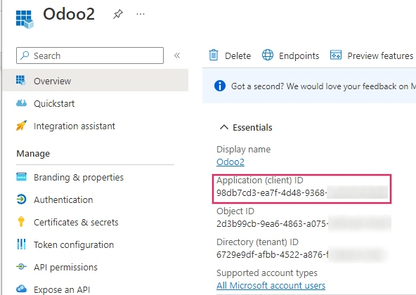
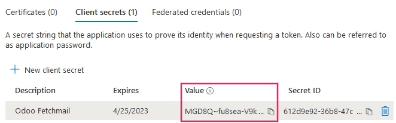
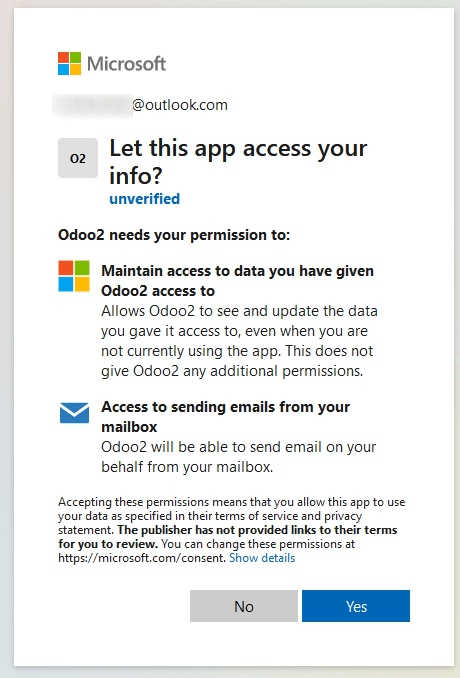
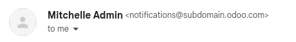

=======================================================
Connect Microsoft Outlook 365 to Odoo using Azure OAuth
=======================================================

Odoo is compatible with Microsoft's Azure OAuth for Microsoft 365. In order to send and receive
secure emails from a custom domain, all that is required is to configure a few settings on the
Azure platform and on the back end of the Odoo database. This configuration works with either a
personal email address or an address created by a custom domain.

.. seealso::
   `Microsoft Learn: Register an application with the Microsoft identity platform
   <https://learn.microsoft.com/azure/active-directory/develop/quickstart-register-app>`_

.. seealso::
   - :doc:`/applications/general/auth/azure`
   - :doc:`/applications/productivity/calendar/outlook`

Setup in Microsoft Azure Portal
===============================

Create a new application
------------------------

To get started, go to `Microsoft's Azure Portal <https://portal.azure.com/>`_. Log in with the
:guilabel:`Microsoft Outlook Office 365` account if there is one, otherwise log in with the
personal :guilabel:`Microsoft account`. A user with administrative access to the Azure Settings
will need to connect and perform the following configuration. Next, navigate to the section
labeled :guilabel:`Manage Microsoft Entra ID` (formally *Azure Active Directory*).

Now, click on :guilabel:`Add (+)`, located in the top menu, and then select :guilabel:`App
registration`. On the :guilabel:`Register an application` screen, rename the :guilabel:`Name` to
`Odoo` or something recognizable. Under the :guilabel:`Supported account types` section select
:guilabel:`Accounts in any organizational directory (Any Microsoft Entra ID directory - Multitenant)
and personal Microsoft accounts (e.g. Skype, Xbox)`.

Under the :guilabel:`Redirect URL` section, select :guilabel:`Web` as the platform, and then input
`https://<odoo base url>/microsoft_outlook/confirm` in the :guilabel:`URL` field. The Odoo base URL
is the canonical domain at which your Odoo instance can be reached in the URL field.

.. example::
   *mydatabase.odoo.com*, where *mydatabase* is the actual prefix of the database's subdomain,
   assuming it's hosted on Odoo.com

After the URL has been added to the field, :guilabel:`Register` the application so it is created.

API permissions
---------------

The :guilabel:`API permissions` should be set next. Odoo will need specific API permissions to be
able to read (IMAP) and send (SMTP) emails in the Microsoft 365 setup. First, click the
:guilabel:`API permissions` link, located in the left menu bar. Next, click on the :guilabel:`(+)
Add a Permission` button and select :guilabel:`Microsoft Graph` under :guilabel:`Commonly Used
Microsoft APIs`. After, select the :guilabel:`Delegated Permissions` option.

In the search bar, search for the following :guilabel:`Delegated permissions` and click
:guilabel:`Add permissions` for each one:

- :guilabel:`SMTP.Send`
- :guilabel:`IMAP.AccessAsUser.All`

.. note::
   The :guilabel:`User.Read` permission will be added by default.

Assign users and groups
=======================

After adding the API permissions, navigate back to the :guilabel:`Overview` of the
:guilabel:`Application` in the top of the left sidebar menu.

Now, add users to this application. Under the :guilabel:`Essentials` overview table, click on the
link labeled :guilabel:`Managed Application in Local Directory`, or the last option on the bottom
right-hand side of the table.

         created application.

In the left sidebar menu, select :guilabel:`Users and Groups`. Next, click on :guilabel:`(+) Add
User/Group`. Depending on the account, either a :guilabel:`Group` and a :guilabel:`User` can be
added, or only :guilabel:`Users`. Personal accounts will only allow for :guilabel:`Users` to be
added.

Under :guilabel:`Users` or :guilabel:`Groups`, click on :guilabel:`None Selected` and add the users
or group of users that will be sending emails from the :guilabel:`Microsoft account` in Odoo.
:guilabel:`Add` the users/groups, click :guilabel:`Select`, and then :guilabel:`Assign` them to the
application.

Create credentials
------------------

Now that the Microsoft Azure app is set up, credentials need to be created for the Odoo setup.
These include the :guilabel:`Client ID` and :guilabel:`Client Secret`. To start, the
:guilabel:`Client ID` can be copied from the :guilabel:`Overview` page of the app. The
:guilabel:`Client ID` or :guilabel:`Application ID` is located under the :guilabel:`Display Name`
in the :guilabel:`Essentials` overview of the app.

Next, the :guilabel:`Client Secret Value` needs to be retrieved. To get this value, click on
:guilabel:`Certificates & Secrets` in the left sidebar menu. Then, a :guilabel:`Client Secret`
needs to be produced. In order to do this, click on the :guilabel:`(+) New Client Secret` button.

A window on the right will populate with a button labeled :guilabel:`Add a client secret`. Under
:guilabel:`Description`, type in `Odoo Fetchmail` or something recognizable, and then set the
:guilabel:`expiration date`.

.. important::
   A new :guilabel:`Client Secret` will need to be produced and configured if the first one
   expires. In this event, there could be an interruption of service, so the expiration date should
   be noted and set to the furthest possible date.

Next, click on :guilabel:`Add` when these two values are entered. A :guilabel:`Client Secret Value`
and :guilabel:`Secret ID` will be created. It is important to copy the :guilabel:`Value` or
:guilabel:`Client Secret Value` into a notepad as it will become encrypted after leaving this page.
The :guilabel:`Secret ID` is not needed.

After these steps, the following items should be ready to be set up in Odoo:

- A client ID (:guilabel:`Client ID` or :guilabel:`Application ID`)
- A client secret (:guilabel:`Value` or :guilabel:`Client Secret Value`)

This completes the setup on the :guilabel:`Microsoft Azure Portal` side.

Setup in Odoo
=============

Enter Microsoft Outlook credentials
-----------------------------------

First, open the Odoo database and navigate to the :guilabel:`Apps` module. Then, remove the
:guilabel:`Apps` filter from the search bar and type in `Outlook`. After that, install the module
called :guilabel:`Microsoft Outlook`.

Next, navigate to :menuselection:`Settings --> General Settings`, and under the :guilabel:`Discuss`
section, ensure that the checkbox for :guilabel:`Custom Email Servers` is checked. This populates
a new option for :guilabel:`Outlook Credentials`.

:guilabel:`Save` the progress.

Then, copy and paste the :guilabel:`Client ID` (Application ID) and :guilabel:`Client Secret
(Client Secret Value)` into the respective fields and :guilabel:`Save` the settings.

.. image:: azure_oauth/outlookcreds.png
   :align: center
   :alt: Outlook Credentials in Odoo General Settings.

Configure outgoing email server
-------------------------------

On the :guilabel:`General Settings` page, under the :guilabel:`Custom Email Servers` setting,
click the :guilabel:`Outgoing Email Servers` link to configure the Microsoft account.

Then, create a new email server and check the box for :guilabel:`Outlook`. Next, fill in the
:guilabel:`Name` (it can be anything) and the Microsoft Outlook email :guilabel:`Username`.

If the :guilabel:`From Filter` field is empty, enter either a :ref:`domain or email address
<email_communication/default>`.

Then, click on :guilabel:`Connect your Outlook account`.

A new window from Microsoft opens to complete the :guilabel:`authorization process`. Select the
appropriate email address that is being configured in Odoo.

Then, allow Odoo to access the Microsoft account by clicking on :guilabel:`Yes`. After this, the
page will navigate back to the newly configured :guilabel:`Outgoing Mail Server` in Odoo. The
configuration automatically loads the :guilabel:`token` in Odoo, and a tag stating
:guilabel:`Outlook Token Valid` appears in green.

.. image:: azure_oauth/outlook-token.png
   :align: center
   :alt: Valid Outlook Token indicator.

Finally, click :guilabel:`Test Connection`. A confirmation message should appear. The Odoo database
can now send safe, secure emails through Microsoft Outlook using OAuth authentication.

.. _azure_oauth/notifications:

Configuration with a single outgoing mail server
~~~~~~~~~~~~~~~~~~~~~~~~~~~~~~~~~~~~~~~~~~~~~~~~

Configuring a single outgoing server is the simplest configuration available for Microsoft Azure
and it doesn't require extensive access rights for the users in the database.

A generic email address would be used to send emails for all users within the database. For example
it could be structured with a `notifications` alias (`notifications@example.com`) or `contact` alias
(`contact@example.com`). This address must be set as the :guilabel:`FROM Filtering` on the server.
This address must also match the `{mail.default.from}@{mail.catchall.domain}` key combination in the
system parameters.

.. seealso::
   For more information on the from filter visit: :ref:`email_communication/default`.

.. note::
   The :guilabel:`System Parameters` can be accessed by activating :ref:`developer-mode` in the
   :menuselection:`Settings --> Technical --> Parameters --> System Parameters` menu.

When using this configuration, every email that is sent from the database will use the address of
the configured `notification` mailbox. However it should be noted that the name of the sender will
appear but their email address will change:

.. example::
   Single outgoing mail server configuration:

   - Outgoing mail server **username** (login) = `notifications@example.com`
   - Outgoing mail server :guilabel:`FROM Filtering` = `notifications@example.com`
   - `mail.catchall.domain` in system parameters = `example.com`
   - `mail.default.from` in system parameters = `notifications`

User-specific (multiple user) configuration
~~~~~~~~~~~~~~~~~~~~~~~~~~~~~~~~~~~~~~~~~~~

In addition to a generic email server, individual email servers can be set up for users in a
database. These email addresses must be set as the :guilabel:`FROM Filtering` on each individual
server for this configuration to work.

This configuration is the more difficult of the two Microsoft Azure configurations, in that it
requires all users configured with email servers to have access rights to settings in order to
establish a connection to the email server.

Setup
*****

Each user should have a separate email server set up. The :guilabel:`FROM Filtering` should be set
so that only the user's email is sent from that server. In other words, only a user with an email
address that matches the set :guilabel:`FROM Filtering` is able to use this server.

.. seealso::
   For more information on the from filter visit: :ref:`email_communication/default`.

A :ref:`fallback server <azure_oauth/notifications>` must be setup to allow for the sending of
:guilabel:`notifications`. The :guilabel:`FROM Filtering` for this server should have the value of
the `{mail.default.from}@{mail.catchall.domain}`.

.. note::
   The :guilabel:`System Parameters` can be accessed by activating :ref:`developer-mode` in the
   :menuselection:`Settings --> Technical --> Parameters --> System Parameters` menu.

.. important::
   The configuration for this transactional email server can work alongside an outgoing mass-mailing
   email server. The :guilabel:`FROM Filtering` for the mass-mailing email server can remain empty,
   but it's require to be added in the settings of the *Email Marketing* application.

   .. seealso::
      For more information on setting the mass-mailing email server visit
      :ref:`email_communication/mass_mails`.

.. example::
   Multiple user outgoing mail server configuration:

   - User #1 mailbox
      - Outgoing mail server #1 **username** (login) = `john@example.com`
      - Outgoing mail server #1 :guilabel:`FROM Filtering` = `john@example.com`
   - User #2 mailbox
      - Outgoing mail server #2 **username** (login) = `jane@example.com`
      - Outgoing mail server #2 :guilabel:`FROM Filtering` = `jane@example.com`
   - Notifications mailbox
      - Outgoing mail server #3 **username** (login) = `notifications@example.com`
      - Outgoing mail server #3 :guilabel:`FROM Filtering` = `notifications@example.com`
   - System Parameters
      - `mail.catchall.domain` in system parameters = `example.com`
      - `mail.default.from` in system parameters = `notifications`

Configure incoming email server
-------------------------------

The incoming account should be configured in a similar way to the outgoing email account. Navigate
to the :guilabel:`Incoming Mail Servers` in the :guilabel:`Technical Menu` and :guilabel:`Create` a
new configuration. Check or Select the button next to :guilabel:`Outlook Oauth Authentication` and
enter the :guilabel:`Microsoft Outlook username`.  Click on :guilabel:`Connect your Outlook
account`. Odoo will state: :guilabel:`Outlook Token Valid` Now :guilabel:`Test and Confirm` the
account. The account should be ready to receive email to the Odoo database.

.. seealso::
   :doc:`../../applications/general/email_communication/email_servers`
