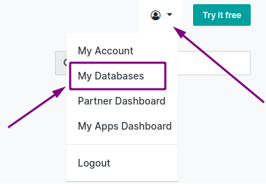

.. |assistance-contact| replace::
   If you need Odoo assistance on this matter, please get in touch with your Odoo Account Manager or
   our `Sales department`_.
.. _Sales department: mailto:sales@odoo.com

.. _db-upgrade:

================
Versions upgrade
================

.. _db-upgrade/overview:

Overview
========

An upgrade is switching to a newer version of Odoo (e.g., Odoo 14.0 to Odoo 15.0).

An upgrade does not cover:

* changing :ref:`Editions <db-upgrade/faq/editions-change>` (i.e., Community to Enterprise edition)
* switching :ref:`hosting type <db-upgrade/faq/hosting-types-switch>` (i.e., On-Premise to Online or
  Odoo.sh)
* migration from another ERP to Odoo

.. note:: |assistance-contact|

.. _db-upgrade/process-workflow:

Process workflow
----------------

The upgrade process in a nutshell:

#. You create a test upgrade request.
#. | Odoo processes the request:
   | This happens via an automated process that runs the database through an upgrade script and
     takes between 20 and 120 minutes. Only if an issue(s) arises will we have to intervene
     manually and adjust the script specifically to your database until the upgrade succeeds.
#. Odoo delivers a test database.
#. You test your database for possible discrepancies (see :ref:`db-upgrade/test-guidance`)
#. If there are any discrepancies, you report them to the Upgrade support team via the help portal
   (see :ref:`db-upgrade/test-assistance`).
#. We will fix the issues and send you a new test database.
#. Once you have completed the testing and are happy with the result, you decide on a date and time
   when you stop users from accessing Odoo, freeze all data entries, and create an upgrade request
   for the production upgrade.
#. Odoo delivers the production database through the automated process.
#. You restore it in your Production environment a few short hours later and continue working on the
   newly upgraded database (this is done automatically on SaaS).

.. _db-upgrade/get-started:

Get started
===========

The upgrade process varies depending on where your database is hosted.

.. _db-upgrade/online:

Online Hosting (SaaS)
---------------------

The upgrade request is made via your `database manager <https://www.odoo.com/my/databases>`_.

.. image:: db_upgrade/online-upgrade-button.png
   :align: center
   :alt: Click on the settings button next to your database, then on "Upgrade"

.. _db-upgrade/odoo-sh:

Cloud Platform (Odoo.sh)
------------------------

:doc:`../odoo_sh/advanced/upgrade_your_database`

.. _db-upgrade/on-premise:

Self-Hosting (On-Premise)
-------------------------

There are two possibilities:

#. Via `Odoo Upgrade service <https://upgrade.odoo.com>`_
#. | For technically advanced users and partners, via the following command line on the machine
     where your database is hosted:
   | ``python <(curl -s https://upgrade.odoo.com/upgrade) test -d <your db name> -t <target
     version>``

The above command will dump your database to a file, send it to the upgrade platform for an upgrade,
display you the live logs, and restore the upgraded database back on your server as a duplicate test
database.

.. _db-upgrade/testing-phase:

Testing Phase (pre-production phase)
====================================

This phase allows you to review an upgraded version of your database without affecting your
production database in any way.

We suggest that you run the test upgrade process at least once, but you can do it as many times as
you need (one at a time).

Once you receive your upgraded test database, check that all data, processes, and functionality are
still correct and working as expected.

If you do find discrepancies, report your issues (see :ref:`db-upgrade/test-assistance`) and request
a new test database (see :ref:`db-upgrade/test-db-request`) when the reported issues are fixed in
the upgrade script.

If you do not find any discrepancies, you'll be able to move on to the upgrade of your
:ref:`production database <db-upgrade/production-live>`.

.. _db-upgrade/test-db-request:

Request a test database
-----------------------

When filling the `website form <https://upgrade.odoo.com>`_, select *Testing* purpose.

.. image:: db_upgrade/test-purpose.png
   :align: center
   :alt: Selection of the "Testing" purpose in the upgrade form on Odoo

.. _db-upgrade/test-guidance:

Test guidance
-------------

Every business and organization has its own operational needs and has to test its specific Odoo
instance respectively. We recommend you look at `the test scenario
<https://docs.google.com/document/d/1ypNs7JKPOsjNbKpdiKFH7Al6g6whZ9jr7f7duAQ5E1w/>` for further
information.

.. todo:: change link "test scenario" once the related doc is published

.. _db-upgrade/test-assistance:

Assistance
----------

If you encounter an issue in the **test database**, please get in touch with Odoo Upgrade Support
via the `Odoo Support page <https://www.odoo.com/help>`_.

Under the *Ticket Description* section, select *An issue related to my upgrade* ticket type.

   .. image:: db_upgrade/test-assistance.png
      :align: center
      :alt: Selection of "An issue related to my upgrade" as Ticket Type in the support form on Odoo

   .. warning::
      If you choose another *Ticket Description* type, the request will be redirected to another
      team. This will slow down the processing and response time.

Please provide as much detail as you can (i.e., videos and screenshots to illustrate your issue).
This will avoid clarifying questions and speed up the resolution process significantly.

   .. image:: db_upgrade/test-assistance-details.png
      :align: center
      :alt: "Detailed Description" field in the support form on Odoo

.. note::
   * The purpose of the test phase is not to correct existing data or configurations in your
     database.
   * |assistance-contact|

.. _db-upgrade/steps-production:

The production launch
---------------------

.. _db-upgrade/production-live:

Production goes live
~~~~~~~~~~~~~~~~~~~~

The production upgrade request is when you decide to upgrade your current database with all your
production data (invoices, VAT returns, inventories, current orders) to a new version of your choice.

After your :ref:`tests <db-upgrade/testing-phase>` are completed to your satisfaction, submit the
request to upgrade your production database via our `website form <https://upgrade.odoo.com>`_.
Select *Production* purpose.

.. image:: db_upgrade/production-purpose.png
   :align: center
   :alt: Selection of the "Production" purpose in the upgrade form on Odoo

.. danger::
   Going into production without first testing may lead to:

   - business interruptions (e.g., no longer having the possibility to validate an action)
   - poor customer experiences (e.g., an eCommerce website that does not work correctly)

.. _db-upgrade/production-assistance:

Assistance
~~~~~~~~~~

If you encounter issues or problems in the **production database**, please get in touch with **Odoo
Support**:

#. Connect to our `Odoo Support page <https://www.odoo.com/help>`_.
#. Under the *Ticket Description* section, select the appropriate type related to your issue but
   **do not select** the option *An issue related to my upgrade*.

   .. note::
      After upgrading to production, the support will be provided by the Support team instead of the
      Upgrade team.

#. Please provide as much detail as you can (i.e., videos and screenshots to illustrate your issue).
   This will avoid clarifying questions and speed up the resolution process significantly.

   .. image:: db_upgrade/production-assistance-details.png
      :align: center
      :alt: "Detailed Description" field in the support form on Odoo

   .. warning::
      If you choose *An issue related to my upgrade* as ticket type, the request will be redirected
      to another team than the support one and will slow down the processing and response time.

.. _db-upgrade/service-level:

Service Level Agreement
=======================

What is covered by the Enterprise Licence?
------------------------------------------

Databases hosted on Odoo’s Cloud platforms (Saas and Odoo.sh) or On-Premise (Self-Hosting) enjoy the
following service at all times.

The upgrade of:

* standard applications
* Studio customization (as long as the Studio app is still active)
* customizations done by our consulting and developer services *if* they are covered by a
  ‘Maintenance of Customisations’ subscription

The Upgrade Service is limited to your database's technical conversion and adaptation (standard
modules and data) to make it compatible with the targeted version.

What upgrading does NOT cover
-----------------------------

* The cleaning of pre-existing data & configuration while upgrading
* Any new developments and/or upgrades of your own :ref:`custom modules
  <db-upgrade/faq/custom-modules>`
* `Training <https://www.odoo.com/learn>`_ on the latest version

You can get more information about your Enterprise Licence on our :ref:`Odoo Enterprise Subscription
Agreement <upgrade>` page.

.. note:: |assistance-contact|

.. _db-upgrade/faq:

FAQ
===

.. _db-upgrade/faq/why:

Why upgrade
-----------

* You benefit from the latest features of the :ref:`new major version
  <db-upgrade/faq/release-notes>` released by Odoo.
* If you are in an :ref:`unsupported version <db-upgrade/supported-versions>`, you get a new version
  with support.

.. _db-upgrade/faq/when:

When to upgrade
---------------

Whenever you want. You can make your upgrade request as soon as a new version is released or when
your version turns unsupported, and you still wish to enjoy support.

.. _db-upgrade/faq/availability:

Availability of the new version
-------------------------------

As soon as Odoo announces the release of a new major version, you can create a test upgrade request
to try the latest version. Please note that at this point, the upgrade scripts will only have been
tested with demo data. Please report any issue you might encounter while testing via the `Odoo
Support page <https://www.odoo.com/help>`_ and make sure to be happy with your test version before
requesting the upgrade of your database in production.

.. _db-upgrade/faq/duration:

Duration of the upgrade
-----------------------

It is impossible to give time estimates for every upgrade request.

In general, the "smaller" the database, the quickest the upgrade request is completed. A single-user
database that uses only CRM will be processed faster than a multi-company, multi-user database that
uses Accounting, Sales, Purchase, and Manufacturing.

You can expect the time it takes for the platform to upgrade the test database will be similar to
the production upgrade.

.. _db-upgrade/faq/project:

The upgrade project
-------------------

It depends on the user involvement (the time spent on testing, reporting problems, etc.) and the
issues encountered that might need to be addressed by our technical team.

So, in a nutshell, what can impact your upgrade lead time?

* Source & targeted versions
* Installed apps
* Volume of data
* Amount of customization (models, fields, methods, workflows, reports, website, etc.)
* Installation of new apps or configuration changes after the start of the test phase
* User commitment

.. _db-upgrade/faq/custom-modules:

Upgrade of the custom modules
-----------------------------

As stated in our :doc:`/legal/terms/enterprise`, section :ref:`charges_standard`, this optional
service is subject to additional fees.

Depending on your situation, the custom code could be upgraded by our services, by one of our
partners, or you can do it yourself.

.. note:: |assistance-contact|

.. _db-upgrade/faq/editions-change:

Editions change (from Community to Enterprise)
----------------------------------------------

The upgrade always returns an Enterprise edition of Odoo, whether the database you sent was a
community or enterprise edition. It is required to have an enterprise subscription to upgrade.

.. note:: |assistance-contact|

.. seealso::
   - `Editions <https://www.odoo.com/page/editions>`_

.. _db-upgrade/faq/hosting-types-switch:

Switching the hosting types (Self-Hosting vs. Online Hosting - SaaS vs. Cloud Platform - Odoo.sh)
-------------------------------------------------------------------------------------------------

An upgrade does not cover a change of `Hosting types <https://www.odoo.com/page/hosting-types>`_.

Open the following link to get :doc:`more information about how to change your hosting type
<hosting_changes>`.

.. note:: |assistance-contact|

.. _db-upgrade/faq/release-notes:

Release Notes by version
------------------------

Open our `Release Note <https://www.odoo.com/page/release-notes>`_ page to get a summary of the new
features and improvements made in each version.

How long is my test available for
~~~~~~~~~~~~~~~~~~~~~~~~~~~~~~~~~

An Odoo Online (SaaS) test database is available for one month by default. We can extend this trial
period upon request. For Odoo.sh or on-premise, there is no restriction.

How many tests to perform before upgrading to production?
~~~~~~~~~~~~~~~~~~~~~~~~~~~~~~~~~~~~~~~~~~~~~~~~~~~~~~~~~

As many as needed. When you are comfortable with the database, run a last test upgrade 48 hours
before requesting your production upgrade and test your workflows one last time.

How to/Where to report upgrade issues?
~~~~~~~~~~~~~~~~~~~~~~~~~~~~~~~~~~~~~~

If you encounter issues during the upgrade process, please contact the Odoo Support through the
`Odoo Support page <https://www.odoo.com/help>`_

- To report an issue discovered during the testing phase, please select **An issue related to my
  upgrade (test phase)**.
- To report an issue discovered post-upgrade, please select **An issue related to my upgrade
  (production)**

Upgrading to production
~~~~~~~~~~~~~~~~~~~~~~~

Once you have completed testing and are happy with the result, you decide on a date and time when
you stop users from accessing Odoo, freeze all data entries, and create an upgrade request for the
production upgrade.

How is my data handled in the Upgrade Platform?
~~~~~~~~~~~~~~~~~~~~~~~~~~~~~~~~~~~~~~~~~~~~~~~

The Odoo Upgrade platform uses the same Privacy Policy as the rest of Odoo.com services.

Your data is hosted on servers that follow our security guidelines, namely:

- SSL - All web connections to client instances are protected with 256-bit SSL encryption
  (HTTPS with a 2048-bit modulus SSL certificate), and running behind Grade A SSL stacks. All our
  certificate chains are using SHA-2 already.
- Safe System - Our servers are running recent Linux distribution with up-to-date security patches,
  with firewall and intrusion countermeasures (not disclosed for obvious reasons).

Servers are located at the same locations as our Cloud providers with the following services:

- Restricted perimeter, physically accessed by authorized data center employees only
- Physical access control with security badges or biometrical security
- Security cameras monitoring the data center locations 24/7
- Security personnel on-site 24/7

The uploaded and migrated databases uploaded to the Upgrade platform are kept for up to 3 months and
are permanently deleted following that period.

You can learn more about privacy and data handling at Odoo by visiting our `General Data Protection
Regulation page <https://www.odoo.com/gdpr>`_.

.. _db-upgrade/assistance:

Assistance
==========

.. _db-upgrade/contact:

Contact our Upgrade service support
-----------------------------------

Should you have any more questions about the upgrade, do not hesitate to send a message to `Odoo
Upgrade Team <mailto:upgrade@odoo.com>`_. We will be happy to answer it as soon as possible.

.. _db-upgrade/supported-versions:

Supported versions
------------------

Please note that Odoo provides support and bug fixing only for the three last major versions of Odoo.

This is a factor to take into consideration before upgrading. If you are on an older version, we
suggest you to prefer the most recent version to benefit from longer support (before having to
upgrade again).

You can get more information about our :doc:`supported versions <supported_versions>`.
