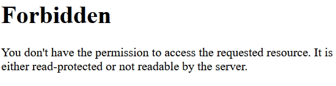
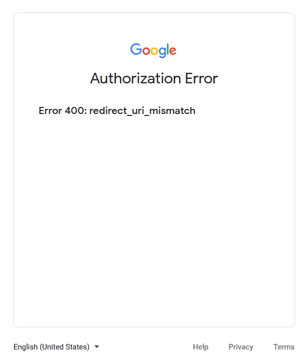

========================================
Connect Gmail to Odoo using Google OAuth
========================================

Odoo is compatible with Google's OAuth for Gmail. In order to send secure emails from a custom
domain, all that is required is to configure a few settings on Google's *Workspace* platform, as
well as on the back end of the Odoo database. This configuration works by using either a personal
email address or an address created by a custom domain.

.. tip::
   For more information, visit `Google's documentation
   <https://support.google.com/cloud/answer/6158849>`_ on setting up OAuth.

Setup in Google
===============

Create a new project
--------------------

To get started, go to the `Google API Platform
<https://console.cloud.google.com/apis/credentials/consent>`_. Log in with your *Google Workspace*
account if you have one, otherwise log in with your personal Gmail account (this should match the
email address you want to configure in Odoo).

After that, click on :guilabel:`Create Project`, located on the far right of the OAuth consent
screen. If a project has already been created in this account, then the :guilabel:`New Project`
option will be located on the top left under the :guilabel:`Select a project` drop-down menu.

On the :guilabel:`New Project` screen, rename the :guilabel:`Project name` to `Odoo` and browse for
the :guilabel:`Location`. Set the :guilabel:`Location` as the `Google Workspace` organization. If
you are using a personal Gmail account, then leave the :guilabel:`Location` as `No Organization`.

.. image:: google_oauth/new-project.png
   :align: center
   :alt: Project Name and Location for Google Oauth.

Click on :guilabel:`Create` to finish this step. On the next screen, :guilabel:`User Type` options,
select the :guilabel:`External` option, and then click on :guilabel:`Create` again, which will
finally navigate to the :guilabel:`Edit app registration` page.

Edit app registration
---------------------

- On the :guilabel:`Oauth consent screen` step, under the :guilabel:`App information` section,
  enter `Odoo` in the :guilabel:`App name` field. Select the organization's email address under the
  :guilabel:`User support` email field.
- Next, under :menuselection:`App Domain --> Authorized domains`, click on :guilabel:`Add Domain`
  and enter `odoo.com`.
- After that, under the :guilabel:`Developer contact information` section, enter the organization's
  email address. Google uses this email address to notify the organization about any changes to
  your project.
- Next, click on the :guilabel:`Save and Continue` button.
- Then, skip the :guilabel:`Scopes` page by scrolling to the bottom and clicking on
  :guilabel:`Save and Continue`.
- Next, add the email being configured under the :guilabel:`Test users` step by clicking on
  :guilabel:`Add Users` and then the :guilabel:`Save and Continue` button. A summary of the
  :guilabel:`App registration` appears.
- Finally, scroll to the bottom and click on :guilabel:`Back to Dashboard`.

Create Credentials
------------------

Now that you have set up the project, you need to create credentials, which includes the
:guilabel:`Client ID` and :guilabel:`Client Secret`. First, click on :guilabel:`Credentials` in the
left sidebar menu.

Then, click on :guilabel:`Create Credentials` in the top menu and select
:guilabel:`OAuth client ID` from the dropdown menu.

- Under :guilabel:`Application Type`, select :guilabel:`Web Application` from the dropdown menu.
- In the :guilabel:`Client ID` field, enter `Odoo`.
- Under the :guilabel:`Authorized redirect URIs` label, click the button :guilabel:`ADD URI`, and
  then input `https://yourdbname.odoo.com/google_gmail/confirm` in the :guilabel:`URIs 1` field. Be
  sure to replace the *yourdbname* part of the URL with your actual Odoo database name.
- Next, click on :guilabel:`Create` to generate an OAuth :guilabel:`Client ID` and
  :guilabel:`Client Secret`. Finally, copy each generated value for later use when configuring in
  Odoo, and then navigate to the Odoo database.

.. image:: google_oauth/client-credentials.png
   :align: center
   :alt: Client ID and Client Secret for Google OAuth.

Setup in Odoo
=============

Enter Google Credentials
------------------------

First, open Odoo and navigate to the :guilabel:`Apps` module. Then, remove the :guilabel:`Apps`
filter from the search bar and type in `Google`. Install the module called :guilabel:`Google Gmail`.

Next, navigate to :menuselection:`Settings --> General Settings`, and under the :guilabel:`Discuss`
section, ensure that the checkbox for :guilabel:`Custom Email Servers` is checked. This populates a
new option for :guilabel:`Gmail Credentials`. Then, copy and paste the :guilabel:`Client ID` and
:guilabel:`Client Secret` into the respective fields and :guilabel:`Save` the settings.

Configure outgoing email server
-------------------------------

After that, on the :guilabel:`General Settings` page, under :guilabel:`Custom Email Servers`, click
:guilabel:`Outgoing Email Servers` to configure the external Gmail account.

.. image:: google_oauth/outgoing-servers.png
   :align: center
   :alt: Configure Outgoing Email Servers in Odoo.

Then, :guilabel:`Create` a new email server and select the option for :guilabel:`Gmail`. Next, fill
in the :guilabel:`Description` (can be anything) and the email :guilabel:`Username` and click on
:guilabel:`Connect your Gmail account`.

A new window from :guilabel:`Google` opens to complete the authorization process. Select the
appropriate email address that is being configured in Odoo.

If the email address is a personal account, an extra step pops up, click :guilabel:`Continue` to
allow the verification and connect the Gmail account to Odoo.

Then, allow Odoo to access the Google account by clicking on :guilabel:`Continue` or
:guilabel:`Allow`. After that, the page navigates back to the newly configured outgoing email
server in Odoo. The configuration automatically loads the token in Odoo, and a tag stating
:guilabel:`Gmail Token Valid` appears in green.

.. image:: google_oauth/green-token.png
   :align: center
   :alt: Configure Outgoing Email Servers in Odoo.

Finally, save the settings and :guilabel:`Test the Connection`. A confirmation message should
appear. The Odoo database can now send safe, secure emails through Google using OAuth
authentication.

Google OAuth FAQ
================

Production VS Testing Publishing Status
---------------------------------------

Choosing :guilabel:`Production` as the :guilabel:`Publishing Status` (instead of Testing) will
display the following warning message:

.. image:: google_oauth/published-status.png
   :align: center
   :alt: OAuth is Limited to 100 Sensitive Scope Logins.

To correct this warning, navigate to the `Google API Platform
<https://console.cloud.google.com/apis/credentials/consent>`_. If the :guilabel:`Publishing status`
is :guilabel:`In Production`, click :guilabel:`Back to Testing` to correct the issue.

No Test Users Added
-------------------

If no test users are added to the OAuth consent screen, then a 403 access denied error will
populate.

.. image:: google_oauth/403-error.png
   :align: center
   :alt: 403 Access Denied Error.

To correct this error, return to the :guilabel:`OAuth consent screen` under
:guilabel:`APIs & Services` and add test user(s) to the app. Add the email that you are configuring
in Odoo.

Gmail Module not updated
------------------------

If the :guilabel:`Gmail Module` in Odoo has not been updated to the latest version, then a
:guilabel:`Forbidden` error message populates.

To correct this error, go to the :guilabel:`Apps` module and clear out the search terms. Then,
search for `Gmail` or `Google` and upgrade the :guilabel:`Google Gmail` module. Finally, click on
the three dots on the upper right of the module and select :guilabel:`Upgrade`.

Application Type
----------------

When creating the :guilabel:`Credentials` (OAuth Client ID and Client Secret), if
:guilabel:`Desktop App` is selected for the :guilabel:`Application Type`, an
:guilabel:`Authorization Error` appears.

To correct this error, delete the credentials already created and create new credentials, selecting
:guilabel:`Web Application` for the :guilabel:`Application Type`. Then, under
:guilabel:`Authorized redirect URIs`, click :guilabel:`ADD URI` and type:
`https://yourdbname.odoo.com/google_gmail/confirm` in the field.

.. note::
   Replace *yourdbname* in the URL with the Odoo database name.
