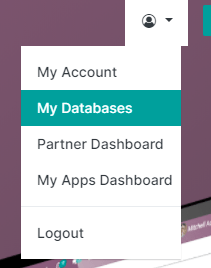
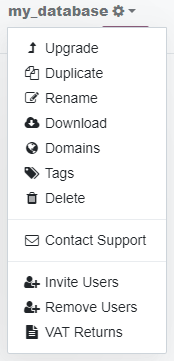

===============================
Odoo Online database management
===============================

To manage a database, sign in to https://www.odoo.com and access the `database management page
<https://www.odoo.com/my/databases>`_ by clicking on the user icon, then on *My Databases*.

.. note::
   Make sure you are connected as the administrator of the database you want to manage.

Open the drop-down menu next to the database you want to manage by clicking on the gear icon.

Several actions are available:

- :ref:`odoo_online/upgrade`
- :ref:`odoo_online/duplicate`
- :ref:`odoo_online/rename`
- :ref:`odoo_online/download`
- :ref:`odoo_online/domains`
- :ref:`odoo_online/tags`
- :ref:`odoo_online/delete`
- :ref:`odoo_online/contact-support`
- :ref:`odoo_online/users`

.. _odoo_online/upgrade:

Upgrade
=======

If you are *not* on the latest **Online version**, you should receive an invitation to :doc:`upgrade
<../upgrade>` your database. A **Rolling Release button** on your database's main screen proposes an
upgrade to the latest version (e.g., 13.0 to 15.1).

.. important::
   - | **If your Odoo database's version is lower than the latest major release:**
     | You must upgrade your database within two months. After these two months, an automatic
       upgrade is initiated.
   - | **If your Odoo database's version is equal to or higher than the latest major release:**
     | You can disregard the invitation to upgrade as you probably wouldn't benefit from new
       features every two months.

.. note::
   Versions that are not supported anymore become deprecated and need to be updated to avoid
   security issues. We recommend you initiate the upgrade of the database yourself, as this method
   allows you to request a test upgrade of your database to check for any discrepancies.

.. seealso::
   - :doc:`../upgrade`
   - :doc:`supported_versions`

.. _odoo_online/duplicate:

Duplicate
=========

Make an exact copy of the database to be able to perform testing without compromising the daily
operations.

.. important::
   - By checking *For testing purposes*, all external communication (emails, payments, delivery
     orders, etc.) are disabled by default on the duplicated database.
   - Duplicate databases expire automatically after 15 days.

.. _odoo_online/rename:

Rename
======

Rename the database and its URL.

.. _odoo_online/download:

Download
========

Download instantly a ZIP file with a backup of the database.

.. note::
   Databases are backed up daily according to the `Odoo Cloud SLA
   <https://www.odoo.com/cloud-sla>`_.

.. _odoo_online/domains:

Domains
=======

Configure custom domains to access the database via another URL.

.. seealso::
   - :doc:`domain_names`

.. _odoo_online/tags:

Tags
====

Add tags to sort your databases out. You can search the tags in the search bar.

.. _odoo_online/delete:

Delete
======

Delete a database instantly.

.. danger::
   Deleting a database means that all data is permanently lost. The deletion is instant and for all
   users. It is recommended to create a backup of the database before deleting it.

Read carefully the warning message that pops up and proceed only if you fully understand the
implications of deleting a database:

.. image:: odoo_online/delete.png
   :align: center
   :alt: A warning message is prompted before deleting a database.

.. note::
   - Only an administrator can delete a database.
   - The database name is immediately available for a new database.
   - It is not possible to delete a database if it is expired or linked to a subscription. If
     needed, please get in touch with `Odoo Support <https://www.odoo.com/help>`_.
   - To delete your account, please get in touch with `Odoo Support <https://www.odoo.com/help>`_.

.. _odoo_online/contact-support:

Contact Support
===============

Access the Odoo `support page <https://www.odoo.com/help>`_ with your database's details already
pre-filled.

.. _odoo_online/users:

Invite / Remove Users
=====================

To invite users, fill out the email address of the new user and click on *Invite*. To add multiple
users, click on *Add more users*.

.. image:: odoo_online/invite-users.png
   :align: center
   :alt: Clicking on "Add more users" adds additional email fields.

To remove users, select the users to remove and click on *Remove*.

.. seealso::
   - :doc:`/applications/general/users/manage_users`
