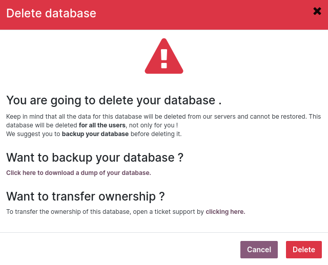
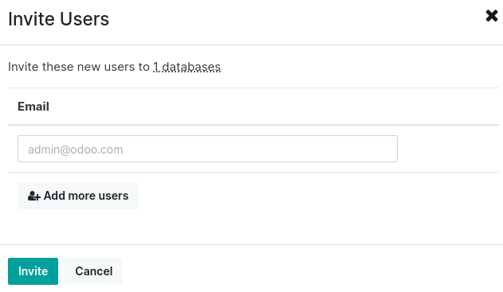

===============================
Odoo Online database management
===============================

To manage a database, go to the `database manager <https://www.odoo.com/my/databases>`_ and sign in
as the database administrator.

All the main database management options are available by clicking the database name, except the
upgrade option, which can be accessed by clicking the **arrow in a circle** icon next to the
database name. It is only displayed if an upgrade is available.

.. image:: odoo_online/database-manager.png
   :alt: Accessing the database management options

- :ref:`odoo_online/upgrade`
- :ref:`odoo_online/duplicate`
- :ref:`odoo_online/rename`
- :ref:`odoo_online/download`
- :ref:`odoo_online/domains`
- :ref:`odoo_online/tags`
- :ref:`odoo_online/delete`
- :ref:`odoo_online/contact-support`
- :ref:`odoo_online/users`

.. _odoo_online/upgrade:

Upgrade
=======

Trigger a database upgrade.

.. seealso::
   For more information about the upgrade process, check out the :ref:`Odoo Online upgrade
   documentation <upgrade/request-test-database>`.

.. _odoo_online/duplicate:

Duplicate
=========

Create an exact copy of the database, which can be used to perform testing without compromising
daily operations.

.. important::
   - By checking :guilabel:`For testing purposes`, all external actions (emails, payments, delivery
     orders, etc.) are disabled by default on the duplicated database.
   - Duplicated databases expire automatically after 15 days.

.. _odoo_online/rename:

Rename
======

Rename the database and its URL.

.. _odoo_online/download:

Download
========

Download a ZIP file containing a backup of the database.

.. note::
   Databases are backed up daily as per the `Odoo Cloud Hosting SLA
   <https://www.odoo.com/cloud-sla>`_.

.. _odoo_online/domains:

Domain names
============

Use a custom :doc:`domain name <domain_names>` to access the database via another URL.

.. tip::
   You can :ref:`register a domain name for free <domain-name/odoo-register>`.

.. _odoo_online/tags:

Tags
====

Add tags to easily identify and sort your databases.

.. tip::
   You can search for tags in the search bar.

.. _odoo_online/delete:

Delete
======

Delete a database instantly.

.. danger::
   Deleting a database means that all data is permanently lost. The deletion is instant and applies
   to all users. It is recommended to create a backup of the database before deleting it.

Carefully read the warning message and only proceed if the implications of deleting a database are
fully understood.

.. note::
   - Only an administrator can delete a database.
   - The database name is immediately made available to anyone.
   - Deleting a database if it has expired or is linked to a subscription is impossible. In that
     case, contact `Odoo Support <https://www.odoo.com/help>`_.

.. _odoo_online/contact-support:

Contact us
==========

Access the `Odoo.com support page <https://www.odoo.com/help>`_ with the database's details already
pre-filled.

.. _odoo_online/users:

Invite / remove users
=====================

To invite users, fill out the new user's email address and click :guilabel:`Invite`. To add multiple
users, click :guilabel:`Add more users`.

To remove users, select them and click :guilabel:`Remove`.

.. seealso::
   - :doc:`/applications/general/users/manage_users`
   - :doc:`/applications/general/users/odoo_account`
