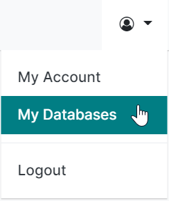
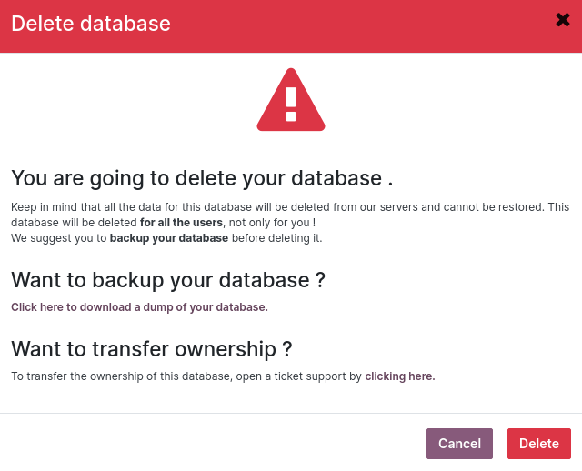
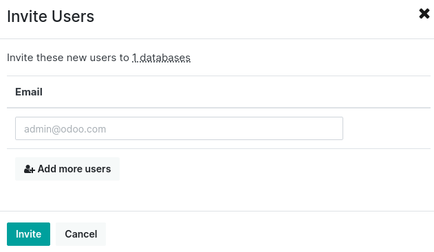

=================================
Online (SaaS) database management
=================================

To manage a database, sign in to https://www.odoo.com and access the `database management page
<https://www.odoo.com/my/databases>`_ by clicking on the user icon, then on *My Databases*.

.. note::
   Make sure you are connected as the administrator of the database you want to manage.

.. image:: online/dropdown-menu.png
   :align: right
   :alt: Clicking on the gear icon opens the drop-down menu.

Open the drop-down menu next to the database you want to manage by clicking on the gear icon.

Several actions are available:

- :ref:`online/upgrade`
- :ref:`online/duplicate`
- :ref:`online/rename`
- :ref:`online/download`
- :ref:`online/domains`
- :ref:`online/tags`
- :ref:`online/delete`
- :ref:`online/contact-support`
- :ref:`online/users`

.. _online/upgrade:

Upgrade
=======

Upgrade the database to the latest Odoo version.

.. warning::
   Upgrading a database to a newer version of Odoo is a complex operation that requires time and
   caution. It is essential to test the upgrade before upgrading the production database.

.. seealso::
   - :doc:`../upgrade/process`

.. _online/duplicate:

Duplicate
=========

Make an exact copy of the database to be able to perform testing without compromising the daily
operations.

.. important::
   - By checking *For testing purposes*, all external communication (emails, payments, delivery
     orders, etc.) are disabled by default on the duplicated database.
   - Duplicate databases expire automatically after 15 days.

.. _online/rename:

Rename
======

Rename the database and its URL.

.. _online/download:

Download
========

Download instantly a ZIP file with a backup of the database.

.. note::
   Databases are backed up daily according to the `Odoo Cloud SLA
   <https://www.odoo.com/cloud-sla>`_.

.. _online/domains:

Domains
=======

Configure custom domains to access the database via another URL.

.. seealso::
   - :doc:`/applications/websites/website/publish/domain_name`

.. _online/tags:

Tags
====

Add tags to sort your databases out. You can search the tags in the search bar.

.. _online/delete:

Delete
======

Delete a database instantly.

.. danger::
   Deleting a database means that all data is permanently lost. The deletion is instant and for all
   users. It is recommended to create a backup of the database before deleting it.

Read carefully the warning message that pops up and proceed only if you fully understand the
implications of deleting a database:

.. note::
   - Only an administrator can delete a database.
   - The database name is immediately available for a new database.
   - It is not possible to delete a database if it is expired or linked to a subscription. If
     needed, please get in touch with `Odoo Support <https://www.odoo.com/help>`_.
   - To delete your account, please get in touch with `Odoo Support <https://www.odoo.com/help>`_.

.. _online/contact-support:

Contact Support
===============

Access the Odoo `support page <https://www.odoo.com/help>`_ with your database's details already
pre-filled.

.. _online/users:

Invite / Remove Users
=====================

To invite users, fill out the email address of the new user and click on *Invite*. To add multiple
users, click on *Add more users*.

To remove users, select the users to remove and click on *Remove*.

.. seealso::
   - :doc:`/applications/general/users/manage_users`
