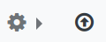
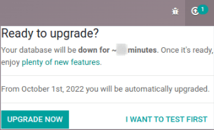
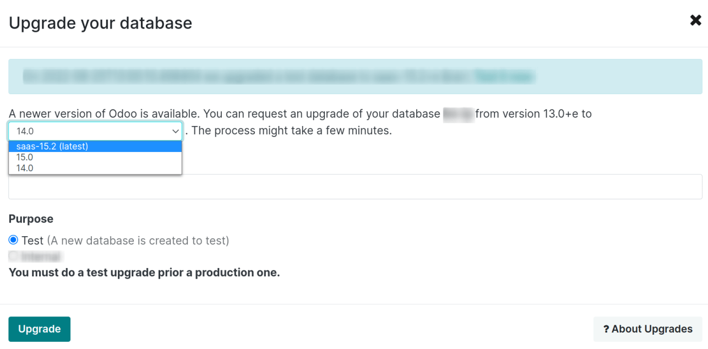

=================================
Online (SaaS) database management
=================================

To manage a database, sign in to https://www.odoo.com and access the `database management page
<https://www.odoo.com/my/databases>`_ by clicking on the user icon and then :guilabel:`My
Databases`.

.. image:: online/my-databases.png
   :align: center
   :alt: Accessing My Databases from the user menu

.. note::
   Make sure you are connected as the administrator of the database you want to manage.

Manage a database by clicking the settings button (:guilabel:`⚙`) next to the database name. If an
upgrade is available, click on the upgrade button (:guilabel:`🡅`) to launch the :ref:`upgrade
process <online/upgrade>`.

Here is a list of all the database actions and settings available by clicking the gear icon
(:guilabel:`⚙`):

- :ref:`online/duplicate`
- :ref:`online/rename`
- :ref:`online/download`
- :ref:`online/domains`
- :ref:`online/tags`
- :ref:`online/share`
- :ref:`online/delete`
- :ref:`online/contact-support`
- :ref:`online/view-access-logs`
- :ref:`online/invite-users`
- :ref:`online/remove-users`

.. _online/upgrade:

Upgrade
=======

If you are *not* on the latest **Online version**, you should see an upgrade notification
(:guilabel:`🡅`) at the top right of the database inviting you to start the process.

Clicking :guilabel:`Upgrade Now` redirects you to your portal.  If you want to start the upgrade,
click on the upgrade button (:guilabel:`🡅`) located next to the database name. A new window opens
where you should select the version you want to upgrade to.

.. important::
   - | When a major version is released (e.g., Odoo 16), you must upgrade your database within two
       months. After these two months, an automatic upgrade is initiated.
   - | When a minor version is released (e.g., Odoo 16.1), you can disregard the invitation to
       upgrade unless you still haven't upgraded to the latest major release.

.. note::
   Versions that are not supported anymore become deprecated and need to be updated to avoid
   security issues. We recommend you initiate the upgrade of the database yourself, as this method
   allows you to request a test upgrade of your database to check for any discrepancies.

.. seealso::
   - :doc:`../upgrade`
   - :doc:`supported_versions`

.. _online/duplicate:

Duplicate
=========

Create an exact copy of a database. Copies are often used to perform tests on a database without
compromising your daily operations.

.. important::
   When you perform tests on a database, it is recommended to tick :guilabel:`For testing purposes`
   as it disables all external communications (emails, payments, delivery orders, etc.).

.. note::
   Duplicated databases expire automatically after 15 days.

.. _online/rename:

Rename
======

Change a database name/URL.

.. _online/download:

Download
========

Save a copy/backup of a database in ZIP file format.

.. note::
   It is not required to create backups manually — Odoo backups databases daily according to the
   `Odoo Cloud SLA <https://www.odoo.com/cloud-sla>`_.

.. _online/domains:

Domain names
============

Configure custom domains to access the database via another URL.

.. note::
   This functionality is disabled on *edu-* databases.

.. seealso::
   - :doc:`domain_names`

.. _online/tags:

Tags
====

Add tags to a database, which can be helpful if you manage several. You can add multiple tags by
clicking on the plus button (:guilabel:`+`)

.. note::
   You can search for tags in the search bar.

.. _online/share:

Share
=====

The :guilabel:`Share` or :guilabel:`Share Course` feature is dedicated to teachers. It generates a
link that students can use to create a copy of the database you shared. Once the link is opened,
students are invited to click `Copy as student` and then register their database.

.. _online/delete:

Delete
======

Delete a database instantly.

.. danger::
   Deleting a database means that all data is permanently lost. The deletion is instant and applies
   to all users. It is recommended to create a :ref:`backup <online/download>` of a database before
   deleting it.

Read carefully the warning message that pops up, and only proceed if you fully understand the
implications of deleting a database.

.. image:: online/delete.png
   :align: center
   :alt: A warning message is prompted before deleting a database.

.. note::
   - Only an administrator can delete a database.
   - The database name is immediately available for newly created databases.
   - It is impossible to delete a database yourself if it has expired or is linked to a
     subscription. If you are in that situation, you can contact `Odoo Support
     <https://www.odoo.com/help>`_.
   - To delete your account, contact `Odoo Support <https://www.odoo.com/help>`_.

.. _online/contact-support:

Contact us
==========

Access the Odoo `Support page <https://www.odoo.com/help>`_ with your database's details already
pre-filled.

.. _online/view-access-logs:

View access log
===============

View all database actions taken by the Odoo staff on a database. Typically, these actions result
from requests received by our helpdesk, requested in the context of a quick start project, or
necessary to maintain your service. It also includes important customer actions.

.. _online/invite-users:

Invite users
============

Invite users by filling out their email address. You can invite multiple users at the same by
clicking on :guilabel:`Add more users`.

.. _online/remove-users:

Remove users
============

Remove users by selecting them and clicking on :guilabel:`Remove`.

.. seealso::
   - :doc:`/applications/general/users/manage_users`