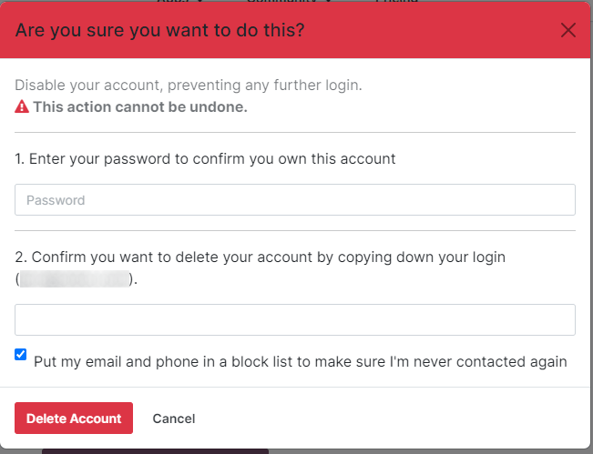

=================
Odoo.com accounts
=================

This document describes how to edit and manage an Odoo.com account, including adding a client
database, deleting an account, resetting a password, and enabling two-factor authentication.

Grant users access to database
==============================

A database can be linked to an Odoo.com account that was created by a different Odoo.com account.
This allows the database to appear in the *My Databases* page of the account. To do so, the
client Odoo.com account needs to be added to the database as a user.

First, sign in to the Odoo.com account that created the client database. In the main Odoo dashboard
of the database, navigate to the **Settings** app, and click :guilabel:`Manage Users` in the
:guilabel:`Users` section. Click the :guilabel:`New` button, and enter a name in the
:guilabel:`Name` field for this user. Next, enter the email address used to register the desired
Odoo.com account in the :guilabel:`Email` field. Navigate back to :guilabel:`Settings` using the
breadcrumbs, and a pop-up window titled :guilabel:`Users Invitations` appears, with a warning that
adding additional users will increase the amount of the subscription.

Click :guilabel:`Confirm`, and the :guilabel:`Users` list appears. An invitation is automatically
sent to the email address. Once confirmed, the client database now appears in the **My Databases**
page of the target Odoo.com account.

.. tip::
   To provide full access to the database for this user, set the :guilabel:`Dashboard` field under
   the :guilabel:`Productivity` header to :guilabel:`Admin`. Next, set the
   :guilabel:`Administration` field under the :guilabel:`Administration` header to
   :guilabel:`Settings`.

Delete Odoo.com account
=======================

To delete an Odoo.com account, start by clicking the profile icon in the upper-right corner
(represented by the username and icon) to reveal a drop-down menu. From the drop-down menu, select
:guilabel:`My Odoo.com account`, which reveals the user portal.

From the user portal, the delete option can be accessed by going to :menuselection:`My Account -->
Edit Security Settings --> Delete Account`. It can also be accessed by going to
`https://www.odoo.com/my/home <https://www.odoo.com/my/home>`_.

.. danger::
   Deleting an Odoo account is irreversible. Be careful performing this action, as the Odoo.com
   account is **not** retrievable once deleted.

Upon clicking the :guilabel:`Delete Account` button, a pop-up window appears, requesting
confirmation for the account deletion.

To confirm the deletion, enter the :guilabel:`Password` and the :guilabel:`Login` for the account
being deleted. Then, click the :guilabel:`Delete Account` button to confirm the deletion.

.. _odoocom/change_password:

Odoo.com account password change
================================

To change an Odoo.com account password, first login into the Odoo.com user account from the Odoo.com
login page. After logging-in, go to the upper-right corner of the screen, and click the :guilabel:`▼
(down arrow)` icon next to the profile icon. Then, select :guilabel:`My Account`, and a portal
dashboard appears.

To change the Odoo.com password, click on the :guilabel:`Edit Security Settings` link, below the
:menuselection:`Account Security` section. Next, make the necessary changes by typing in the current
:guilabel:`Password`, :guilabel:`New Password`, and verify the new password. Lastly, click on
:guilabel:`Change Password` to complete the password change.

.. note::
   If a customer would like to change the login, contact Odoo support `here
   <https://www.odoo.com/help>`_.

.. note::
   Passwords for Odoo.com users and portal users remain separate, even if the same email address is
   used.

Add two-factor authentication
=============================

To add two-factor authentication, login into the Odoo.com user account from the Odoo.com login page.
After logging-in, go to the upper-right corner of the screen, and click the :guilabel:`▼ (down
arrow)` icon next to the :guilabel:`profile icon`. Then, select :guilabel:`My Account`, and a portal
dashboard appears.

If the user would like to turn on two-factor authentication (2FA) for Odoo.com access, click on the
:guilabel:`Edit Security Settings` link below the :menuselection:`Account Security` section.

Click on :guilabel:`Enable two-factor authentication` to turn on :abbr:`2FA (two-factor
authentication)`. Then, confirm the current password in the :guilabel:`Password` field. Next, click
on :guilabel:`Confirm Password`. Following that, activate :abbr:`2FA (two-factor authentication)` in
a :abbr:`2FA (two-factor authentication)` app (Google Authenticator, Authy, etc.), by scanning the
:guilabel:`QR code` or entering a :guilabel:`Verification Code`.

Finally, click on :guilabel:`Enable two-factor authentication` to complete the setup.

.. note::
   Under :guilabel:`My Account` Odoo.com users can also access the following:

   - :guilabel:`My Partner dashboard`
   - :guilabel:`My In-App Services`
   - :guilabel:`My Apps Dashboard`
