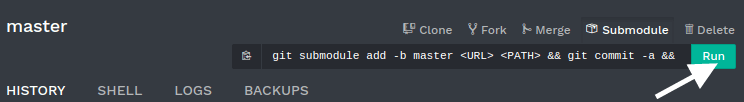

.. _odoosh-advanced-submodules:

==========
Submodules
==========

Overview
========

A `Git submodule <https://git-scm.com/book/en/v2/Git-Tools-Submodules>`_ allows you to integrate other Git projects
into your code, without the need to copy-paste all their code.

Indeed, your custom modules can depend on modules from other repositories.
Regarding Odoo, this feature allows you to add modules from other Git repositories into the branches of your repository.
Adding these dependencies in your branch through submodules makes the deployment of your code and servers easier,
as you can clone the repositories added as submodules at the same time you clone your own repository.

Besides, you can choose the branch of the repository added as submodule
and you have the control of the revision you want.
It's up to you to decide whether you want to pin the submodule to a specific revision and when you want to update
to a newer revision.

In Odoo.sh, the submodules give you the possibility to use and depend on modules available in other repositories.
The platform will detect that you added modules through submodules in your branches
and add them to your addons path automatically so you can install them in your databases.

If you add private repositories as submodules in your branches,
you need to configure a deploy key in your Odoo.sh project settings and in your repository settings.
Otherwise Odoo.sh won't be allowed to download them.
The procedure is detailed in the chapter :ref:`Settings > Submodules <odoosh-gettingstarted-settings-submodules>`.

Adding a submodule
==================

With Odoo.sh (simple)
---------------------

.. warning::
   For now it is not possible to add **private** repositories with this method. You can nevertheless
   do so :ref:`with Git <odoosh-advanced-submodules-withgit>`.

On Odoo.sh, in the branches view of your project, choose the branch in which you want to add a submodule.

In the upper right corner, click on the *Submodule* button, and then on *Run*.

A dialog with a form is shown. Fill the inputs as follows:

* Repository URL: The SSH URL of the repository.
* Branch: The branch you want to use.
* Path: The folder in which you want to add this submodule in your branch.

.. image:: submodules/advanced-submodules-dialog.png
   :align: center

On Github, you can get the repository URL with the *Clone or download* button of the repository. Make sure to *use SSH*.

.. image:: submodules/advanced-submodules-github-sshurl.png
  :align: center

.. _odoosh-advanced-submodules-withgit:

With Git (advanced)
-------------------

In a terminal, in the folder where your Git repository is cloned,
checkout the branch in which you want to add a submodule:

.. code-block:: bash

  $ git checkout <branch>

Then, add the submodule using the command below:

.. code-block:: bash

  $ git submodule add -b <branch> <git@yourprovider.com>:<username/repository.git> <path>

Replace

* *<git@yourprovider.com>:<username/repository.git>* by the SSH URL of the repository you want to add as submodule,
* *<branch>* by the branch you want to use in the above repository,
* *<path>* by the folder in which you want to add this submodule.

Commit and push your changes:

.. code-block:: bash

  $ git commit -a && git push -u <remote> <branch>

Replace

* <remote> by the repository on which you want to push your changes. For a standard Git setup, this is *origin*.
* <branch> by the branch on which you want to push your changes.
  Most likely the branch you used :code:`git checkout` on in the first step.

You can read the `git-scm.com documentation <https://git-scm.com/book/en/v2/Git-Tools-Submodules>`_
for more details about the Git submodules.
For instance, if you would like to update your submodules to have their latest revision,
you can follow the chapter
`Pulling in Upstream changes <https://git-scm.com/book/en/v2/Git-Tools-Submodules#_pulling_in_upstream_changes_from_the_submodule_remote>`_.

Ignore modules
==============

If you're adding a repository that contains a lot of modules, you may want to ignore some of them in case there are any
that are installed automatically. To do so, you can prefix your submodule folder with a :code:`.`. The platform will
ignore this folder and you can hand pick your modules by creating symlinks to them from another folder.
