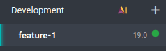
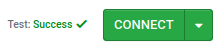
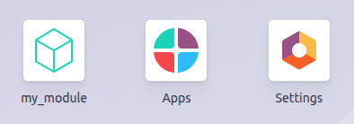

===============
Create a module
===============

Before creating your first module, it is necessary to :doc:`create an Odoo.sh project
<getting_started/create>` and knowing your GitHub repository's URL.

.. admonition:: Glossary

   - `~/src` is the directory where the Git repositories related to your Odoo projects are located.
   - `odoo` is the GitHub user.
   - `odoo-addons` is the GitHub repository.
   - `feature-1` is the name of a development branch.
   - `main` is the name of the production branch.
   - `my_module` is the name of the module.

   Replace these as necessary.

.. _odoo-sh/module/development-branch:

Create the development branch
=============================

.. tabs::

   .. group-tab:: On Odoo.sh

      From the :doc:`Branches view <getting_started/branches>`:

      - In the branches navigation panel, click the ＋ (:guilabel:`New development branch`) button
        next to :guilabel:`Development`.
      - Under :guilabel:`Fork`, select the `main` branch.
      - Under :guilabel:`To`, enter `feature-1`.

      .. image:: create_module/development-branch-odoo-sh.png
         :alt: Forking the production branch to create a development branch on Odoo.sh

      Once the build is ready, you can access the :doc:`editor <getting_started/online_editor>` and
      the code of your development branch from the folder `~/src/user` folder.

   .. group-tab:: On a computer

      - Clone your GitHub repository on your computer by running the following commands:

        .. code-block:: bash

           mkdir ~/src
           cd ~/src
           git clone https://github.com/odoo/odoo-addons.git
           cd ~/src/odoo-addons

      - Create a new branch by running:

        .. code-block:: bash

           git checkout -b feature-1 main

.. _odoo-sh/module/module-structure:

Create the module structure
===========================

.. _odoo-sh/module/module-structure/scaffolding:

Scaffolding
-----------

While it is not required, scaffolding avoids the tedium of setting the basic Odoo module structure.
You can scaffold a new module using the `odoo-bin` executable.

.. tabs::

   .. group-tab:: On Odoo.sh

      From the :doc:`editor <getting_started/online_editor>` terminal, run:

      .. code-block:: bash

         odoo-bin scaffold my_module ~/src/user/

   .. group-tab:: On a computer

      With :doc:`Odoo installed <../on_premise/source>` on your computer, run:

      .. code-block:: bash

         ./odoo-bin scaffold my_module ~/src/odoo-addons/

.. tip::
   If you do not want to install Odoo on your computer, you can also :download:`download this module
   structure template <create_module/my_module.zip>`. Replace every occurrence of `my_module` with
   the name of your choice.

The structure below will be generated:

::

  my_module
  ├── __init__.py
  ├── __manifest__.py
  ├── controllers
  │   ├── __init__.py
  │   └── controllers.py
  ├── demo
  │   └── demo.xml
  ├── models
  │   ├── __init__.py
  │   └── models.py
  ├── security
  │   ├── ir.model.access.csv
  │   └── models.py
  └── views
      ├── templates.xml
      └── views.xml

.. warning::
   Only use alphanumeric characters (`a-z`, `0-9`) or underscores (`_`) when naming your module, as
   its name is used for Python classes, and class names containing special characters other than
   underscores are not valid in Python.

Uncomment the following files:

- :file:`models/models.py` an example of a model with its fields
- :file:`views/views.xml` a tree and a form view, with the menus opening them
- :file:`demo/demo.xml` demo records for the example model
- :file:`controllers/controllers.py` an example of a controller implementing some routes
- :file:`views/templates.xml` two example qweb views used by the controller routes
- :file:`__manifest__.py` the manifest of your module, including its title, description and data
  files to load. Uncomment the access control list data file:

  .. code-block:: python

     # 'security/ir.model.access.csv',

.. _odoo-sh/module/module-structure/manually:

Manually
--------

To create your module structure manually, follow the
:doc:`/developer/tutorials/server_framework_101` tutorial to understand the structure of a module
and the content of each file.

.. _odoo-sh/module/push-development:

Push on the development branch
==============================

#. Stage the changes to be committed by running:

   .. code-block:: bash

      git add my_module

#. Commit your changes by running:

   .. code-block:: bash

      git commit -m "My first module"

#. Push your changes to your remote repository by running:

   .. tabs::

      .. group-tab:: On Odoo.sh

         From the :doc:`editor <getting_started/online_editor>` terminal, run:

         .. code-block:: bash

            git push https HEAD:feature-1

         .. seealso::
            :ref:`Online editor documentation: committing and pushing changes
            <odoo-sh/editor/commit>`

      .. group-tab:: On a computer

         Run:

         .. code-block:: bash

            git push -u origin feature-1

         It is only necessary to specify `-u origin feature-1` the first time you push. After that,
         run:

         .. code-block:: bash

            git push

.. _odoo-sh/module/test-module:

Test the module
===============

The branch should appear under the :guilabel:`Development` section of the :doc:`Branches view
<getting_started/branches>` navigation panel.

Click the branch name to view its history, including the changes you just pushed. Once the database
is ready, click :guilabel:`Connect` to access it.

If your Odoo.sh project is configured to automatically install the module, it will appear directly
on the database dashboard. Otherwise, it will be available for installation under the
:guilabel:`Apps` app.

.. _odoo-sh/module/test-production:

Test with the production data
=============================

.. note::
   A production database is required for this step. If you do not have one yet, create it.

Once you have tested the module in a development build with the demo data and believe it is ready,
you can test it with the production data using a staging branch.

You can:

- Convert your development branch to a staging branch by dragging and dropping it into the
  :guilabel:`Staging` section.
- Merge it into an existing staging branch by dragging and dropping it onto that branch.
- Use the `git merge` command to merge your branches.

This creates a new staging build that duplicates the production database and runs it on a server
updated with your branch’s latest changes.

Once the database is ready, click :guilabel:`Connect` to access it.

.. _odoo-sh/module/test-production/install:

Install the module
------------------

Install the module from the :guilabel:`Apps` app. As the module may not appear directly in the list
of apps, update the list of apps by activating the :ref:`developer mode <developer-mode>` and
clicking :menuselection:`Update Apps List --> Update`.

.. note::
   The module is not installed automatically, as the purpose of the staging build is to test the
   behavior of your changes as they would be on the production database, so you would not want a
   module installed automatically.

.. _odoo-sh/module/deploy:

Deploy in production
====================

Once you have tested the module in a staging branch with the production data and believe it is ready
for production, you can merge your branch into the production branch by:

- Dragging and dropping the staging branch onto the production branch.
- Using the `git merge` command to merge your branches.

This merges the latest changes from the staging branch into the production branch and updates the
production server with them.

Once the database is ready,  click :guilabel:`Connect` to access it.

.. _odoo-sh/module/deploy/install:

Install the module
------------------

Install the module from the :guilabel:`Apps` app. As the module may not appear directly in the list
of apps, update the list of apps by activating the :ref:`developer mode <developer-mode>` and
clicking :menuselection:`Update Apps List --> Update`.

.. _odoo-sh/module/add:

Add a change
============

This section explains how to add a change in your module by adding a new field in a model and
deploying it.

#. From the :doc:`editor <getting_started/online_editor>` or from your computer, open the module
   folder :file:`~/src/odoo-addons/my_module`, then open the :file:`models/models.py` file to edit
   it. After the description field:

   .. code-block:: python

      description = fields.Text()

   add a datetime field:

   .. code-block:: python

      start_datetime = fields.Datetime('Start time', default=lambda self: fields.Datetime.now())

#. Open the :file:`views/views.xml` file and after:

   .. code-block:: xml

      <field name="value2"/>

   add:

   .. code-block:: xml

      <field name="start_datetime"/>

   .. _odoo-sh/module/add/manifest:

#. These changes alter the database structure by adding a column to a table and modifying a view. To
   be applied to an existing database, such as your production database, these changes require the
   module to be updated. If you would like the update to be performed automatically by the Odoo.sh
   platform when you push your changes, increase the module's version in its manifest by opening
   :file:`__manifest__.py` and replacing:

   .. code-block:: python

      'version': '0.1',

   with:

   .. code-block:: python

     'version': '0.2',

   The platform will detect a version change and trigger the module update upon deployment of the
   new revision.

#. Next, :ref:`push the changes <odoo-sh/module/push-development>`.

#. Once you have :ref:`tested your changes <odoo-sh/module/test-module>`, you can merge them into
   the production branch, for instance, by dragging and dropping the branch onto the production
   branch in the Odoo.sh interface. Since you increased the module version in the manifest, the
   platform will automatically update the module, and your new field will be available immediately.
   Otherwise, you can manually :ref:`update the module <odoo-sh/module/deploy/install>` within the
   apps list.

Use an external Python library
==============================

If you would like to use an external Python library that is not installed by default, you can define
a :file:`requirements.txt` file listing the external libraries your modules depend on. The platform
will use this file to automatically install the Python libraries your project needs.

.. note::
   - It is not possible to install or upgrade system packages on Odoo.sh databases (e.g., apt
     packages). However, under specific conditions, `packages can be considered for installation
     <https://www.odoo.sh/faq#install_dependencies>`_. This also applies to Python modules that
     require system packages for compilation and to third-party Odoo modules.
   - PostgreSQL extensions are not supported on Odoo.sh hence it is not possible to install
     extensions (such as PostGIS, ltree, ...) in Odoo.sh databases.

For example, to use the `Unidecode library <https://pypi.org/project/Unidecode>`_ in your module:

#. Create a file :file:`requirements.txt` in the root folder of your repository:

   - From the Odoo.sh editor, create and open the file :file:`~/src/user/requirements.txt`.
   - From your computer, create nd open the file :file:`~/src/odoo-addons/requirements.txt`.

#. Add to the file:

   .. code-block:: text

      unidecode

#. You can now use the library in your module, for instance, to remove accents from characters in
   the name field of your model. To do so, open the :file:`models/models.py` file and before:

   .. code-block:: python

      from odoo import models, fields, api

   add:

   .. code-block:: python

      from unidecode import unidecode

#. After:

   .. code-block:: python

      start_datetime = fields.Datetime('Start time', default=lambda self: fields.Datetime.now())

   add:

   .. code-block:: python

      @api.model
      def create(self, values):
          if 'name' in values:
              values['name'] = unidecode(values['name'])
          return super(my_module, self).create(values)

      def write(self, values):
          if 'name' in values:
              values['name'] = unidecode(values['name'])
          return super(my_module, self).write(values)

#. Increase the module version to install the Python dependency by editing the :ref:`module's
   manifest <odoo-sh/module/add/manifest>` :file:`__manifest__.py`.

#. Then, :ref:`push the changes <odoo-sh/module/push-development>`.

   .. tip::
      Stage the :file:`requirements.txt` file by running `git add requirements.txt`.
