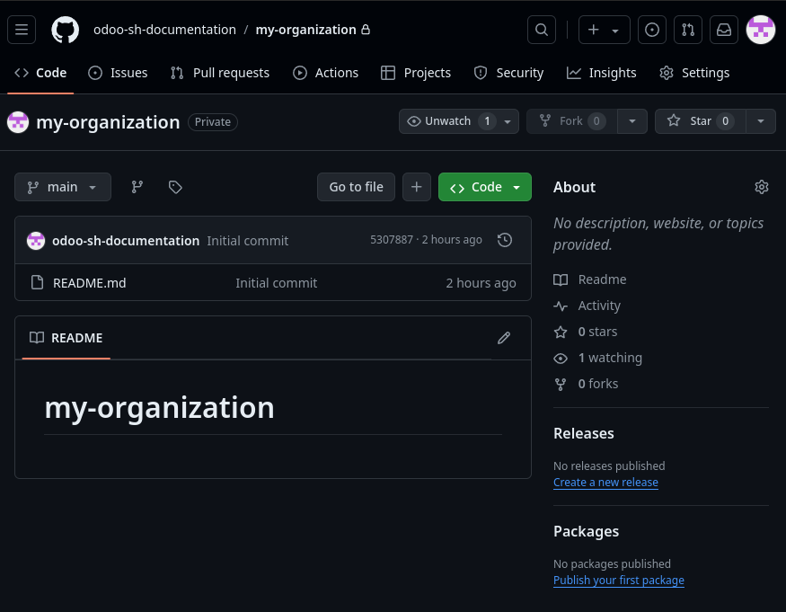
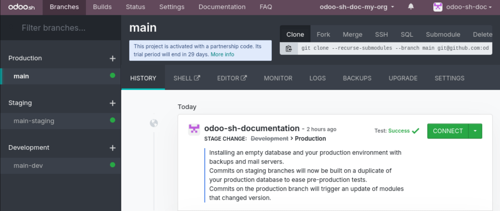
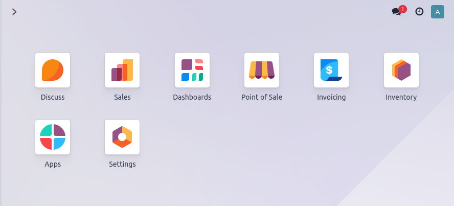

:show-content:

===============
Getting started
===============

.. _odoo-sh/getting-started/components:

Main components
===============

When working with Odoo.sh, it is important to understand the main components involved:

- :ref:`GitHub repository <odoo-sh/getting-started/components/github>`
- :ref:`Odoo.sh project <odoo-sh/getting-started/components/project>`
- :ref:`Odoo database <odoo-sh/getting-started/components/database>`

While they are all interconnected, each one plays a distinct role in the development and deployment
of Odoo applications. Together, they form a cohesive pipeline from code development to a live
business use.

.. _odoo-sh/getting-started/components/github:

GitHub repository
-----------------

A GitHub repository is like a folder on your computer that contains all the files and folders for a
specific project. The difference is that it's stored on GitHub and can be accessed and edited by
multiple people on different computers.

In other words, a GitHub repository is a place where you can store your project's files and share
them with others, so they can collaborate with you, make changes, and contribute to your project. It
also tracks all changes to your project over time, so you can easily roll back to a previous version
if needed.

Additionally, GitHub offers many features to help you manage your project, such as issue tracking,
pull requests, and code reviews. It's a powerful tool for managing and collaborating on software
projects, and is widely used by developers around the world. a version-controlled space where the
Odoo applications' source code is stored. It tracks every change, supports collaboration, and can
be either public or private.

.. _odoo-sh/getting-started/components/project:

Odoo.sh project
---------------

An Odoo.sh project is a *Platform as a Service* (PaaS) that integrates with GitHub and enables
streamlined development, testing, and deployment of Odoo applications. It includes tools such as
automated backups, staging environments, and continuous integration pipelines.

.. _odoo-sh/getting-started/components/database:

Odoo database
-------------

An Odoo database stores all the operational data used and generated by Odoo applications, such as
business records, configurations, and user data.

.. _odoo-sh/getting-started/users:

User types
==========

Odoo.sh involves different types of users, each with a specific role in the project lifecycle:

- **GitHub users**: developers with access to the GitHub repository linked to the Odoo.sh project.
  Access to the repository does not automatically make someone a collaborator on the Odoo.sh
  project.
- **Odoo.sh collaborators**: individuals managing the Odoo.sh project. Each collaborator must be
  linked to a GitHub user. However, collaborators are not the same as database users.
- **Database users**: end-users of the deployed Odoo database. They interact with the live system but
  are not involved in development or project management.

.. _odoo-sh/getting-started/concepts:

Technical concepts
==================

When working with Odoo.sh, it is also important to understand several technical concepts:

- :ref:`Forking a repository <odoo-sh/getting-started/concepts/fork>`
- :ref:`Pushing a commit <odoo-sh/getting-started/concepts/commit>`
- :ref:`Merging a branch <odoo-sh/getting-started/concepts/merge>`

.. _odoo-sh/getting-started/concepts/fork:

Forking a repository
--------------------

Forking a repository on GitHub is when you create a copy of someone else's repository on your own
account. This allows you to make changes to the repository without affecting the original version.

When you fork a repository, you create your own copy of the repository, complete with all the files
and folders in the original repository. You can then make changes to the files in your copy of the
repository and commit them, just like you would with any other repository.

The benefit of forking a repository is that you can make changes to the code without affecting the
original version, which is useful when you want to experiment with new features or fix bugs in
someone else's code. You can also use the forked repository as a starting point for your project,
making changes as needed.

Once you have made changes to the forked repository, you can submit a pull request to the original
repository owner, asking them to merge your changes back into their repository. This is a common
approach for open-source projects to accept contributions from other developers, and it can be a
great way to get involved in the community and improve your coding skills.

.. _odoo-sh/getting-started/concepts/commit:

Pushing a commit
----------------

When you make changes to a file or multiple files in a Git repository on your local computer, those
changes are considered *uncommitted*. In other words, Git knows that changes have been made, but
they haven't been officially saved or recorded yet.

To save those changes and add them to the Git repository, you need to create a *commit*. A commit is
a snapshot of the changes you made to the files at a specific point in time. It records what changes
were made, who made them, and when.

Once you've created a commit, you can then *push* it to a remote repository, such as one hosted on
GitHub. Pushing a commit means sending the changes you've made in the commit from your local
repository to the remote repository so that others can see and use them.

To summarize, pushing a commit means sending the changes you have made to the files in your Git
repository from your local computer to a remote repository. It is a way to share your changes with
others and collaborate on a project.

.. _odoo-sh/getting-started/concepts/merge:

Merging a branch
----------------

Merging a branch into another is the process of combining the changes made in one branch into the
other. For example, let's say you created a new branch called `feature-branch` to work on a new
feature for your project. Once you've finished making changes to this branch, you can merge those
changes back into the main branch (often called the `master` or `main` branch).

When you merge a branch, Git examines the changes in both branches and attempts to combine them. If
there are any conflicts between the changes made in the two branches, Git will prompt you to resolve
them before completing the merge (code-wise).

.. toctree::
   :titlesonly:

   getting_started/create
   getting_started/branches
   getting_started/builds
   getting_started/settings
   getting_started/online_editor
