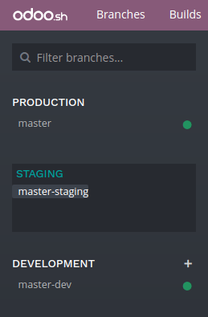
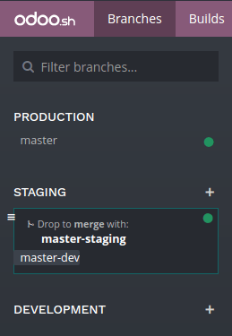
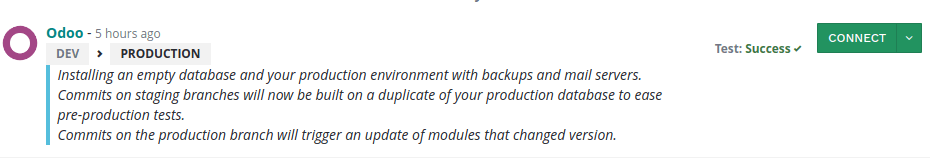
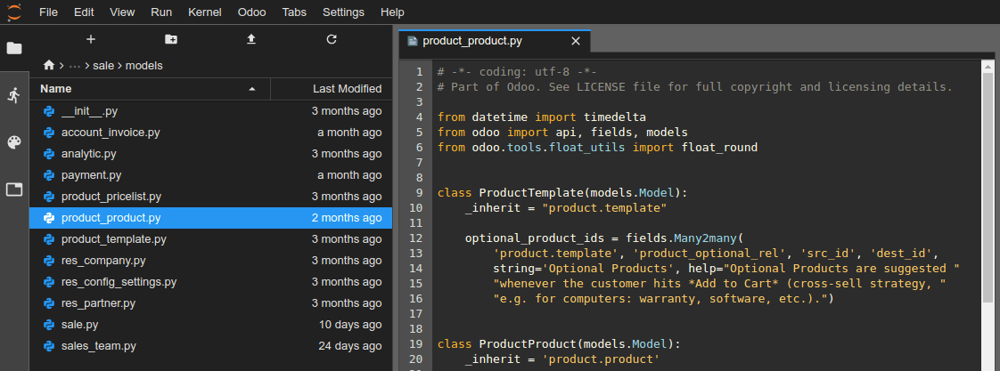
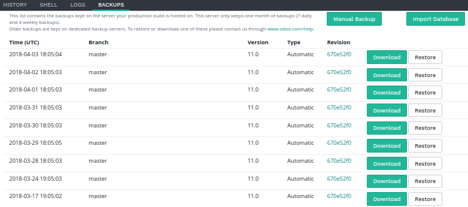
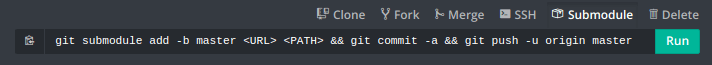

========
Branches
========

Overview
========

The branches view gives you an overview of the different branches your repository has.

.. image:: branches/interface-branches.png
   :align: center

.. _odoosh-gettingstarted-branches-stages:

Stages
======

Odoo.sh offers three different stages for your branches: production, staging and development.

You can change the stage of a branch by drag and dropping it into the stage section title.

.. _stage_production:

Production
----------

This is the branch holding the code on which your production database runs.
There can be only one production branch.

When you push a new commit in this branch,
your production server is updated with the code of the new revision and is then restarted.

If your changes require the update of a module, such as a change in a form view,
and you want it to be performed automatically,
increase the version number of the module in its manifest (*__manifest__.py*).
The platform will then take care to perform the update during which the
instance will be held temporarily unavailable for maintenance reason.

This method is equivalent to perform an upgrade of the module through the Apps menu,
or through the :code:`-u` switch of
:doc:`the command line </developer/reference/cli>`.

In the case the changes in the commit prevent the server to restart,
or if the modules update fails,
the server is automatically reverted to the previous successful code revision and
the database is roll-backed as it was before the update.
You still have access to the log of the failed update, so you can troubleshoot it.

The demo data is not loaded, as it is not meant to be used in a production database.
The unit tests are not performed, as it would increase the unavailability time of the production
database during the updates.

Partners using trial projects should be aware their production branch, along with all the staging branches,
will automatically be set back to the development stage after 30 days.

Staging
-------

Staging branches are meant to test your new features using the production data without compromising
the actual production database with test records. They will create databases that are neutralized
duplicates of the production database.

The neutralization includes:

* Disabling scheduled actions. If you want to test them, you can trigger their action manually or
  re-enable them. Be aware that the platform will trigger them less often if no one is using the
  database in order to save up resources.
* Disabling outgoing emails by intercepting them with a mailcatcher. An
  :ref:`interface to view <odoosh-gettingstarted-branches-tabs-mails>` the emails sent by your
  database is provided. That way, you do not have to worry about sending test emails to your contacts.
* Setting payment providers and shipping providers in test mode.
* Disabling IAP services

The latest database will be kept alive indefinitely, older ones from the same branch may get garbage collected
to make room for new ones. It will be valid for 3 months, after which you will be expected to rebuild the branch.
If you make configuration or view changes in these databases, make sure to document them or write them directly
in the modules of the branch, using XML data files overriding the default configuration or views.

The unit tests are not performed as, in Odoo, they currently rely on the demo data, which is not loaded in the
production database. In the future, if Odoo supports to run the unit tests without the demo data,
Odoo.sh will then consider running the tests on staging databases.

Development
-----------

Development branches create new databases using the demo data to run the unit tests.
The installed modules are the ones included in your branches. You can change this list of modules
to install in your :ref:`project Settings <odoosh-gettingstarted-settings-modules-installation>`.

When you push a new commit in one of these branches,
a new server is started, with a database created from scratch and the new revision of the branch.
The demo data is loaded, and the unit tests are performed by default.
This verifies your changes do not break any of the features tested by them. If you wish, you can
disable the tests or allow specific tests to be run with custom tags in the :ref:`branch's settings
<odoosh-gettingstarted-branches-tabs-settings>`.

Similar to staging branches, the emails are not sent but are intercepted by a mailcatcher and
scheduled actions are not triggered as long as the database is not in use.

The databases created for development branches are meant to live around three days.
After that, they can be automatically garbage collected to make room for new databases without prior notice.

.. _odoosh-gettingstarted-branches-mergingbranches:

Merging your branches
---------------------

You can merge your branches easily by drag and dropping them into each other.

When you want to test the changes of your development branches with the production data,
you can either:

* merge the development branch into your staging branch, by drag and dropping it onto the desired staging branch,
* drag and dropping the development branch on the staging section title, to make it become a staging branch.

When your latest changes are ready for production,
you can drag and drop your staging branch onto your production branch
to merge and deploy in production your newest features.

If you are bold enough,
you can merge your development branches into your production branch as well.
It just means you skip the validation of your changes with the production data through a staging branch.

You can merge your development branches into each other, and your staging branches into each other.

Of course, you can also use :code:`git merge` directly on your workstation to merge your branches.
Odoo.sh will be notified when new revisions have been pushed in your branches.

Merging a staging branch in the production branch only merges the source code: Any configuration changes you made in the
staging databases are not passed to the production database.

If you test configuration changes in staging branches, and want them to be applied in the production, you have to either:

* write the configuration changes in XML data files
  overriding the default configuration or views in your branches,
  and then increase the version of your module in its manifest (*__manifest__.py*) to trigger the update of the module
  when you merge your staging branch in your production branch.
  This is the best practice for a better scalability of your developments as you will use the Git versioning features
  for all your configuration changes, and therefore have a traceability for your changes.
* pass them manually from your staging to your production database, by copy/pasting them.

.. _odoosh-gettingstarted-branches-tabs:

Tabs
====

History
-------

An overview of your branch history:

* The messages of the commits and their authors,
* The various events linked to the platform, such as stage changes, database imports, backup restores.

For each event, a status is displayed in the top right-hand corner.
It can provide information about the ongoing operation on the database (installation, update, backup import, ...),
or its result (tests feedback, successful backup import, ...).
When an operation is successful, you can access the database thanks to the *connect* button.

.. _odoosh-gettingstarted-branches-tabs-mails:

Mails
-----

This tab contains the mail catcher. It displays an overview of the emails sent by your database.
The mail catcher is available for your development and
staging branches as the emails of your production database are really sent instead of being intercepted.

.. image:: branches/interface-branches-mails.png
   :align: center
   :scale: 50%

Shell
-----

A shell access to your container. You can perform basic linux commands (:code:`ls`, :code:`top`)
and open a shell on your database by typing :code:`psql`.

.. image:: branches/interface-branches-shell.png
   :align: center

You can open multiple tabs and drag-and-drop them to arrange the layout as you wish,
for instance side by side.

.. Note::
  Long running shell instances are not guaranteed. Idle shells can be
  disconnected at anytime in order to free up resources.

Editor
------

An online integrated development environment (IDE) to edit the source code.
You can also open terminals, Python consoles and even Odoo Shell consoles.

You can open multiple tabs and drag-and-drop them to arrange the layout as you wish,
for instance side by side.

Monitoring
----------

This link contains various monitoring metrics of the current build.

.. image:: branches/interface-branches-monitoring.png
   :align: center

You can zoom, change the time range or select a specific metric on each graph.
On the graphs, annotations help you relate to changes on the build (database import, git push, etc...).

.. _odoosh/logs:

Logs
----

A viewer to have a look to your server logs.

.. image:: branches/interface-branches-logs.png
   :align: center

Different logs are available:

* install.log: The logs of the database installation. In a development branch, the logs of the tests are included.
* pip.log: The logs of the Python dependencies installation.
* odoo.log: The logs of the running server.
* update.log: The logs of the database updates.
* pg_long_queries.log: The logs of psql queries that take an unusual amount of time.

If new lines are added in the logs, they will be displayed automatically.
If you scroll to the bottom, the browser will scroll automatically each time a new line is added.

You can pause the logs fetching by clicking on the according button in the upper right corner of the view.
The fetching is automatically stopped after 5 minutes. You can restart it using the play button.

.. _odoo_sh_branches_backups:

Backups
-------

A list of the backups available for download and restore, the ability to perform a manual backup and to import a
database.

Odoo.sh makes daily backups of the production database. It keeps 7 daily, 4 weekly and 3 monthly backups.
Each backup includes the database dump, the filestore (attachments, binary fields), logs and sessions.

Staging and development databases are not backed up.
You nevertheless have the possibility to restore a backup of the production database in your staging branches, for
testing purposes, or to manually recover data that has been deleted by accident from the production database.

The list contains the backups kept on the server your production database is hosted on.
This server only keeps one month of backups: 7 daily and 4 weekly backups.

Dedicated backup servers keep the same backups, as well as 3 additional monthly backups.
To restore or download one of these monthly backups, please `contact us <https://www.odoo.com/help>`_.

If you merge a commit updating the version of one or several modules (in :file:`__manifest__.py`), or their linked python
dependencies (in :file:`requirements.txt`), then Odoo.sh performs a backup automatically (flagged with type Update in the list),
as either the container will be changed by the installation of new pip packages, either the database itself will be
changed with the module update triggered afterwards. In these two cases, we are doing a backup as it may potentially
break things.

If you merge a commit that only changes some code without the above-mentioned modifications, then no backup is done
by Odoo.sh, as neither the container nor the database is modified so the platform considers this safe enough. Of course,
as an extra precaution, you can make a backup manually before making big changes in your production sources in case
something goes wrong (those manual backups are available for about one week). To avoid abuse, we limit manual backups
to 5 per day.

The *import database* feature accepts database archives in the format provided by:

* the standard Odoo databases manager,
  (available for on-premise Odoo servers under :code:`/web/database/manager`)
* the Odoo online databases manager,
* the Odoo.sh backup download button of this *Backups* tab,
* the Odoo.sh dump download button in the :ref:`Builds view <odoosh-gettingstarted-builds>`.

.. _odoo_sh/upgrade:

Upgrade
-------

Available for production and staging branches for valid projects.

.. seealso::
    :doc:`Upgrade documentation <../../upgrade>`

.. _odoosh-gettingstarted-branches-tabs-settings:

Settings
--------

Here you can find a couple of settings that only apply to the currently selected branch.

.. image:: branches/interface-branches-settings.jpg
   :align: center

**Behaviour upon new commit**

For development and staging branches, you can change the branch's behavior upon receiving a new
commit. By default, a development branch will create a new build and a staging branch will update
the previous build (see the :ref:`Production Stage <stage_production>`). This is especially useful
should the feature you're working on require a particular setup or configuration, to avoid having
to manually set it up again on every commit. If you choose new build for a staging branch, it will
make a fresh copy from the production build every time a commit is pushed. A branch that is put
back from staging to development will automatically be set to 'Do nothing'.

**Modules installation**

Choose the modules to install automatically for your development builds.

.. image:: branches/interface-settings-modulesinstallation.png
   :align: center

* *Install only my modules* will install the modules of the branch only. This is the default option.
  The :ref:`submodules <odoosh-advanced-submodules>` are excluded.
* *Full installation (all modules)* will install the modules of the branch, the modules included in the submodules
  and all standard modules of Odoo. When running the full installation, the test suite is disabled.
* *Install a list of modules* will install the modules specified in the input just below this option.
  The names are the technical name of the modules, and they must be comma-separated.

If the tests are enabled, the standard Odoo modules suite can take up to 1 hour.
This setting applies to development builds only.
Staging builds duplicate the production build and the production build only installs base.

**Test suite**

For development branches, you can choose to enable or disable the test suite. It's enabled by default.
When the test suite is enabled, you can restrict them by specifying test tags :ref:`test tags
<developer/reference/testing/selection>`.

**Odoo Version**

For development branches only, you can change the version of Odoo, should you want to test upgraded code or develop
features while your production database is in the process of being upgraded to a newer version.

In addition, for each version you have two options regarding the code update.

* You can choose to benefit from the latest bug, security and performance fixes automatically. The
  sources of your Odoo server will be updated weekly. This is the 'Latest' option.
* You can choose to pin the Odoo sources to a specific revision by selecting them from a list of
  dates. Revisions will expire after 3 months. You will be notified by mail when the expiration
  date approaches and if you don't take action afterwards, you will automatically be set to the
  latest revision.

**Custom domains**

Here you can configure additional domains for the selected branch. It's possible to add other
*<name>.odoo.com* domains or your own custom domains. For the latter you have to:

* own or purchase the domain name,
* add the domain name in this list,
* in your registrar's domain name manager,
  configure the domain name with a ``CNAME`` record set to your production database domain name.

For instance, to associate *www.mycompany.com* to your database *mycompany.odoo.com*:

* in Odoo.sh, add *www.mycompany.com* in the custom domains of your project settings,
* in your domain name manager (e.g. *godaddy.com*, *gandi.net*, *ovh.com*),
  configure *www.mycompany.com* with a ``CNAME`` record with as value *mycompany.odoo.com*.

Bare domains (e.g. *mycompany.com*) are not accepted:

* they can only be configured using ``A`` records,
* ``A`` records only accept IP addresses as value,
* the IP address of your database can change, following an upgrade, a hardware failure or
  your wish to host your database in another country or continent.

Therefore, bare domains could suddenly no longer work because of this change of IP address.

In addition, if you would like both *mycompany.com* and *www.mycompany.com* to work with your database,
having the first redirecting to the second is amongst the
`SEO best practices <https://support.google.com/webmasters/answer/7451184?hl=en>`_
(See *Provide one version of a URL to reach a document*)
in order to have one dominant URL. You can therefore just configure *mycompany.com* to redirect to *www.mycompany.com*.
Most domain managers have the feature to configure this redirection. This is commonly called a web redirection.

**HTTPS/SSL**

If the redirection is correctly set up, the platform will automatically generate an SSL certificate
with `Let's Encrypt <https://letsencrypt.org/about/>`_ within the hour and your domain will be
accessible through HTTPS.

While it is currently not possible to configure your own SSL certificates on the Odoo.sh platform
we are considering the feature if there is enough demand.

**SPF and DKIM compliance**

In case the domain of your users email addresses use SPF (Sender Policy Framework) or DKIM
(DomainKeys Identified Mail), don't forget to authorize Odoo as a sending host in your domain name
settings to increase the deliverability of your outgoing emails.
The configuration steps are explained in the documentation about :ref:`SPF
<email_domain/spf_compliant>` and :ref:`DKIM <email_domain/DKIM_compliant>`.

.. Warning::
  Forgetting to configure your SPF or DKIM to authorize Odoo as a sending host can lead to the
  delivery of your emails as spam in your contacts inbox.

Shell commands
==============

In the top right-hand corner of the view, different shell commands are available.

Each command can be copied in the clipboard to be used in a terminal,
and some of them can be used directly from Odoo.sh by clicking the *run* button
in such case a popup will prompt the user in order to define eventual placeholders
such as ``<URL>``, ``<PATH>``, ...

Clone
-----

Download the Git repository.

.. code-block:: bash

  $ git clone --recurse-submodules --branch master git@github.com:odoo/odoo.git

Clones the repository *odoo/odoo*.

* :code:`--recurse-submodules`: Downloads the submodules of your repository. Submodules included in the submodules are downloaded as well.
* :code:`--branch`: checks out a specific branch of the repository, in this case *master*.

The *run* button is not available for this command, as it is meant to be used on your machines.

Fork
----

Create a new branch based on the current branch.

.. code-block:: bash

  $ git checkout -b feature-1 master

Creates a new branch called *feature-1* based on the branch *master*, and then checkouts it.

.. code-block:: bash

  $ git push -u origin feature-1

Uploads the new branch *feature-1* on your remote repository.

Merge
-----

Merge the current branch in another branch.

.. code-block:: bash

  $ git merge staging-1

Merges the branch *staging-1* in the current branch.

.. code-block:: bash

  $ git push -u origin master

Uploads the changes you just added in the *master* branch on your remote repository.

SSH
---

Setup
~~~~~

In order to use SSH, you have to set up your profile SSH public key (if it is not already done).
To do so, follow these steps:

#. `Generate a new SSH key
   <https://help.github.com/en/github/authenticating-to-github/generating-a-new-ssh-key-and-adding-it-to-the-ssh-agent#generating-a-new-ssh-key>`_
#. `Copy the SSH key to your clipboard
   <https://help.github.com/en/github/authenticating-to-github/adding-a-new-ssh-key-to-your-github-account>`_
   (only apply the step 1)
#. Paste the copied content to your profile SSH keys and press "Add"

   .. image:: branches/SSH-key-pasting.png
      :align: center

#. The key should appear below

   .. image:: branches/SSH-key-appearing.png
      :align: center

Connection
~~~~~~~~~~

To connect to your builds using ssh use the following command in a terminal:

.. code-block:: bash

  $ ssh <build_id>@<domain>

You will find a shortcut for this command into the SSH tab in the upper right corner.

.. image:: branches/SSH-panel.png
   :align: center

Provided you have the :ref:`correct access rights <odoosh-gettingstarted-settings-collaborators>` on the project,
you'll be granted ssh access to the build.

.. Note::
  Long running ssh connections are not guaranteed. Idle connections will be
  disconnected in order to free up resources.

Submodule
---------

Add a branch from another repository in your current branch as a *submodule*.

*Submodules* allows you to use modules from other repositories in your project.

The submodules feature is detailed in the chapter
:ref:`Submodules <odoosh-advanced-submodules>` of this documentation.

.. code-block:: bash

  $ git submodule add -b master <URL> <PATH>

Adds the branch *master* of the repository *<URL>* as a submodule under the path *<PATH>* in your current branch.

.. code-block:: bash

  $ git commit -a

Commits all your current changes.

.. code-block:: bash

  $ git push -u origin master

Uploads the changes you just added in the *master* branch on your remote repository.

Delete
------

Delete a branch from your repository.

.. code-block:: bash

  $ git push origin :master

Deletes the branch in your remote repository.

.. code-block:: bash

  $ git branch -D master

Deletes the branch in your local copy of the repository.
